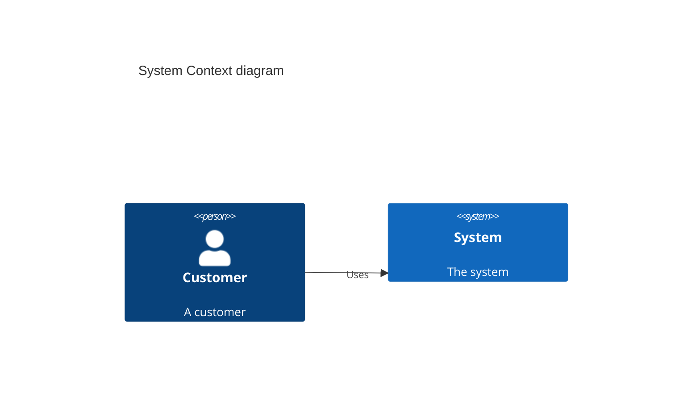
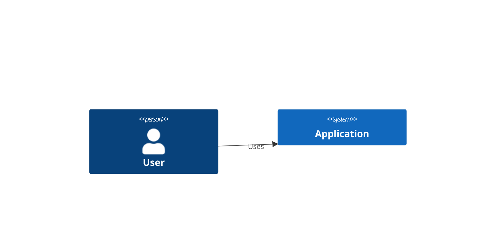

# C4-PlantUML Support Documentation

## Overview

Whysper now supports **C4-PlantUML** diagrams in addition to C4-Mermaid diagrams. The system automatically detects PlantUML fence markers (`@startuml`/`@enduml`) and converts C4-PlantUML syntax to D2 for rendering.

## Supported C4 Formats

### 1. **C4-Mermaid Syntax** (Original)


### 2. **C4-PlantUML Syntax** (NEW!)
```plantuml
@startuml
!include C4_Context.puml

Person(customer, "Customer", "A customer")
System(system, "System", "The system")
Rel(customer, system, "Uses")

@enduml
```

### 3. **Direct C4 Syntax**
```c4
Person(customer, "Customer", "A customer")
System(system, "System", "The system")
Rel(customer, system, "Uses")
```

## Detection Logic

### Language Markers
The system detects C4 diagrams using these language markers:
- `c4` - Direct C4 language marker
- `c4diagram` - Alternative C4 marker
- `plantuml` or `puml` - PlantUML marker (with C4 content validation)
- `mermaid` - Mermaid marker (with C4 content validation)

### Content-Based Detection
Even without language markers, the system detects C4 diagrams by finding:

**Mermaid-style keywords:**
- `C4Context`, `C4Container`, `C4Component`, `C4Dynamic`, `C4Deployment`
- `Person()`, `System()`, `Container()`, `Component()`
- `Rel()`, `Boundary()`

**PlantUML-style markers:**
- `@startuml` / `@enduml`
- `!include` (especially `!include C4_...`)
- Combined with C4 element functions: `Person()`, `System()`, etc.

## PlantUML Fence Processing

### Automatic Marker Removal
The converter automatically strips PlantUML-specific markers:
```typescript
// These are removed automatically:
@startuml
@enduml
!include C4_Context.puml
!include C4_Container.puml
!define CUSTOM_MACRO
```

After stripping, the C4 content is processed just like C4-Mermaid syntax.

### Example Conversion

**Input (PlantUML):**
```plantuml
@startuml
!include C4_Context.puml

Person(customer, "Banking Customer", "A customer of the bank")
System(banking_system, "Internet Banking", "Allows customers to view accounts")

Rel(customer, banking_system, "Uses")

@enduml
```

**After Fence Stripping:**
```c4
Person(customer, "Banking Customer", "A customer of the bank")
System(banking_system, "Internet Banking", "Allows customers to view accounts")

Rel(customer, banking_system, "Uses")
```

**Final D2 Output:**
```d2
direction: down

customer: {
  label: "Banking Customer"
  shape: person
  tooltip: "A customer of the bank"
}

banking_system: {
  label: "Internet Banking"
  shape: rectangle
  tooltip: "Allows customers to view accounts"
  style: {fill: #1168bd; stroke: #0b4884}
}

customer -> banking_system: "Uses"
```

## Usage Examples

### Ask the AI for C4 Diagrams

**Prompt:**
```
Can you create a C4 context diagram for an e-commerce system using PlantUML format?
```

The AI might respond with:
````markdown
```plantuml
@startuml
!include C4_Context.puml

Person(customer, "Customer", "A person who shops online")
System(ecommerce, "E-Commerce System", "Allows customers to purchase products")
System_Ext(payment, "Payment Gateway", "Processes payments")
System_Ext(shipping, "Shipping Service", "Handles product delivery")

Rel(customer, ecommerce, "Browses and purchases")
Rel(ecommerce, payment, "Processes payments via", "HTTPS/REST")
Rel(ecommerce, shipping, "Requests delivery via", "HTTPS/REST")

@enduml
```
````

The system will:
1. ✅ Detect `plantuml` language marker
2. ✅ Detect C4 content (Person, System, Rel functions)
3. ✅ Strip PlantUML markers (`@startuml`, `@enduml`, `!include`)
4. ✅ Convert to D2 syntax
5. ✅ Render beautiful diagram

### Mixed PlantUML and C4-Mermaid

You can use both formats in the same conversation. The system handles each independently:

**PlantUML Format:**
```plantuml
@startuml
Person(user, "User")
System(app, "Application")
Rel(user, app, "Uses")
@enduml
```

**Mermaid Format:**


Both render identically!

## Error Handling

### Invalid PlantUML C4 Code

If the PlantUML code is invalid, you'll see clear error messages:

**Example Error:**
```
C4 to D2 conversion failed.

Main error: C4 to D2 conversion produced no entities or relationships.
The C4 code may not be in the expected format.
Expected format: Person(id, "label"), System(id, "label"), Rel(from, to, "label")

Fallback error: [fallback conversion details]

Please check that your C4 diagram syntax is correct.
```

### Common Issues

1. **Missing Quotes**
   ```plantuml
   @startuml
   Person(user, User)  ❌ Missing quotes
   @enduml
   ```
   Should be:
   ```plantuml
   @startuml
   Person(user, "User")  ✅ With quotes
   @enduml
   ```

2. **Incomplete Relationships**
   ```plantuml
   Rel(user, app)  ❌ Missing label
   ```
   Should be:
   ```plantuml
   Rel(user, app, "Uses")  ✅ With label
   ```

## Technical Implementation

### Files Modified

1. **[frontend/src/utils/c4ToD2.ts](frontend/src/utils/c4ToD2.ts)**
   - Added `stripPlantUMLMarkers()` function
   - Enhanced `convertC4ToD2()` to call fence stripper
   - Updated `looksLikeC4()` to detect PlantUML markers

2. **[frontend/src/utils/mermaidUtils.ts](frontend/src/utils/mermaidUtils.ts)**
   - Added `PLANTUML_C4_MARKERS` constants
   - Enhanced `isC4Code()` to recognize `plantuml`/`puml` languages
   - Enhanced `isC4Syntax()` to detect PlantUML markers + C4 content

3. **[frontend/src/components/chat/ChatView.tsx](frontend/src/components/chat/ChatView.tsx)**
   - Updated `CodeComponentRenderer` to handle PlantUML C4 diagrams
   - Added detection logic for `plantuml`/`puml` language markers
   - Shows diagram source in title (PlantUML/Mermaid/C4)

### Detection Flow

```
┌─────────────────────────────────────────────────────────────┐
│  Step 1: Language Marker Detection                          │
│  - Check for: c4, c4diagram, plantuml, puml, mermaid        │
└────────────────────┬────────────────────────────────────────┘
                     │
                     ▼
┌─────────────────────────────────────────────────────────────┐
│  Step 2: Content Validation (if PlantUML or Mermaid)        │
│  - Check for C4 keywords: Person, System, Component, Rel    │
│  - Check for PlantUML markers: @startuml, @enduml          │
└────────────────────┬────────────────────────────────────────┘
                     │
                     ▼
┌─────────────────────────────────────────────────────────────┐
│  Step 3: Fence Marker Stripping                             │
│  - Remove @startuml, @enduml                                │
│  - Remove !include, !define lines                           │
└────────────────────┬────────────────────────────────────────┘
                     │
                     ▼
┌─────────────────────────────────────────────────────────────┐
│  Step 4: C4 to D2 Conversion                                │
│  - Parse entities (Person, System, etc.)                    │
│  - Parse relationships (Rel)                                │
│  - Parse boundaries (System_Boundary, etc.)                 │
└────────────────────┬────────────────────────────────────────┘
                     │
                     ▼
┌─────────────────────────────────────────────────────────────┐
│  Step 5: D2 Rendering                                       │
│  - Compile D2 syntax                                        │
│  - Render to SVG                                            │
│  - Display in UI                                            │
└─────────────────────────────────────────────────────────────┘
```

## Testing

### Test PlantUML C4 Detection

You can test the PlantUML support by asking:

**Test Prompt 1:**
```
Create a C4 context diagram using PlantUML format with:
- A user (Person)
- An application (System)
- A database (SystemDb_Ext)
- Relationships between them
```

**Test Prompt 2:**
```
Show me a PlantUML C4 diagram with @startuml and @enduml markers
```

**Test Prompt 3:**
```
Generate a C4 container diagram in PlantUML format with boundaries
```

### Expected Behavior

✅ **Should Detect and Render:**
- Code blocks with `plantuml` or `puml` language marker + C4 content
- Code blocks with `@startuml`/`@enduml` markers + C4 functions
- Code blocks with `!include C4_` + C4 functions
- Mermaid blocks with C4 keywords (backward compatible)
- Direct `c4`/`c4diagram` language markers

❌ **Should NOT Detect as C4:**
- PlantUML blocks without C4 content (regular UML)
- Mermaid blocks without C4 keywords (regular Mermaid)
- Plain text containing `@startuml` without C4 functions

## Benefits

### 1. **Wider Format Support**
- Works with C4-PlantUML (the most popular C4 format)
- Works with C4-Mermaid (simpler syntax)
- Works with direct C4 syntax

### 2. **Ecosystem Compatibility**
- Supports diagrams from official C4-PlantUML repository
- Compatible with existing C4 diagram tools
- Allows copying diagrams from C4 documentation

### 3. **Automatic Conversion**
- PlantUML fences are stripped automatically
- C4 syntax converts to D2 seamlessly
- No manual editing required

### 4. **Comprehensive Error Handling**
- Clear error messages for invalid syntax
- Fallback conversion if main conversion fails
- Shows both C4 source and D2 output in errors

## Limitations

### PlantUML Features NOT Supported

These PlantUML-specific features are automatically removed and won't affect rendering:

- ❌ `!include` directives (stripped, not processed)
- ❌ `!define` macros (stripped, not expanded)
- ❌ PlantUML styling (colors, fonts via `skinparam`)
- ❌ PlantUML layout hints (`left to right direction`)

These features are C4-specific and ARE supported:

- ✅ All C4 element types (Person, System, Container, Component, etc.)
- ✅ External variants (_Ext suffix)
- ✅ Database/Queue variants (SystemDb, ContainerQueue, etc.)
- ✅ All relationship types (Rel, Rel_Back, Rel_Up, etc.)
- ✅ Boundaries (System_Boundary, Enterprise_Boundary, etc.)
- ✅ Descriptions and technology labels

## Conclusion

Whysper now provides **full support for C4-PlantUML diagrams**, making it compatible with the most popular C4 diagramming format while maintaining backward compatibility with C4-Mermaid syntax.

Simply ask the AI to create C4 diagrams in PlantUML format, and they'll render beautifully using D2!
