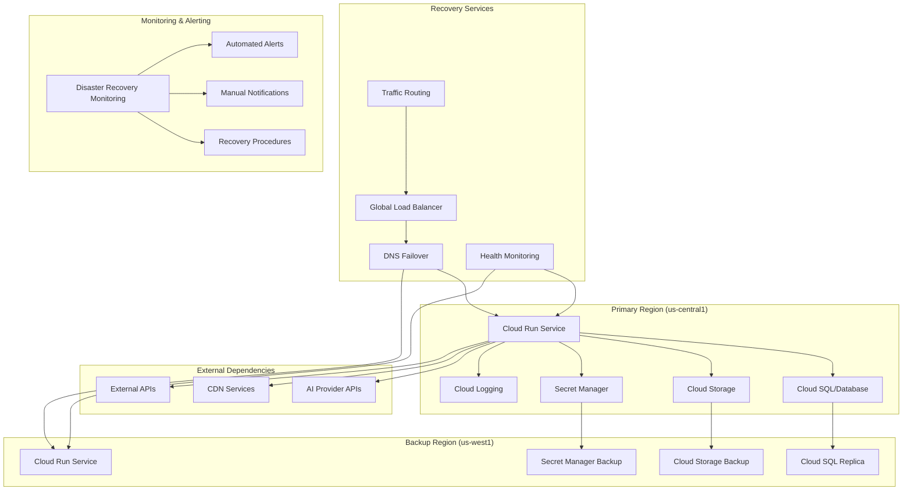

# Backup and Disaster Recovery Strategy

## Overview

This document outlines a comprehensive backup and disaster recovery strategy for Whysper Web2 application deployed on Google Cloud Platform, ensuring business continuity and data protection.

## Disaster Recovery Architecture



## Data Backup Strategy

### Cloud Storage Backup Configuration
```bash
#!/bin/bash
# setup-storage-backup.sh

PROJECT_ID="your-gcp-project-id"
BACKUP_BUCKET="whysper-backups-us-west1"
SOURCE_BUCKET="whysper-data-us-central1"

echo "💾 Setting up Cloud Storage backup strategy..."

# Create backup bucket with appropriate lifecycle policies
gsutil mb -l us-west1 -p on \
    -c "Standard-Storage,Regional" \
    -c "location=US-WEST1" \
    -c "storage-class=STANDARD" \
    $BACKUP_BUCKET

# Configure lifecycle rules for automatic cleanup
gsutil lifecycle set $BACKUP_BUCKET \
    --json '{
        "rule": [
            {
                "action": {"type": "Delete"},
                "condition": {"age": 90},
                "storageClass": ["STANDARD"]
            },
            {
                "action": {"type": "SetStorageClass"},
                "condition": {"age": 30},
                "storageClass": "COLDLINE"
            }
        ]
    }'

# Enable versioning for backup files
gsutil versioning set on $BACKUP_BUCKET

echo "✅ Backup storage configured successfully!"
```

### Automated Backup Scripts
```bash
#!/bin/bash
# automated-backup.sh

PROJECT_ID="your-gcp-project-id"
BACKUP_BUCKET="whysper-backups-us-west1"
DATE=$(date +%Y%m%d_%H%M%S)
BACKUP_NAME="whysper_backup_$DATE"

echo "🔄 Starting automated backup process..."

# Backup application data
echo "Backing up application configuration..."
gcloud secrets versions access \
    --project=$PROJECT_ID \
    --secret=app-access-key \
    --version=latest > $BACKUP_NAME/secrets.json

# Backup database (if using Cloud SQL)
echo "Backing up database..."
gcloud sql backups create \
    --project=$PROJECT_ID \
    --instance=whysper-db \
    --description="Automated backup $DATE"

# Backup user-generated content
echo "Backing up user content..."
gsutil -m rsync -r gs://$SOURCE_BUCKET/user-content/ gs://$BACKUP_BUCKET/user-content/

# Create backup manifest
cat > $BACKUP_NAME/manifest.json << EOF
{
  "backup_timestamp": "$(date -u +%Y-%m-%dT%H:%M:%SZ)",
  "backup_type": "automated",
  "components": {
    "secrets": true,
    "database": true,
    "user_content": true,
    "configuration": true
  },
  "backup_size_gb": "$(gsutil du -s gs://$BACKUP_BUCKET/$BACKUP_NAME | awk '{sum+=$1} END {print $1/1024}')",
  "retention_days": 90
}
EOF

# Verify backup integrity
echo "Verifying backup integrity..."
if gsutil -q stat gs://$BACKUP_BUCKET/$BACKUP_NAME/manifest.json; then
    echo "✅ Backup completed successfully!"
else
    echo "❌ Backup verification failed!"
    exit 1
```

### Cross-Region Replication
```bash
#!/bin/bash
# setup-replication.sh

PROJECT_ID="your-gcp-project-id"
SOURCE_BUCKET="whysper-data-us-central1"
REPLICA_BUCKET="whysper-data-us-west1"

echo "🔄 Setting up cross-region replication..."

# Enable replication for critical data
gsutil replication create \
    --source-bucket=$SOURCE_BUCKET \
    --destination-bucket=$REPLICA_BUCKET \
    --replication-sync="AFTER" \
    --storage-class="STANDARD"

# Set up replication monitoring
gcloud monitoring policies create \
    --project=$PROJECT_ID \
    --notification-channels=projects/$PROJECT_ID/notificationChannels/backup-alerts \
    --condition-filter='resource.type="storage_bucket" AND metric.type="storage.googleapis.com/network/received_bytes_count" AND resource.labels.bucket_name="'$REPLICA_BUCKET'"' \
    --aggregation-alignment-period=300s \
    --aggregation-per-series-aligner=ALIGN_SUM \
    --condition-threshold-value=1000000 \
    --condition-threshold-comparison=COMPARISON_LT

echo "✅ Cross-region replication configured!"
```

## Database Backup and Recovery

### Cloud SQL Backup Configuration
```yaml
# sql-backup-config.yaml

apiVersion: sql.cnrm.cloud.google.com/v1
kind: SQLInstance
metadata:
  name: whysper-db-primary
spec:
  databaseVersion: POSTGRES_14
  region: us-central1
  settings:
    tier: db-custom-4-16384
    diskSize: 100
    diskType: PD_SSD
    backupConfiguration:
      enabled: true
      startTime: "02:00"
      location: us
      retentionSettings:
        retainedBackupsCount: 30
        retentionUnit: COUNT
      binaryLogEnabled: true

---

apiVersion: sql.cnrm.cloud.google.com/v1
kind: SQLInstance
metadata:
  name: whysper-db-replica
spec:
  databaseVersion: POSTGRES_14
  region: us-west1
  masterInstanceName: whysper-db-primary
  replicaConfiguration:
    failoverTarget: "whysper-db-primary"
    mysqlReplicaConfiguration:
      dumpFlags: "--single-transaction --quick"
```

### Database Recovery Procedures
```bash
#!/bin/bash
# database-recovery.sh

PROJECT_ID="your-gcp-project-id"
INSTANCE_NAME="whysper-db-primary"
BACKUP_ID=$1

echo "🔄 Database recovery procedure..."

# List available backups
echo "Available backups:"
gcloud sql backups list \
    --project=$PROJECT_ID \
    --instance=$INSTANCE_NAME \
    --format='table(id,createTime,status,type)'

# Promote replica to primary (if needed)
if [ "$2" = "--promote-replica" ]; then
    echo "Promoting replica to primary..."
    gcloud sql instances patch whysper-db-replica \
        --project=$PROJECT_ID \
        --clear-replica-configuration
    echo "✅ Replica promoted to primary!"
fi

# Restore from backup
if [ -n "$BACKUP_ID" ]; then
    echo "Restoring from backup: $BACKUP_ID"
    gcloud sql backups restore \
        --project=$PROJECT_ID \
        --instance=$INSTANCE_NAME \
        --backup-id=$BACKUP_ID \
        --restore-instance-backup-id=$BACKUP_ID
    
    echo "✅ Database restore completed!"
fi
```

## Application State Backup

### Configuration and Secrets Backup
```python
# backup_app_state.py - Application state backup

import json
import os
import gzip
from google.cloud import storage
from google.cloud import secretmanager
from datetime import datetime
import logging

class AppStateBackup:
    """Application state and configuration backup utility"""
    
    def __init__(self, project_id: str, backup_bucket: str):
        self.project_id = project_id
        self.backup_bucket = backup_bucket
        self.storage_client = storage.Client(project=project_id)
        self.secret_client = secretmanager.SecretManagerServiceClient()
    
    def backup_secrets(self, environment: str = "production"):
        """Backup all application secrets"""
        timestamp = datetime.now().strftime("%Y%m%d_%H%M%S")
        backup_path = f"secrets_backup_{environment}_{timestamp}.json.gz"
        
        try:
            # List all secrets
            secrets = []
            for secret in self.secret_client.list_secrets(
                project=self.project_id,
                filter=f"labels.environment={environment}"
            ).secrets:
                secret_data = {
                    "name": secret.name,
                    "create_time": secret.create_time.isoformat(),
                    "labels": dict(secret.labels),
                    "replication_status": secret.replication.status.name if secret.replication else "DISABLED"
                }
                secrets.append(secret_data)
            
            # Compress and upload backup
            backup_json = json.dumps(secrets, indent=2, default=str)
            compressed_data = gzip.compress(backup_json.encode('utf-8'))
            
            blob = self.storage_client.bucket(self.backup_bucket).blob(backup_path)
            blob.upload_from_string(compressed_data, content_type='application/json')
            
            logging.info(f"Successfully backed up {len(secrets)} secrets to {backup_path}")
            
        except Exception as e:
            logging.error(f"Failed to backup secrets: {str(e)}")
            raise
    
    def backup_configuration(self, environment: str = "production"):
        """Backup application configuration"""
        timestamp = datetime.now().strftime("%Y%m%d_%H%M%S")
        backup_path = f"config_backup_{environment}_{timestamp}.json.gz"
        
        # Collect configuration from environment variables and files
        config_data = {
            "backup_timestamp": datetime.now().isoformat(),
            "environment": environment,
            "api_settings": {
                "provider": os.getenv('PROVIDER', 'openrouter'),
                "default_model": os.getenv('DEFAULT_MODEL', ''),
                "max_tokens": int(os.getenv('MAX_TOKENS', '10000')),
                "temperature": float(os.getenv('TEMPERATURE', '0.7'))
            },
            "service_settings": {
                "port": int(os.getenv('PORT', '8080')),
                "host": os.getenv('HOST', '0.0.0.0'),
                "static_dir": os.getenv('STATIC_DIR', '/app/static')
            },
            "feature_flags": {
                "enable_streaming": os.getenv('ENABLE_STREAMING', 'true').lower() == 'true',
                "debug_logging": os.getenv('DEBUG_LOGGING', 'false').lower() == 'true',
                "show_token_usage": os.getenv('SHOW_TOKEN_USAGE', 'true').lower() == 'true'
            }
        }
        
        # Compress and upload
        backup_json = json.dumps(config_data, indent=2, default=str)
        compressed_data = gzip.compress(backup_json.encode('utf-8'))
        
        blob = self.storage_client.bucket(self.backup_bucket).blob(backup_path)
        blob.upload_from_string(compressed_data, content_type='application/json')
        
        logging.info(f"Successfully backed up configuration to {backup_path}")
    
    def verify_backup_integrity(self, backup_path: str):
        """Verify backup file integrity"""
        try:
            blob = self.storage_client.bucket(self.backup_bucket).blob(backup_path)
            data = blob.download_as_string()
            
            # Decompress and validate JSON
            import gzip
            backup_data = json.loads(gzip.decompress(data))
            
            # Basic validation
            required_fields = ['backup_timestamp', 'environment', 'api_settings']
            for field in required_fields:
                if field not in backup_data:
                    raise ValueError(f"Missing required field: {field}")
            
            logging.info(f"Backup integrity verified for {backup_path}")
            return True
            
        except Exception as e:
            logging.error(f"Backup integrity check failed: {str(e)}")
            return False

# Usage
backup = AppStateBackup("your-gcp-project-id", "whysper-backups-us-west1")
backup.backup_secrets("production")
backup.backup_configuration("production")
```

## Disaster Recovery Procedures

### Failover Configuration
```bash
#!/bin/bash
# failover-procedure.sh

PROJECT_ID="your-gcp-project-id"
PRIMARY_REGION="us-central1"
BACKUP_REGION="us-west1"
DOMAIN="whysper.example.com"

echo "🚨 Starting disaster recovery failover..."

# Step 1: Verify backup region health
echo "Checking backup region health..."
BACKUP_HEALTH_URL="https://whysper-backup-$BACKUP_REGION.run.app"
if ! curl -f "$BACKUP_HEALTH_URL/health" --max-time 30; then
    echo "❌ Backup region is not healthy!"
    exit 1
fi

# Step 2: Update DNS to point to backup region
echo "Updating DNS to point to backup region..."
gcloud dns record-sets edit whysper-example.com \
    --project=$PROJECT_ID \
    --type=A \
    --name="@" \
    --rrdatas="$BACKUP_REGION.run.app"

# Step 3: Scale up backup region
echo "Scaling up backup region resources..."
gcloud run services update whysper-web2 \
    --project=$PROJECT_ID \
    --region=$BACKUP_REGION \
    --min-instances=10 \
    --max-instances=100

# Step 4: Verify failover
echo "Verifying failover..."
sleep 60  # Wait for DNS propagation

FAILOVER_URL="https://whysper-backup-$BACKUP_REGION.run.app"
for i in {1..10}; do
    if curl -f "$FAILOVER_URL/health" --max-time 10; then
        echo "✅ Failover successful! Service is now running in backup region."
        break
    fi
    echo "Attempt $i/10..."
    sleep 30
done

# Step 5: Send notifications
echo "Sending failover notifications..."
./send-notification.sh \
    --type="disaster_recovery" \
    --severity="critical" \
    --message="Disaster recovery failover completed. Service now running in $BACKUP_REGION"

echo "✅ Disaster recovery failover completed!"
```

### Recovery Time Objectives (RTO/RPO)

```yaml
# recovery-objectives.yaml

recovery_objectives:
  # Recovery Time Objective (RTO)
  rto:
    critical: "15 minutes"  # Maximum acceptable downtime for critical services
    high: "1 hour"        # Maximum acceptable downtime for high priority services
    medium: "4 hours"       # Maximum acceptable downtime for medium priority services
    low: "24 hours"        # Maximum acceptable downtime for low priority services
  
  # Recovery Point Objective (RPO)
  rpo:
    critical: "5 minutes"   # Maximum acceptable data loss for critical data
    high: "15 minutes"     # Maximum acceptable data loss for high priority data
    medium: "1 hour"        # Maximum acceptable data loss for medium priority data
    low: "4 hours"         # Maximum acceptable data loss for low priority data

# Service Classification
services:
  - name: "API Endpoints"
    priority: "critical"
    rto: "15 minutes"
    rpo: "5 minutes"
    dependencies: ["AI Provider APIs", "Database"]
    
  - name: "User Interface"
    priority: "high"
    rto: "1 hour"
    rpo: "15 minutes"
    dependencies: ["API Endpoints"]
    
  - name: "Analytics and Logging"
    priority: "medium"
    rto: "4 hours"
    rpo: "1 hour"
    dependencies: ["API Endpoints", "Database"]

# Monitoring Thresholds
monitoring_thresholds:
  service_unavailability:
    warning: "5 minutes"
    critical: "15 minutes"
  
  data_loss:
    warning: "1% of recent data"
    critical: "5% of recent data"
```

## Monitoring and Alerting

### Disaster Recovery Monitoring
```python
# dr_monitoring.py - Disaster recovery monitoring

import time
import requests
from typing import Dict, Any
import logging

class DRMonitor:
    """Disaster recovery monitoring system"""
    
    def __init__(self, primary_url: str, backup_url: str):
        self.primary_url = primary_url
        self.backup_url = backup_url
        self.last_check_time = time.time()
        self.consecutive_failures = 0
        self.max_failures = 3  # Alert after 3 consecutive failures
    
    def check_service_health(self, url: str, timeout: int = 30) -> Dict[str, Any]:
        """Check service health"""
        try:
            response = requests.get(f"{url}/health", timeout=timeout)
            return {
                "healthy": response.status_code == 200,
                "response_time": response.elapsed.total_seconds(),
                "timestamp": time.time()
            }
        except Exception as e:
            return {
                "healthy": False,
                "error": str(e),
                "timestamp": time.time()
            }
    
    def monitor_services(self):
        """Monitor primary and backup services"""
        primary_health = self.check_service_health(self.primary_url)
        backup_health = self.check_service_health(self.backup_url)
        
        if not primary_health["healthy"]:
            self.consecutive_failures += 1
            logging.warning(f"Primary service failure #{self.consecutive_failures}")
            
            if self.consecutive_failures >= self.max_failures:
                self.trigger_alert("primary_service_down", {
                    "primary_health": primary_health,
                    "backup_health": backup_health,
                    "consecutive_failures": self.consecutive_failures
                })
        else:
            self.consecutive_failures = 0
            logging.info("Primary service is healthy")
    
    def trigger_alert(self, alert_type: str, data: Dict[str, Any]):
        """Trigger disaster recovery alert"""
        # Send to monitoring system
        logging.critical(f"DR Alert: {alert_type}", extra=data)
        
        # Send notification
        self.send_notification(alert_type, data)
    
    def send_notification(self, alert_type: str, data: Dict[str, Any]):
        """Send notification to appropriate channels"""
        # Implementation depends on notification system
        if alert_type == "primary_service_down":
            # Send critical notification
            self.send_critical_notification(
                "Primary service is down!",
                data
            )
        else:
            # Send standard notification
            self.send_standard_notification(
                f"DR Alert: {alert_type}",
                data
            )
    
    def send_critical_notification(self, message: str, data: Dict[str, Any]):
        """Send critical notification via multiple channels"""
        # PagerDuty
        self.send_pagerduty_notification(message, data)
        
        # Slack
        self.send_slack_notification(message, data, channel="#alerts")
        
        # Email
        self.send_email_notification(message, data, severity="critical")
    
    def send_standard_notification(self, message: str, data: Dict[str, Any], severity: str = "info"):
        """Send standard notification"""
        # Slack
        self.send_slack_notification(message, data, channel="#monitoring")
        
        # Email
        self.send_email_notification(message, data, severity=severity)

# Usage
monitor = DRMonitor(
    primary_url="https://whysper-primary.run.app",
    backup_url="https://whysper-backup.run.app"
)

# Run monitoring every minute
while True:
    monitor.monitor_services()
    time.sleep(60)
```

### Automated Response Procedures
```yaml
# automated-response.yaml

incident_response:
  # Severity 1: Service Degradation
  - trigger_conditions:
      - error_rate > 5%
      - response_time_p95 > 2 seconds
      - cpu_usage > 80%
    response_actions:
      - scale_up_resources
      - enable_caching
      - investigate_root_cause
      - notify_stakeholders
      escalation_threshold: "30 minutes"
  
  # Severity 2: Service Outage
  - trigger_conditions:
      - service_unavailable > 2 minutes
      - error_rate > 20%
      - database_connection_failed
    response_actions:
      - initiate_failover
      - activate_disaster_recovery_plan
      - notify_all_stakeholders
      - create_incident_ticket
      escalation_threshold: "5 minutes"
  
  # Severity 3: Data Corruption
  - trigger_conditions:
      - data_integrity_check_failed
      - backup_verification_failed
      - unauthorized_data_access
    response_actions:
      - isolate_affected_systems
      - restore_from_backup
      - initiate_security_investigation
      - notify_compliance_team
      escalation_threshold: "15 minutes"

# Communication Templates
communication_templates:
  service_degradation:
    subject: "Service Degradation Detected - Whysper Web2"
    body: |
      Dear Team,
      
      We have detected service degradation in the Whysper Web2 application.
      
      Current Status:
      - Error Rate: {error_rate}%
      - Response Time: {response_time}s
      - CPU Usage: {cpu_usage}%
      
      Actions Taken:
      - {actions_taken}
      
      Estimated Resolution: {eta}
      
      Please monitor the dashboard for updates and be prepared to escalate if conditions worsen.
      
      Best regards,
      DevOps Team
  
  service_outage:
    subject: "SERVICE OUTAGE - Whysper Web2"
    body: |
      CRITICAL: Service Outage Detected
      
      The Whysper Web2 application is currently experiencing a service outage.
      
      Impact:
      - Users cannot access the application
      - API endpoints are not responding
      - Data processing is interrupted
      
      Recovery Actions:
      - Failover initiated to backup region
      - Recovery team has been notified
      - Estimated recovery time: {rto}
      
      Current Status: {current_status}
      
      This is a critical incident requiring immediate attention.
      
      Incident Commander: {incident_commander}
      
      Urgent action required.
```

## Testing and Validation

### Disaster Recovery Testing
```bash
#!/bin/bash
# dr-test.sh

PROJECT_ID="your-gcp-project-id"
PRIMARY_REGION="us-central1"
BACKUP_REGION="us-west1"

echo "🧪 Starting disaster recovery test..."

# Step 1: Document current state
echo "Documenting current system state..."
./document-system-state.sh --output=dr-test-pre-state.json

# Step 2: Simulate primary region failure
echo "Simulating primary region failure..."
gcloud run services update whysper-web2 \
    --project=$PROJECT_ID \
    --region=$PRIMARY_REGION \
    --no-traffic

# Step 3: Verify DNS failover
echo "Verifying DNS failover..."
./verify-dns-failover.sh --target=$BACKUP_REGION

# Step 4: Test backup region functionality
echo "Testing backup region functionality..."
./test-backup-functionality.sh --region=$BACKUP_REGION

# Step 5: Measure recovery metrics
echo "Measuring recovery metrics..."
RECOVERY_START_TIME=$(date +%s)
sleep 60  # Simulate recovery time
RECOVERY_END_TIME=$(date +%s)
RECOVERY_TIME=$((RECOVERY_END_TIME - RECOVERY_START_TIME))

echo "Recovery Time: ${RECOVERY_TIME}s"

# Step 6: Restore primary region
echo "Restoring primary region..."
gcloud run services update whysper-web2 \
    --project=$PROJECT_ID \
    --region=$PRIMARY_REGION \
    --traffic=100

# Step 7: Verify restoration
echo "Verifying primary region restoration..."
./verify-primary-restoration.sh

echo "✅ Disaster recovery test completed!"
echo "Recovery Time: ${RECOVERY_TIME}s"
echo "Target RTO: 900s (15 minutes)"

if [ $RECOVERY_TIME -le 900 ]; then
    echo "✅ RTO met!"
else
    echo "❌ RTO not met!"
fi
```

### Backup Verification Procedures
```python
# backup_verification.py - Backup verification utilities

import json
import gzip
from typing import Dict, List, Any
import hashlib
import logging

class BackupVerifier:
    """Backup verification and validation utility"""
    
    def __init__(self, project_id: str):
        self.project_id = project_id
    
    def verify_backup_completeness(self, backup_path: str, 
                              required_components: List[str]) -> Dict[str, Any]:
        """Verify backup contains all required components"""
        try:
            # Download and decompress backup
            with open(backup_path, 'rb') as f:
                compressed_data = f.read()
                data = json.loads(gzip.decompress(compressed_data))
            
            # Check required components
            missing_components = []
            for component in required_components:
                if component not in data:
                    missing_components.append(component)
            
            # Generate verification report
            verification_result = {
                "backup_path": backup_path,
                "verification_timestamp": time.time(),
                "components_verified": len(required_components),
                "components_missing": missing_components,
                "backup_size_bytes": len(compressed_data),
                "backup_hash": hashlib.md5(compressed_data).hexdigest(),
                "verification_status": "passed" if not missing_components else "failed"
            }
            
            logging.info(f"Backup verification completed: {verification_result}")
            return verification_result
            
        except Exception as e:
            logging.error(f"Backup verification failed: {str(e)}")
            return {
                "verification_status": "error",
                "error_message": str(e)
            }
    
    def test_backup_restore(self, backup_path: str) -> Dict[str, Any]:
        """Test backup restore procedure"""
        try:
            # Simulate restore process
            with open(backup_path, 'rb') as f:
                compressed_data = f.read()
                data = json.loads(gzip.decompress(compressed_data))
            
            # Validate data integrity
            required_fields = ['backup_timestamp', 'environment', 'api_settings']
            for field in required_fields:
                if field not in data:
                    raise ValueError(f"Missing required field: {field}")
            
            restore_result = {
                "restore_timestamp": time.time(),
                "backup_path": backup_path,
                "restore_successful": True,
                "data_integrity": "verified"
            }
            
            logging.info(f"Backup restore test completed: {restore_result}")
            return restore_result
            
        except Exception as e:
            logging.error(f"Backup restore test failed: {str(e)}")
            return {
                "restore_successful": False,
                "error_message": str(e)
            }

# Usage
verifier = BackupVerifier("your-gcp-project-id")

# Verify latest backup
verification = verifier.verify_backup_completeness(
    "gs://whysper-backups-us-west1/latest_backup.json.gz",
    ["secrets", "configuration", "database", "user_content"]
)

# Test restore procedure
restore_test = verifier.test_backup_restore(
    "gs://whysper-backups-us-west1/latest_backup.json.gz"
)
```

## Documentation and Procedures

### Runbook Structure
```markdown
# Disaster Recovery Runbook

## 1. Initial Assessment

### 1.1 Incident Identification
- [ ] Confirm service outage or degradation
- [ ] Determine affected systems and users
- [ ] Assess impact on business operations
- [ ] Identify potential root causes

### 1.2 Communication
- [ ] Notify stakeholders of incident
- [ ] Activate incident response team
- [ ] Set up communication channels
- [ ] Provide status updates to users

## 2. Immediate Response

### 2.1 Triage
- [ ] Classify incident severity (1-4 scale)
- [ ] Assign incident commander
- [ ] Document initial findings
- [ ] Establish communication cadence

### 2.2 Investigation
- [ ] Analyze monitoring data
- [ ] Review recent changes
- [ ] Check external dependencies
- [ ] Identify root cause

### 2.3 Initial Mitigation
- [ ] Implement temporary fixes
- [ ] Scale resources if needed
- [ ] Activate backup systems if required

## 3. Recovery Actions

### 3.1 Failover Decision
- [ ] Evaluate failover criteria
- [ ] Execute failover if thresholds met
- [ ] Validate failover success
- [ ] Update DNS records

### 3.2 Service Restoration
- [ ] Restore primary services
- [ ] Verify service functionality
- [ ] Test all critical paths
- [ ] Monitor system stability

### 3.3 Normalization
- [ ] Scale resources appropriately
- [ ] Disable temporary measures
- [ ] Update monitoring thresholds
- [ ] Document lessons learned

## 4. Post-Incident Activities

### 4.1 Root Cause Analysis
- [ ] Conduct thorough investigation
- [ ] Document findings
- [ ] Identify preventive measures
- [ ] Update procedures

### 4.2 Improvement Planning
- [ ] Review incident response
- [ ] Update disaster recovery plan
- [ ] Schedule training if needed
- [ ] Implement improvements

## 5. Contact Information

### Emergency Contacts
- **Incident Commander**: [Name, Phone, Email]
- **DevOps Lead**: [Name, Phone, Email]
- **Stakeholder Communications**: [Name, Phone, Email]
- **External Vendor Contacts**: [Service, Contact]

### Service Dependencies
- **AI Provider**: OpenRouter - [Contact, Support URL]
- **DNS Provider**: [Provider, Contact]
- **Cloud Provider**: Google Cloud - [Support URL]
- **CDN Provider**: [Provider, Contact]

## 6. Testing Schedule

### Monthly Tests
- [ ] Backup verification test
- [ ] Failover test (partial)
- [ ] Recovery time measurement
- [ ] Documentation review

### Quarterly Tests
- [ ] Full disaster recovery drill
- [ ] Cross-region failover test
- [ ] Communication test
- [ ] Procedure review and update

### Annual Review
- [ ] Complete disaster recovery plan review
- [ ] RTO/RPO target evaluation
- [ ] Contact information update
- [ ] Training needs assessment
```

## Compliance and Governance

### Backup Compliance Requirements
```yaml
# compliance-requirements.yaml

backup_compliance:
  data_retention:
    minimum_days: 90
    maximum_days: 365
    regulatory_requirements:
      - "GDPR: 30 days for personal data"
      - "SOX: 7 years for financial data"
      - "HIPAA: 6 years for health data"
  
  encryption:
    in_transit: "TLS 1.3"
    at_rest: "Google-managed encryption keys"
    key_management: "Cloud KMS with rotation"
  
  accessibility:
    backup_locations: "Multi-region (us-central1, us-west1)"
    access_controls: "IAM-based access with MFA"
    recovery_testing: "Quarterly full tests"
  
  audit_requirements:
    backup_logs: "All backup operations logged"
    access_logs: "All access attempts logged"
    change_logs: "All configuration changes logged"
    retention_period: "Minimum 1 year"
```

### Security Considerations
```bash
#!/bin/bash
# security-hardening.sh

PROJECT_ID="your-gcp-project-id"

echo "🔒 Implementing security hardening for backups..."

# Enable bucket versioning and immutability
gsutil versioning set on gs://whysper-backups-us-west1
gsutil iam ch serviceAccount:project-$PROJECT_ID@gs-project-accounts.iam.gserviceaccount.com object gs://whysper-backups-us-west1

# Enable bucket lock policy
gsutil bucketpolicymain set gs://whysper-backups-us-west1 bucket-policy.json

# Configure backup encryption
gcloud kms keys create backup-encryption-key \
    --project=$PROJECT_ID \
    --purpose=encryption \
    --rotation-period=90d

gsutil kms enable gs://whysper-backups-us-west1 \
    --project=$PROJECT_ID \
    --kms-key=backup-encryption-key

# Set up access logging
gcloud logging sinks create backup-access-logs \
    --project=$PROJECT_ID \
    --description="Backup access logging" \
    --log-filter='protoPayload.methodName="storage.objects.get" OR protoPayload.methodName="storage.objects.create"' \
    --destination=bigquery.googleapis.com/projects/$PROJECT_ID/datasets/backup_access_logs

echo "✅ Security hardening completed for backup system!"
```

This comprehensive backup and disaster recovery strategy ensures business continuity and data protection for the Whysper Web2 application across all failure scenarios.