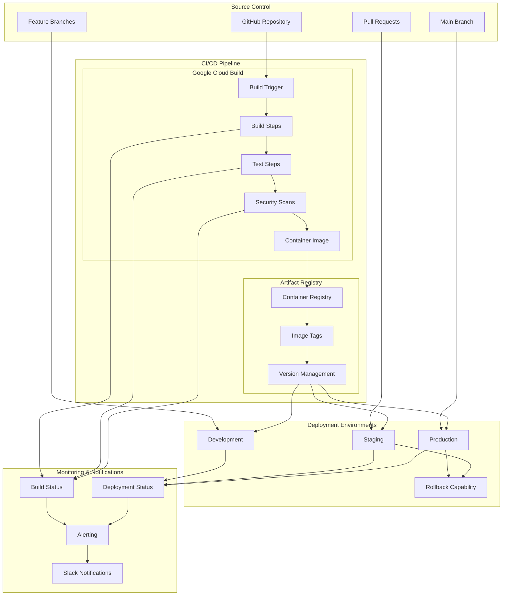

# CI/CD Pipeline with Google Cloud Build

## Overview

This document outlines a comprehensive CI/CD pipeline for Whysper Web2 using Google Cloud Build, GitHub integration, and automated deployment to Google Cloud Run.

## Pipeline Architecture



## Cloud Build Configuration

### Main Cloudbuild.yaml
```yaml
# cloudbuild.yaml - Main build configuration

steps:
  # Step 1: Setup and authenticate
  - name: 'gcr.io/cloud-builders/docker'
    id: 'docker-setup'
    waitFor: ['-']
    entrypoint: 'bash'
    args:
      - '-c'
      - |
        echo "🔧 Setting up Docker environment..."
        echo "Authenticated as $(gcloud auth list --filter=status:ACTIVE --format='value(account)')"

  # Step 2: Build frontend
  - name: 'node:18-alpine'
    id: 'build-frontend'
    waitFor: ['docker-setup']
    entrypoint: 'npm'
    args:
      - 'ci'
      - '--'
      - 'run'
      - 'build'
    dir: 'frontend'
    env:
      - 'NODE_ENV=production'
      - 'VITE_BACKEND_PORT=8080'

  # Step 3: Backend dependencies
  - name: 'python:3.9-slim'
    id: 'install-backend-deps'
    waitFor: ['docker-setup']
    entrypoint: 'pip'
    args:
      - 'install'
      - '--no-cache-dir'
      - '-r'
      - 'requirements.txt'
    dir: 'backend'

  # Step 4: Run backend tests
  - name: 'python:3.9-slim'
    id: 'backend-tests'
    waitFor: ['install-backend-deps']
    entrypoint: 'python'
    args:
      - '-m'
      - 'pytest'
      - 'tests/'
      - '--junitxml=test-results.xml'
      - '--cov=app'
      - '--cov-report=xml'
    dir: 'backend'
    env:
      - 'PYTHONPATH=/workspace/backend'

  # Step 5: Security scan on dependencies
  - name: 'python:3.9-slim'
    id: 'security-scan'
    waitFor: ['install-backend-deps']
    entrypoint: 'pip'
    args:
      - 'install'
      - 'safety'
      - 'bandit'
    dir: 'backend'
    script: |
      safety check -r requirements.txt --json --output safety-report.json || true
      bandit -r app/ -f json -o bandit-report.json || true

  # Step 6: Build container image
  - name: 'gcr.io/cloud-builders/docker'
    id: 'build-image'
    waitFor: ['build-frontend', 'backend-tests']
    entrypoint: 'docker'
    args:
      - 'build'
      - '-t'
      - 'gcr.io/$PROJECT_ID/whysper-web2:$BUILD_ID'
      - '-t'
      - 'gcr.io/$PROJECT_ID/whysper-web2:latest'
      - '--build-arg'
      - 'BUILDKIT_INLINE_CACHE=1'
      - '.'
    dir: '.'

  # Step 7: Container vulnerability scan
  - name: 'gcr.io/cloud-builders/gcloud'
    id: 'vulnerability-scan'
    waitFor: ['build-image']
    entrypoint: 'gcloud'
    args:
      - 'container'
      - 'images'
      - 'describe'
      - 'gcr.io/$PROJECT_ID/whysper-web2:$BUILD_ID'
      - '--format=json'
      - '--show-package-vulnerability'
    script: |
      gcloud beta container images get-vulnerability-scan-results \
        gcr.io/$PROJECT_ID/whysper-web2:$BUILD_ID \
        --format=json > vulnerability-scan.json

  # Step 8: Push to Artifact Registry
  - name: 'gcr.io/cloud-builders/docker'
    id: 'push-image'
    waitFor: ['vulnerability-scan']
    entrypoint: 'docker'
    args:
      - 'push'
      - 'gcr.io/$PROJECT_ID/whysper-web2:$BUILD_ID'
      - 'gcr.io/$PROJECT_ID/whysper-web2:latest'

  # Step 9: Deploy to development (if on dev branch)
  - name: 'gcr.io/cloud-builders/gcloud'
    id: 'deploy-dev'
    waitFor: ['push-image']
    entrypoint: 'gcloud'
    args:
      - 'run'
      - 'deploy'
      - 'whysper-web2-dev'
      - '--image'
      - 'gcr.io/$PROJECT_ID/whysper-web2:$BUILD_ID'
      - '--region'
      - 'us-central1'
      - '--set-secrets'
      - 'API_KEY=dev-openrouter-api-key:latest'
      - '--set-env-vars'
      - 'PORT=8080,HOST=0.0.0.0,PROVIDER=openrouter,LOG_LEVEL=DEBUG,DEBUG_LOGGING=true'
    condition:
      substitutions:
        - '_BRANCH'
      expression: '$_BRANCH == "develop"'

  # Step 10: Deploy to staging (if on main branch)
  - name: 'gcr.io/cloud-builders/gcloud'
    id: 'deploy-staging'
    waitFor: ['push-image']
    entrypoint: 'gcloud'
    args:
      - 'run'
      - 'deploy'
      - 'whysper-web2-staging'
      - '--image'
      - 'gcr.io/$PROJECT_ID/whysper-web2:$BUILD_ID'
      - '--region'
      - 'us-central1'
      - '--set-secrets'
      - 'API_KEY=staging-openrouter-api-key:latest'
      - '--set-env-vars'
      - 'PORT=8080,HOST=0.0.0.0,PROVIDER=openrouter,LOG_LEVEL=INFO,DEBUG_LOGGING=false'
    condition:
      substitutions:
        - '_BRANCH'
      expression: '$_BRANCH == "main"'

  # Step 11: Deploy to production (manual approval required)
  - name: 'gcr.io/cloud-builders/gcloud'
    id: 'deploy-prod'
    waitFor: ['push-image']
    entrypoint: 'gcloud'
    args:
      - 'run'
      - 'deploy'
      - 'whysper-web2'
      - '--image'
      - 'gcr.io/$PROJECT_ID/whysper-web2:$BUILD_ID'
      - '--region'
      - 'us-central1'
      - '--set-secrets'
      - 'API_KEY=prod-openrouter-api-key:latest'
      - '--set-env-vars'
      - 'PORT=8080,HOST=0.0.0.0,PROVIDER=openrouter,LOG_LEVEL=INFO,DEBUG_LOGGING=false'
    condition:
      substitutions:
        - '_BRANCH'
        - '_DEPLOY_PROD'
      expression: '$_BRANCH == "main" && $_DEPLOY_PROD == "true"'

# Build artifacts
artifacts:
  objects:
    - location: 'backend/test-results.xml'
      path: 'backend/test-results.xml'
    - location: 'backend/coverage.xml'
      path: 'backend/coverage.xml'
    - location: 'backend/safety-report.json'
      path: 'backend/safety-report.json'
    - location: 'backend/bandit-report.json'
      path: 'backend/bandit-report.json'
    - location: 'vulnerability-scan.json'
      path: 'vulnerability-scan.json'

# Substitutions
substitutions:
  _BUILD_ID: '$BUILD_ID'
  _BRANCH: '$BRANCH_NAME'
  _COMMIT_SHA: '$COMMIT_SHA'
  _DEPLOY_PROD: 'false'

# Build options
options:
  dynamicSubstitutions: true
  logging: CLOUD_LOGGING_ONLY
  machineType: 'E2_HIGHCPU_8'
  diskSizeGb: 100
  timeout: '1800s'

# Tags
tags:
  - 'whysper-web2'
  - 'ci-cd'
  - 'automated'
```

### Environment-Specific Build Configurations

#### Development Build Configuration
```yaml
# cloudbuild-dev.yaml

steps:
  # Use the main cloudbuild.yaml but with development overrides
  - name: 'gcr.io/cloud-builders/gcloud'
    id: 'deploy-dev'
    waitFor: ['push-image']
    entrypoint: 'gcloud'
    args:
      - 'run'
      - 'deploy'
      - 'whysper-web2-dev'
      - '--image'
      - 'gcr.io/$PROJECT_ID/whysper-web2:$BUILD_ID'
      - '--region'
      - 'us-central1'
      - '--set-secrets'
      - 'API_KEY=dev-openrouter-api-key:latest'
      - 'ACCESS_KEY=dev-app-access-key:latest'
      - '--set-env-vars'
      - 'PORT=8080,HOST=0.0.0.0,PROVIDER=openrouter,DEFAULT_MODEL=google/gemini-2.5-flash-preview-09-2025,STATIC_DIR=/app/static,LOG_LEVEL=DEBUG,DEBUG_LOGGING=true,ENABLE_STREAMING=true,SHOW_TOKEN_USAGE=true,MAX_TOKENS=10000,TEMPERATURE=0.7,AI_CONNECT_TIMEOUT=30,AI_READ_TIMEOUT=120'

substitutions:
  _ENVIRONMENT: 'development'
  _SERVICE_NAME: 'whysper-web2-dev'
  _DEPLOY_PROD: 'false'
```

#### Production Build Configuration
```yaml
# cloudbuild-prod.yaml

steps:
  # Production deployment with additional safety checks
  - name: 'gcr.io/cloud-builders/gcloud'
    id: 'deploy-prod'
    waitFor: ['push-image']
    entrypoint: 'gcloud'
    args:
      - 'run'
      - 'deploy'
      - 'whysper-web2'
      - '--image'
      - 'gcr.io/$PROJECT_ID/whysper-web2:$BUILD_ID'
      - '--region'
      - 'us-central1'
      - '--set-secrets'
      - 'API_KEY=prod-openrouter-api-key:latest'
      - 'ACCESS_KEY=prod-app-access-key:latest'
      - '--set-env-vars'
      - 'PORT=8080,HOST=0.0.0.0,PROVIDER=openrouter,DEFAULT_MODEL=google/gemini-2.5-flash-preview-09-2025,STATIC_DIR=/app/static,LOG_LEVEL=INFO,DEBUG_LOGGING=false,ENABLE_STREAMING=true,SHOW_TOKEN_USAGE=true,MAX_TOKENS=10000,TEMPERATURE=0.7,AI_CONNECT_TIMEOUT=30,AI_READ_TIMEOUT=120'
      - '--no-traffic'  # Deploy without traffic initially
      - '--tag'
      - 'production-$BUILD_ID'

  # Step: Gradual traffic migration
  - name: 'gcr.io/cloud-builders/gcloud'
    id: 'migrate-traffic'
    waitFor: ['deploy-prod']
    entrypoint: 'gcloud'
    args:
      - 'run'
      - 'services'
      - 'update-traffic'
      - 'whysper-web2'
      - '--region'
      - 'us-central1'
      - '--to-revisions'
      - 'whysper-web2=95,production-$BUILD_ID=5'

substitutions:
  _ENVIRONMENT: 'production'
  _SERVICE_NAME: 'whysper-web2'
  _DEPLOY_PROD: 'true'
```

## Build Triggers Configuration

### GitHub Integration Setup
```bash
#!/bin/bash
# setup-build-triggers.sh

PROJECT_ID="your-gcp-project-id"
REPO_NAME="whysper-web2"
REPO_OWNER="your-github-username"

echo "🔧 Setting up Cloud Build triggers..."

# Enable required APIs
gcloud services enable cloudbuild.googleapis.com --project=$PROJECT_ID
gcloud services enable sourcerepo.googleapis.com --project=$PROJECT_ID

# Connect GitHub repository
gcloud beta builds repositories connect github $REPO_OWNER/$REPO_NAME \
    --project=$PROJECT_ID

# Create trigger for development branch
gcloud beta builds triggers create github \
    --project=$PROJECT_ID \
    --repo-name=$REPO_NAME \
    --repo-owner=$REPO_OWNER \
    --branch-pattern="^develop$" \
    --build-config="cloudbuild-dev.yaml" \
    --description="Trigger for development branch" \
    --substitutions=_BRANCH=develop,_ENVIRONMENT=development

# Create trigger for main branch
gcloud beta builds triggers create github \
    --project=$PROJECT_ID \
    --repo-name=$REPO_NAME \
    --repo-owner=$REPO_OWNER \
    --branch-pattern="^main$" \
    --build-config="cloudbuild-prod.yaml" \
    --description="Trigger for main branch (staging)" \
    --substitutions=_BRANCH=main,_ENVIRONMENT=staging

# Create trigger for pull requests
gcloud beta builds triggers create github \
    --project=$PROJECT_ID \
    --repo-name=$REPO_NAME \
    --repo-owner=$REPO_OWNER \
    --pull-request-pattern=".*" \
    --build-config="cloudbuild.yaml" \
    --description="Trigger for pull requests" \
    --substitutions=_BRANCH=pr,_ENVIRONMENT=testing

echo "✅ Build triggers configured successfully!"
```

### Manual Production Deployment
```bash
#!/bin/bash
# deploy-production.sh

PROJECT_ID="your-gcp-project-id"
BUILD_ID=$(date +%Y%m%d-%H%M%S)

echo "🚀 Starting production deployment..."

# Trigger production build with manual approval
gcloud beta builds triggers run github-main-production \
    --project=$PROJECT_ID \
    --substitutions=_BUILD_ID=$BUILD_ID,_DEPLOY_PROD=true

echo "✅ Production deployment initiated!"
echo "📊 Monitor build at: https://console.cloud.google.com/cloud-build/builds"
```

## Quality Gates and Testing

### Automated Testing Pipeline
```yaml
# test-pipeline.yaml - Additional test steps

steps:
  # Frontend tests
  - name: 'node:18-alpine'
    id: 'frontend-tests'
    entrypoint: 'npm'
    args:
      - 'test'
      - '--'
      - '--coverage'
      - '--watchAll=false'
      - '--reporter=junit'
      - '--outputFile=test-results.xml'
    dir: 'frontend'
    env:
      - 'CI=true'

  # Frontend linting
  - name: 'node:18-alpine'
    id: 'frontend-lint'
    entrypoint: 'npm'
    args:
      - 'run'
      - 'lint'
      - '--'
      - '--format=json'
      - '--output-file=lint-results.json'
    dir: 'frontend'

  # Frontend type checking
  - name: 'node:18-alpine'
    id: 'frontend-types'
    entrypoint: 'npm'
    args:
      - 'run'
      - 'type-check'
    dir: 'frontend'

  # Backend formatting check
  - name: 'python:3.9-slim'
    id: 'backend-format'
    entrypoint: 'ruff'
    args:
      - 'check'
      - '--format=json'
      - 'backend/'
    dir: 'backend'

  # Backend type checking
  - name: 'python:3.9-slim'
    id: 'backend-types'
    entrypoint: 'mypy'
    args:
      - 'app/'
      - '--junit-xml'
      - '--tb=short'
    dir: 'backend'

  # Integration tests
  - name: 'gcr.io/cloud-builders/docker'
    id: 'integration-tests'
    entrypoint: 'docker'
    args:
      - 'run'
      - '--rm'
      - 'gcr.io/$PROJECT_ID/whysper-web2:$BUILD_ID'
      - 'python'
      - '-m'
      - 'pytest'
      - 'tests/integration/'
      - '--junitxml=integration-results.xml'
    env:
      - 'TEST_ENVIRONMENT=ci'
      - 'API_KEY=test-api-key'
      - 'PROVIDER=openrouter'
```

### Security Scanning Configuration
```yaml
# security-scan.yaml - Security scanning steps

steps:
  # Container image vulnerability scan
  - name: 'gcr.io/cloud-builders/gcloud'
    id: 'vulnerability-scan'
    entrypoint: 'gcloud'
    args:
      - 'beta'
      - 'container'
      - 'images'
      - 'vulnerability-scanning'
      - 'scan'
      - 'gcr.io/$PROJECT_ID/whysper-web2:$BUILD_ID'
      - '--format=json'
    script: |
      gcloud beta container images vulnerability-scanning scan-results \
        gcr.io/$PROJECT_ID/whysper-web2:$BUILD_ID \
        --format=json > vulnerability-results.json

  # Static application security testing
  - name: 'python:3.9-slim'
    id: 'sast-scan'
    entrypoint: 'bandit'
    args:
      - '-r'
      - 'app/'
      - '-f'
      - 'json'
      - '-o'
      - 'sast-results.json'
    dir: 'backend'

  # Dependency vulnerability scan
  - name: 'python:3.9-slim'
    id: 'dependency-scan'
    entrypoint: 'safety'
    args:
      - 'check'
      - '-r'
      - 'requirements.txt'
      '--json'
      '--output'
      - 'dependency-results.json'
    dir: 'backend'

  # Secret scanning
  - name: 'gcr.io/cloud-builders/gcloud'
    id: 'secret-scan'
    entrypoint: 'gcloud'
    args:
      - 'beta'
      - 'secrets'
      - 'scan'
      - '--file-pattern=**/*.py'
      '--exclude-pattern=**/test_*.py'
      '--verify-secrets'
    dir: 'backend'

# Security gate - fail build on critical vulnerabilities
- name: 'gcr.io/cloud-builders/gcloud'
    id: 'security-gate'
    entrypoint: 'bash'
    args:
      - '-c'
      - |
        echo "🔍 Checking security scan results..."
        
        # Check for critical vulnerabilities
        if [ "$(jq -r '.vulnerabilities[] | select(.severity == "CRITICAL") | length' vulnerability-results.json)" -gt 0 ]; then
          echo "❌ Critical vulnerabilities found. Build failed."
          exit 1
        fi
        
        # Check for high-severity SAST issues
        if [ "$(jq -r '.results[] | select(.issue_severity == "HIGH") | length' sast-results.json)" -gt 0 ]; then
          echo "❌ High-severity security issues found. Build failed."
          exit 1
        fi
        
        echo "✅ Security checks passed!"
```

## Deployment Strategies

### Blue-Green Deployment
```yaml
# blue-green-deploy.yaml

steps:
  # Deploy green version
  - name: 'gcr.io/cloud-builders/gcloud'
    id: 'deploy-green'
    entrypoint: 'gcloud'
    args:
      - 'run'
      - 'deploy'
      - 'whysper-web2-green'
      - '--image'
      - 'gcr.io/$PROJECT_ID/whysper-web2:$BUILD_ID'
      - '--region'
      - 'us-central1'
      - '--no-traffic'

  # Health check on green
  - name: 'gcr.io/cloud-builders/gcloud'
    id: 'health-check-green'
    waitFor: ['deploy-green']
    entrypoint: 'bash'
    args:
      - '-c'
      - |
        GREEN_URL=$(gcloud run services describe whysper-web2-green \
          --region=us-central1 \
          --format='value(status.url)')
        
        echo "🏥 Checking green deployment health..."
        for i in {1..30}; do
          if curl -f "$GREEN_URL/health"; then
            echo "✅ Green deployment is healthy"
            break
          fi
          echo "Attempt $i/30..."
          sleep 10
        done

  # Switch traffic to green
  - name: 'gcr.io/cloud-builders/gcloud'
    id: 'switch-traffic'
    waitFor: ['health-check-green']
    entrypoint: 'gcloud'
    args:
      - 'run'
      - 'services'
      - 'update-traffic'
      - 'whysper-web2'
      - '--region'
      - 'us-central1'
      - '--to-revisions'
      - 'whysper-web2-green=100'

  # Clean up blue deployment
  - name: 'gcr.io/cloud-builders/gcloud'
    id: 'cleanup-blue'
    waitFor: ['switch-traffic']
    entrypoint: 'gcloud'
    args:
      - 'run'
      - 'services'
      - 'delete'
      - 'whysper-web2-blue'
      - '--region'
      - 'us-central1'
      - '--quiet'
```

### Canary Deployment
```yaml
# canary-deploy.yaml

steps:
  # Deploy canary version
  - name: 'gcr.io/cloud-builders/gcloud'
    id: 'deploy-canary'
    entrypoint: 'gcloud'
    args:
      - 'run'
      - 'deploy'
      - 'whysper-web2'
      - '--image'
      - 'gcr.io/$PROJECT_ID/whysper-web2:$BUILD_ID'
      - '--region'
      - 'us-central1'
      - '--no-traffic'

  # Gradual traffic shift
  - name: 'gcr.io/cloud-builders/gcloud'
    id: 'shift-traffic-5'
    waitFor: ['deploy-canary']
    entrypoint: 'gcloud'
    args:
      - 'run'
      - 'services'
      - 'update-traffic'
      - 'whysper-web2'
      - '--region'
      - 'us-central1'
      - '--to-revisions'
      - 'whysper-web2=95,whysper-web2-canary=5'

  - name: 'gcr.io/cloud-builders/gcloud'
    id: 'shift-traffic-25'
    waitFor: ['shift-traffic-5']
    entrypoint: 'gcloud'
    args:
      - 'run'
      - 'services'
      - 'update-traffic'
      - 'whysper-web2'
      - '--region'
      - 'us-central1'
      - '--to-revisions'
      - 'whysper-web2=75,whysper-web2-canary=25'

  - name: 'gcr.io/cloud-builders/gcloud'
    id: 'shift-traffic-50'
    waitFor: ['shift-traffic-25']
    entrypoint: 'gcloud'
    args:
      - 'run'
      - 'services'
      - 'update-traffic'
      - 'whysper-web2'
      - '--region'
      - 'us-central1'
      - '--to-revisions'
      - 'whysper-web2=50,whysper-web2-canary=50'

  - name: 'gcr.io/cloud-builders/gcloud'
    id: 'shift-traffic-100'
    waitFor: ['shift-traffic-50']
    entrypoint: 'gcloud'
    args:
      - 'run'
      - 'services'
      - 'update-traffic'
      - 'whysper-web2'
      - '--region'
      - 'us-central1'
      - '--to-revisions'
      - 'whysper-web2-canary=100'
```

## Monitoring and Notifications

### Build Status Monitoring
```yaml
# build-monitoring.yaml

steps:
  # Post build status to Slack
  - name: 'gcr.io/cloud-builders/gcloud'
    id: 'notify-slack'
    entrypoint: 'bash'
    args:
      - '-c'
      - |
        if [ "$BUILD_STATUS" = "SUCCESS" ]; then
          COLOR="good"
          EMOJI="✅"
          MESSAGE="Build succeeded for branch $_BRANCH"
        else
          COLOR="danger"
          EMOJI="❌"
          MESSAGE="Build failed for branch $_BRANCH"
        fi
        
        curl -X POST -H 'Content-type: application/json' \
          -d "{\"text\":\"$EMOJI $MESSAGE\",\"color\":\"$COLOR\"}" \
          "$SLACK_WEBHOOK_URL"

  # Update GitHub commit status
  - name: 'gcr.io/cloud-builders/gcloud'
    id: 'github-status'
    entrypoint: 'bash'
    args:
      - '-c'
      - |
        if [ "$BUILD_STATUS" = "SUCCESS" ]; then
          STATE="success"
          DESCRIPTION="Build succeeded"
        else
          STATE="failure"
          DESCRIPTION="Build failed"
        fi
        
        curl -X POST \
          -H "Authorization: token $GITHUB_TOKEN" \
          -H "Accept: application/vnd.github.v3+json" \
          -d "{\"state\":\"$STATE\",\"description\":\"$DESCRIPTION\",\"context\":\"cloud-build\"}" \
          "https://api.github.com/repos/$REPO_OWNER/$REPO_NAME/statuses/$_COMMIT_SHA"
```

### Performance Monitoring
```yaml
# performance-monitoring.yaml

steps:
  # Deploy performance test environment
  - name: 'gcr.io/cloud-builders/gcloud'
    id: 'deploy-perf-test'
    entrypoint: 'gcloud'
    args:
      - 'run'
      - 'deploy'
      - 'whysper-web2-perf'
      - '--image'
      - 'gcr.io/$PROJECT_ID/whysper-web2:$BUILD_ID'
      - '--region'
      - 'us-central1'

  # Run performance tests
  - name: 'gcr.io/cloud-builders/k6'
    id: 'performance-tests'
    waitFor: ['deploy-perf-test']
    entrypoint: 'k6'
    args:
      - 'run'
      - '--out=json'
      - 'tests/performance/load-test.js'
      - '--env'
      - 'BASE_URL=$(gcloud run services describe whysper-web2-perf --region=us-central1 --format='value(status.url)')'
    script: |
      # Performance test logic here

  # Compare performance against baseline
  - name: 'gcr.io/cloud-builders/gcloud'
    id: 'performance-comparison'
    waitFor: ['performance-tests']
    entrypoint: 'bash'
    args:
      - '-c'
      - |
        echo "📊 Analyzing performance results..."
        # Compare with baseline metrics
        # Fail if performance degrades significantly
```

## Rollback Procedures

### Automated Rollback
```yaml
# rollback.yaml

steps:
  # Identify last healthy revision
  - name: 'gcr.io/cloud-builders/gcloud'
    id: 'find-healthy-revision'
    entrypoint: 'gcloud'
    args:
      - 'run'
      - 'services'
      - 'list-traffic'
      - 'whysper-web2'
      - '--region'
      - 'us-central1'
      - '--format=json'
    script: |
      HEALTHY_REVISION=$(jq -r '.traffic[] | select(.percent > 0) | sort_by(.percent) | reverse | .[0].revisionName' traffic-info.json)
      echo "Found healthy revision: $HEALTHY_REVISION"

  # Rollback to healthy revision
  - name: 'gcr.io/cloud-builders/gcloud'
    id: 'execute-rollback'
    waitFor: ['find-healthy-revision']
    entrypoint: 'gcloud'
    args:
      - 'run'
      - 'services'
      - 'update-traffic'
      - 'whysper-web2'
      - '--region'
      - 'us-central1'
      - '--to-revisions'
      - "$HEALTHY_REVISION=100"

  # Notify rollback
  - name: 'gcr.io/cloud-builders/gcloud'
    id: 'notify-rollback'
    waitFor: ['execute-rollback']
    entrypoint: 'bash'
    args:
      - '-c'
      - |
        curl -X POST -H 'Content-type: application/json' \
          -d "{\"text\":\"🔄 Rollback executed to $HEALTHY_REVISION\",\"color\":\"warning\"}" \
          "$SLACK_WEBHOOK_URL"
```

### Manual Rollback Script
```bash
#!/bin/bash
# manual-rollback.sh

PROJECT_ID="your-gcp-project-id"
SERVICE_NAME="whysper-web2"
REGION="us-central1"

echo "🔄 Manual rollback procedure..."

# List available revisions
echo "Available revisions:"
gcloud run services revisions list $SERVICE_NAME \
    --project=$PROJECT_ID \
    --region=$REGION \
    --format='table(revisionName,createTime,status)'

# Prompt for revision selection
read -p "Enter revision to rollback to: " REVISION

# Execute rollback
gcloud run services update-traffic $SERVICE_NAME \
    --project=$PROJECT_ID \
    --region=$REGION \
    --to-revisions "$REVISION=100"

echo "✅ Rollback to $REVISION completed!"
```

## Best Practices

### CI/CD Best Practices
1. **Fast builds** with proper caching
2. **Parallel execution** where possible
3. **Fail fast** on errors
4. **Comprehensive testing** at multiple levels
5. **Security scanning** for all artifacts
6. **Gradual deployments** with monitoring
7. **Automated rollbacks** on failure
8. **Clear documentation** for all processes

### Build Optimization
1. **Layer caching** for Docker builds
2. **Dependency caching** for faster installs
3. **Parallel test execution**
4. **Artifact reuse** between steps
5. **Resource optimization** for build machines

### Security Considerations
1. **Secret management** with proper access controls
2. **Vulnerability scanning** for all images
3. **Code scanning** for security issues
4. **Access logging** for all operations
5. **Approval workflows** for production changes

This comprehensive CI/CD pipeline ensures reliable, secure, and automated deployment of the Whysper Web2 application across all environments.