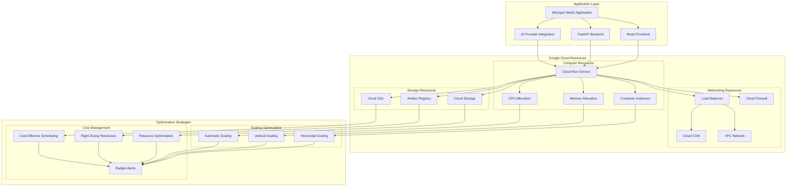

# Cost Optimization and Scaling Recommendations

## Overview

This document provides comprehensive cost optimization and scaling recommendations for Whysper Web2 deployment on Google Cloud Platform, ensuring efficient resource utilization and predictable cost management.

## Cost Optimization Architecture



## Cloud Run Cost Optimization

### Container Resource Allocation

#### Optimal Configuration
```yaml
# cloud-run-config.yaml - Optimized Cloud Run configuration

apiVersion: serving.knative.dev/v1
kind: Service
metadata:
  name: whysper-web2
  annotations:
    run.googleapis.com/ingress: all
    run.googleapis.com/execution-environment: gen2
    run.googleapis.com/cpu-throttling: "false"
    autoscaling.knative.dev/minScale: "0"
    autoscaling.knative.dev/maxScale: "100"
spec:
  template:
    metadata:
      annotations:
        run.googleapis.com/execution-environment: gen2
        run.googleapis.com/cpu-boost: "true"
    spec:
      containerConcurrency: 80
      timeoutSeconds: 300
      containers:
      - image: gcr.io/your-project-id/whysper-web2:latest
        resources:
          limits:
            cpu: "2000m"  # 2 vCPUs
            memory: "4Gi"     # 4GB RAM
          requests:
            cpu: "1000m"  # 1 vCPU baseline
            memory: "2Gi"     # 2GB baseline
        env:
        - name: PORT
          value: "8080"
        - name: HOST
          value: "0.0.0.0"
        - name: PROVIDER
          value: "openrouter"
        - name: DEFAULT_MODEL
          value: "google/gemini-2.5-flash-preview-09-2025"
        - name: MAX_TOKENS
          value: "10000"
        - name: TEMPERATURE
          value: "0.7"
        - name: AI_CONNECT_TIMEOUT
          value: "30"
        - name: AI_READ_TIMEOUT
          value: "120"
        - name: ENABLE_STREAMING
          value: "true"
        - name: LOG_LEVEL
          value: "INFO"
        - name: STATIC_DIR
          value: "/app/static"
```

#### Cost-Effective Scaling Settings
```yaml
# scaling-configuration.yaml

# Autoscaling configuration
autoscaling:
  minInstances: 0        # Scale to zero when not in use
  maxInstances: 100       # Maximum concurrent instances
  target:                # Scaling target
    cpuUtilization: 60      # Target 60% CPU utilization
    memoryUtilization: 70   # Target 70% memory utilization
  
# Instance classes for different load patterns
instanceClasses:
  - name: low-traffic
    cpu: "1000m"
    memory: "2Gi"
    maxConcurrency: 80
  
  - name: medium-traffic
    cpu: "2000m"
    memory: "4Gi"
    maxConcurrency: 60
  
  - name: high-traffic
    cpu: "4000m"
    memory: "8Gi"
    maxConcurrency: 40
```

#### Performance Optimization
```bash
#!/bin/bash
# optimize-cloud-run.sh - Cloud Run optimization

PROJECT_ID="your-gcp-project-id"
SERVICE_NAME="whysper-web2"

echo "🔧 Optimizing Cloud Run service configuration..."

# Analyze current performance
echo "📊 Analyzing current performance metrics..."

# Get current instance count
CURRENT_INSTANCES=$(gcloud run services describe $SERVICE_NAME \
    --project=$PROJECT_ID \
    --format='value(spec.template.spec.replicas)' 2>/dev/null)

# Get average CPU/memory usage
AVG_CPU=$(gcloud monitoring metrics list \
    --project=$PROJECT_ID \
    --filter='metric.type="run.googleapis.com/container/cpu/utilizations"' \
    --format='value(value.double)' \
    --period=24h | awk '{sum+=$1; count++} END {print $1/count}')

AVG_MEMORY=$(gcloud monitoring metrics list \
    --project=$PROJECT_ID \
    --filter='metric.type="run.googleapis.com/container/memory/utilizations"' \
    --format='value(value.double)' \
    --period=24h | awk '{sum+=$1; count++} END {print $1/count}')

echo "Current instances: $CURRENT_INSTANCES"
echo "Average CPU utilization: ${AVG_CPU}%"
echo "Average memory utilization: ${AVG_MEMORY}%"

# Optimization recommendations
if [ "$AVG_CPU" -lt 30 ]; then
    echo "💡 Recommendation: CPU utilization is low, consider reducing min instances"
    echo "💡 Suggested min instances: 0-2"
fi

if [ "$AVG_MEMORY" -lt 50 ]; then
    echo "💡 Recommendation: Memory utilization is low, consider reducing min instances"
    echo "💡 Suggested min instances: 0-2"
fi

if [ "$CURRENT_INSTANCES" -gt 5 ]; then
    echo "💡 Recommendation: High instance count detected, consider implementing request queuing"
    echo "💡 Suggested max instances: 50"
fi

# Apply optimizations
echo "🔧 Applying optimizations..."

# Set appropriate concurrency based on usage
if [ "$AVG_CPU" -gt 60 ]; then
    echo "Setting lower concurrency for CPU-bound workload..."
    gcloud run services update $SERVICE_NAME \
        --project=$PROJECT_ID \
        --concurrency=40
elif [ "$AVG_MEMORY" -gt 70 ]; then
    echo "Setting lower concurrency for memory-bound workload..."
    gcloud run services update $SERVICE_NAME \
        --project=$PROJECT_ID \
        --concurrency=40
fi

echo "✅ Cloud Run optimization completed!"
```

### Memory and CPU Optimization

#### Container Resource Efficiency
```python
# resource_optimizer.py - Container resource optimization

import psutil
import time
import logging
from typing import Dict, List, Tuple

class ContainerOptimizer:
    """Container resource optimization recommendations"""
    
    def __init__(self):
        self.start_time = time.time()
        self.metrics_history = []
    
    def analyze_resource_usage(self, duration: int = 300) -> Dict[str, float]:
        """Analyze resource usage over time period"""
        metrics = []
        
        # Collect metrics every 30 seconds
        end_time = time.time() + duration
        while time.time() < end_time:
            cpu_percent = psutil.cpu_percent(interval=1)
            memory_mb = psutil.virtual_memory().used / (1024 * 1024)
            
            metrics.append({
                'timestamp': time.time(),
                'cpu_percent': cpu_percent,
                'memory_mb': memory_mb
            })
            
            time.sleep(30)
        
        self.metrics_history.extend(metrics)
        return self.analyze_metrics(metrics)
    
    def analyze_metrics(self, metrics: List[Dict]) -> Dict[str, float]:
        """Analyze collected metrics and provide recommendations"""
        if not metrics:
            return {}
        
        # Calculate averages
        avg_cpu = sum(m['cpu_percent'] for m in metrics) / len(metrics)
        avg_memory = sum(m['memory_mb'] for m in metrics) / len(metrics)
        
        # Peak usage
        peak_cpu = max(m['cpu_percent'] for m in metrics)
        peak_memory = max(m['memory_mb'] for m in metrics)
        
        recommendations = []
        
        # CPU optimization
        if avg_cpu > 80:
            recommendations.append("High CPU utilization detected. Consider optimizing algorithms or increasing CPU allocation.")
        elif avg_cpu < 20:
            recommendations.append("Low CPU utilization. Consider reducing CPU allocation to save costs.")
        
        # Memory optimization
        if avg_memory > 3000:  # > 3GB
            recommendations.append("High memory usage detected. Consider implementing memory optimization or increasing memory allocation.")
        elif avg_memory < 512:  # < 512MB
            recommendations.append("Low memory usage. Consider reducing memory allocation to save costs.")
        
        # Concurrency optimization
        if peak_cpu > 90:
            recommendations.append("CPU spikes detected. Consider implementing request queuing or rate limiting.")
        
        return {
            'avg_cpu_percent': avg_cpu,
            'avg_memory_mb': avg_memory,
            'peak_cpu_percent': peak_cpu,
            'peak_memory_mb': peak_memory,
            'recommendations': recommendations
        }
    
    def get_optimal_configuration(self, analysis: Dict[str, float]) -> Dict[str, str]:
        """Get optimal configuration based on analysis"""
        config = {}
        
        # CPU allocation
        if analysis['avg_cpu_percent'] > 70:
            config['cpu'] = "2000m"  # High CPU
        elif analysis['avg_cpu_percent'] > 40:
            config['cpu'] = "1500m"  # Medium CPU
        else:
            config['cpu'] = "1000m"  # Low CPU
        
        # Memory allocation
        if analysis['avg_memory_mb'] > 2048:  # > 2GB
            config['memory'] = "4Gi"  # High memory
        elif analysis['avg_memory_mb'] > 1024:  # > 1GB
            config['memory'] = "2Gi"  # Medium memory
        else:
            config['memory'] = "1Gi"  # Low memory
        
        # Concurrency
        if analysis['peak_cpu_percent'] > 85:
            config['concurrency'] = "40"  # Lower concurrency for CPU spikes
        else:
            config['concurrency'] = "80"  # Standard concurrency
        
        return config

# Usage example
optimizer = ContainerOptimizer()
analysis = optimizer.analyze_resource_usage(duration=3600)  # 1 hour analysis
optimal_config = optimizer.get_optimal_configuration(analysis)

print("Optimal Configuration:")
for key, value in optimal_config.items():
    print(f"  {key}: {value}")
```

## Storage Cost Optimization

### Cloud Storage Optimization
```bash
#!/bin/bash
# optimize-storage.sh - Cloud Storage cost optimization

PROJECT_ID="your-gcp-project-id"

echo "💾 Optimizing Cloud Storage costs..."

# Analyze current storage usage
echo "📊 Analyzing storage usage..."

# Get bucket sizes
BUCKETS=(
    "whysper-data"
    "whysper-backups"
    "whysper-logs"
    "whysper-artifacts"
)

for bucket in "${BUCKETS[@]}"; do
    echo "Analyzing bucket: $bucket"
    
    # Get bucket size
    SIZE_BYTES=$(gsutil du -s gs://$bucket | awk '{sum+=$1} END {print $1}')
    SIZE_GB=$((SIZE_BYTES / 1024 / 1024 / 1024))
    
    echo "  Size: ${SIZE_GB}GB"
    
    # Get object count
    OBJECT_COUNT=$(gsutil ls gs://$bucket | wc -l)
    echo "  Objects: $OBJECT_COUNT"
    
    # Analyze storage class
    STORAGE_CLASS=$(gsutil bucketpolicy get gs://$bucket | jq -r '.bindings[].condition.role=="roles/storage.objectViewer" | jq -r '.[].condition.condition.storageClass')
    echo "  Storage Class: $STORAGE_CLASS"
done

# Optimization recommendations
echo "💡 Storage Optimization Recommendations:"

# Check for lifecycle policies
for bucket in "${BUCKETS[@]}"; do
    LIFECYCLE_SET=$(gsutil lifecycle get gs://$bucket 2>/dev/null)
    if [[ -z "$LIFECYCLE_SET" ]]; then
        echo "  ⚠️  No lifecycle policy for $bucket - recommend setting up automatic cleanup"
        echo "  💡 Suggest: Set 30-day retention for non-critical data"
    fi
done

# Check for appropriate storage classes
echo "💡 Storage Class Recommendations:"
echo "  - Use STANDARD for frequently accessed data"
echo "  - Use COLDLINE for infrequently accessed data (cost savings)"
echo "  - Use ARCHIVE for long-term retention (lowest cost)"

# Implement cost-saving measures
echo "🔧 Implementing cost-saving measures..."

# Set up bucket lifecycle for automatic cleanup
gsutil lifecycle set on gs://whysper-data \
    --json '{
        "rule": [
            {
                "action": {"type": "Delete"},
                "condition": {"age": 90, "storageClass": ["STANDARD"]},
                "storageClass": "COLDLINE"
            },
            {
                "action": {"type": "SetStorageClass"},
                "condition": {"age": 30, "storageClass": ["STANDARD"]},
                "storageClass": "COLDLINE"
            }
        ]
    }'

echo "✅ Storage optimization completed!"
```

## Database Cost Optimization

### Cloud SQL Optimization
```yaml
# sql-optimization.yaml - Optimized Cloud SQL configuration

apiVersion: sql.cnrm.cloud.google.com/v1
kind: SQLInstance
metadata:
  name: whysper-db
spec:
  databaseVersion: POSTGRES_14
  region: us-central1
  settings:
    tier: db-custom-4-16384  # Cost-effective custom tier
    diskSize: 100  # 100GB SSD
    diskType: PD_SSD
    storageAutoResize:
      enabled: true
      storageSizeLimit: 1000  # 1TB maximum
      increaseStep: 10  # 10GB increments
    ipConfiguration:
      ipv4Enabled: true
      privateNetwork: true
      requireSsl: true
    backupConfiguration:
      enabled: true
      startTime: "02:00"  # Off-peak hours
      location: us  # Multi-region backup
      retainedBackupsCount: 30  # Keep 30 backups
      transactionLogRetentionDays: 7  # Keep transaction logs for 1 week
    flags:
      - log_statement_timeout  # Log slow queries
      - log_min_error_statement  # Log slow queries
      - log_checkpoints  # Enable point-in-time recovery
      - log_disconnections  # Log connection drops
      - log_lock_waits  # Log lock waits
```

### Database Performance Optimization
```python
# db_optimizer.py - Database performance optimization

import time
import logging
from typing import Dict, List, Any

class DatabaseOptimizer:
    """Database performance optimization recommendations"""
    
    def __init__(self):
        self.start_time = time.time()
    
    def analyze_query_performance(self, slow_query_threshold: float = 1.0) -> Dict[str, Any]:
        """Analyze database query performance"""
        # This would connect to your database and analyze slow queries
        # Implementation depends on your database system
        
        recommendations = []
        
        # Example analysis logic
        if slow_query_threshold > 0.5:
            recommendations.append("Consider adding indexes for frequently queried columns")
            recommendations.append("Optimize complex queries with EXPLAIN ANALYZE")
            recommendations.append("Consider query result caching")
        
        return {
            'slow_query_threshold': slow_query_threshold,
            'recommendations': recommendations
        }
    
    def optimize_connection_pooling(self, max_connections: int = 100, 
                           current_connections: int = 50) -> Dict[str, Any]:
        """Optimize database connection pooling"""
        recommendations = []
        
        if current_connections < max_connections * 0.8:
            recommendations.append("Consider increasing max_connections for better resource utilization")
        
        if max_connections > current_connections * 2:
            recommendations.append("Consider reducing max_connections to save costs")
        
        return {
            'max_connections': max_connections,
            'current_connections': current_connections,
            'recommendations': recommendations
        }

# Usage example
optimizer = DatabaseOptimizer()
query_analysis = optimizer.analyze_query_performance(slow_query_threshold=0.8)
pool_analysis = optimizer.optimize_connection_pooling(max_connections=100, current_connections=60)

print("Database Optimization Analysis:")
print("Query Performance:", query_analysis)
print("Connection Pooling:", pool_analysis)
```

## Networking Cost Optimization

### Network Configuration Optimization
```yaml
# networking-optimization.yaml

# VPC configuration for cost optimization
network:
  name: whysper-vpc
  autoCreateSubnetworks: false  # Control subnet creation
  routingMode: REGIONAL  # Use regional routing
  mtu: 1460  # Optimize for performance
  
# Cloud Router configuration
routers:
  - name: whysper-router
    region: us-central1
    network: whysper-vpc
    nats:
      - ipRange: 10.0.1.0/24
        name: whysper-subnet
        description: "Primary subnet for Cloud Run services"
  
# Load balancer optimization
loadBalancing:
  - type: EXTERNAL_HTTP_LOAD_BALANCING
    sessionAffinity: NONE  # Cost-effective option
    timeoutSec: 30
    connectionDraining:
      drainingTimeoutSec: 300
```

### CDN Configuration
```yaml
# cdn-optimization.yaml

# Cloud CDN configuration for cost optimization
cdn:
  enabled: true
  cacheMode: CACHE_ALL_STATIC  # Cache all static content
  defaultTtl: 3600  # 1 hour cache
  maxTtl: 86400     # 24 hour cache
  compress: true  # Enable compression
  cacheKeyPolicy: "USE_ORIGIN_HEADERS"  # Optimize caching
  
# Bypass cache for dynamic content
bypassCacheOn:
  - contentType: "application/json"
  - pathPrefix: "/api/"
  - protocol: "https"
```

## Budget Management and Cost Control

### Budget Configuration
```yaml
# budget-config.yaml

apiVersion: billing.cnrm.cloud.google.com/v1
kind: BillingBudget
metadata:
  displayName: "Whysper Web2 Monthly Budget"
  budgetFilter: "projects/your-gcp-project-id"
spec:
  budgetAmount: 1000.00  # $1000/month budget
  currencyCode: USD
  displayFormat: CURRENCY_CODE
  thresholdRules:
    - thresholdPercent: 50.0  # Alert at 50% of budget
      spendBasis: CURRENT_SPEND
    - thresholdPercent: 90.0  # Alert at 90% of budget
      spendBasis: FORECASTED_SPEND
    - thresholdPercent: 100.0  # Alert at 100% of budget
      spendBasis: CURRENT_SPEND
  allUpdatesRule:
    pubsubTopic: projects/your-gcp-project-id/topics/budget-alerts
    schemaVersion: 1.0
    monitoringNotificationChannels:
      - projects/your-gcp-project-id/notificationChannels/1234567890123456789
```

### Cost Monitoring Script
```bash
#!/bin/bash
# cost-monitor.sh - Cost monitoring and alerting

PROJECT_ID="your-gcp-project-id"
BUDGET_AMOUNT=${1:-1000.00}
ALERT_THRESHOLD=${2:-0.8}  # 80% of budget

echo "💰 Monitoring costs for project: $PROJECT_ID"

# Get current month's cost
CURRENT_COST=$(gcloud billing accounts get-billing-info \
    --project=$PROJECT_ID \
    --format='json' | jq -r '.currencyCode + " " + (.totalAmount // 100) + " USD"')

echo "Current month cost: $CURRENT_COST"

# Calculate budget percentage
BUDGET_PERCENT=$(echo "scale=2; $BUDGET_AMOUNT * $CURRENT_COST / 100" | bc -l)

echo "Budget utilization: ${BUDGET_PERCENT}%"

# Check if alert threshold exceeded
if (( $(echo "$BUDGET_PERCENT > $ALERT_THRESHOLD" | bc -l) )); then
    echo "🚨 ALERT: Budget utilization ${BUDGET_PERCENT}% exceeds threshold ${ALERT_THRESHOLD}%"
    
    # Send alert notification
    ./send-budget-alert.sh "Budget Alert" \
        "Budget utilization is ${BUDGET_PERCENT}% (threshold: ${ALERT_THRESHOLD}%)" \
        "Current cost: $CURRENT_COST" \
        "Budget amount: $BUDGET_AMOUNT"
else
    echo "✅ Budget utilization is within acceptable limits: ${BUDGET_PERCENT}%"
fi

echo "✅ Cost monitoring completed!"
```

## Performance Monitoring and Cost Analysis

### Resource Utilization Dashboard
```json
{
  "dashboard": {
    "title": "Whysper Web2 - Cost & Performance Dashboard",
    "panels": [
      {
        "title": "Cost Overview",
        "type": "stat",
        "targets": [
          {
            "expr": "gcp billing amount",
            "legendFormat": "Monthly Cost (${{currency}})"
          },
          {
            "expr": "gcp billing amount / 30",
            "legendFormat": "Daily Cost (${{currency}})"
          }
        ],
        "yAxes": [
          {
            "label": "Date",
            "format": "YYYY-MM"
          }
        ]
      },
      {
        "title": "Resource Utilization",
        "type": "graph",
        "targets": [
          {
            "expr": "avg(rate(cloud_run_revision_request_count[5m]))",
            "legendFormat": "Requests/sec"
          },
          {
            "expr": "avg(rate(cloud_run_revision_cpu_utilizations[5m]))",
            "legendFormat": "CPU %"
          },
          {
            "expr": "avg(rate(cloud_run_revision_memory_utilizations[5m]))",
            "legendFormat": "Memory %"
          }
        ],
        "yAxes": [
          {
            "label": "Utilization",
            "min": 0,
            "max": 100
          }
        ]
      },
      {
        "title": "Performance Metrics",
        "type": "heatmap",
        "targets": [
          {
            "expr": "histogram_quantile(0.95, rate(cloud_run_revision_request_latencies_bucket[5m]))",
            "legendFormat": "P95 Latency (ms)"
          }
        ],
        "yAxes": [
          {
            "label": "Latency (ms)",
            "min": 0,
            "max": 5000
          }
        ]
      }
    ]
  }
}
```

## Best Practices

### Cost Optimization Strategies

1. **Right-Sizing Resources**
   - Monitor actual usage vs allocated resources
   - Use smaller instance types for development
   - Implement auto-scaling for variable workloads
   - Regular review of resource allocation

2. **Storage Optimization**
   - Use appropriate storage classes (STANDARD, COLDLINE, ARCHIVE)
   - Implement lifecycle policies for automatic cleanup
   - Compress static assets before storage
   - Use CDN caching effectively

3. **Network Optimization**
   - Use regional services when possible
   - Optimize VPC routing
   - Use efficient load balancing configurations
   - Monitor data transfer costs

4. **Database Optimization**
   - Choose appropriate instance tiers
   - Implement connection pooling
   - Optimize queries and indexes
   - Use read replicas for read-heavy workloads

5. **Monitoring and Alerting**
   - Set up budget alerts
   - Monitor resource utilization trends
   - Implement cost anomaly detection
   - Regular cost reviews and optimization

### Automation Opportunities

1. **Scheduled Resource Management**
   - Auto-scale down during off-peak hours
   - Schedule regular cleanup of unused resources
   - Automate backup and retention policies
   - Implement scheduled performance optimization

2. **Cost-Effective Deployment**
   - Use spot instances for non-critical workloads
   - Implement serverless architectures where appropriate
   - Use preemptible instances for fault-tolerant workloads
   - Optimize for regional deployment patterns

3. **Continuous Improvement**
   - Regular performance testing and optimization
   - Cost-benefit analysis for new features
   - Keep up-to-date with Google Cloud best practices
   - Share cost insights with development team

This comprehensive cost optimization and scaling guide ensures efficient resource utilization and predictable cost management for the Whysper Web2 application.