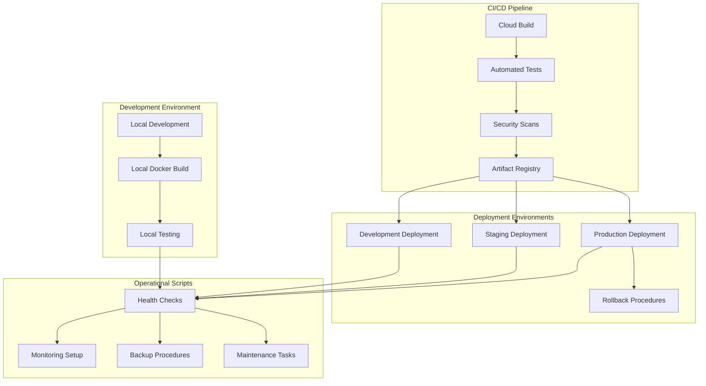

# Deployment Scripts and Documentation

## Overview

This document provides comprehensive deployment scripts and documentation for deploying Whysper Web2 to Google Cloud Platform, including automated setup, validation, and operational procedures.

## Script Architecture



## Setup Scripts

### Initial Project Setup
```bash
#!/bin/bash
# setup-project.sh - Initial Google Cloud project setup

set -e  # Exit on any error

PROJECT_ID="your-gcp-project-id"
PROJECT_NAME="Whysper Web2"
ORGANIZATION="your-organization"

echo "🚀 Setting up Google Cloud project for $PROJECT_NAME..."

# Check if gcloud is installed
if ! command -v gcloud &> /dev/null; then
    echo "❌ Google Cloud SDK (gcloud) is not installed."
    echo "Please install it first: https://cloud.google.com/sdk/docs/install"
    exit 1
fi

# Authenticate with Google Cloud
echo "🔐 Authenticating with Google Cloud..."
gcloud auth login --project=$PROJECT_ID

# Set project configuration
gcloud config set project $PROJECT_ID

# Enable required APIs
echo "📋 Enabling required Google Cloud APIs..."
REQUIRED_APIS=(
    "run.googleapis.com"
    "cloudbuild.googleapis.com"
    "artifactregistry.googleapis.com"
    "secretmanager.googleapis.com"
    "logging.googleapis.com"
    "monitoring.googleapis.com"
    "sql-component.googleapis.com"
    "storage-component.googleapis.com"
    "dns.googleapis.com"
    "iam.googleapis.com"
    "containerregistry.googleapis.com"
)

for api in "${REQUIRED_APIS[@]}"; do
    echo "Enabling $api..."
    gcloud services enable $api --project=$PROJECT_ID
    if [ $? -eq 0 ]; then
        echo "✅ $api enabled successfully"
    else
        echo "❌ Failed to enable $api"
        exit 1
    fi
done

echo "✅ All required APIs enabled successfully!"

# Create service accounts
echo "👤 Creating service accounts..."
./create-service-accounts.sh $PROJECT_ID

# Set up billing
echo "💳 Setting up billing..."
gcloud billing projects link $PROJECT_ID --account-id=BILLING_ACCOUNT_ID

echo "✅ Project setup completed successfully!"
echo "📊 Next steps:"
echo "1. Configure environment variables in .env files"
echo "2. Run deployment scripts for your target environment"
echo "3. Configure CI/CD pipeline if using GitHub"
echo "4. Set up monitoring and alerting"
```

### Service Account Creation Script
```bash
#!/bin/bash
# create-service-accounts.sh - Service account creation and configuration

PROJECT_ID=$1

set -e

echo "👤 Creating service accounts for project: $PROJECT_ID"

# Cloud Build service account
gcloud iam service-accounts create whysper-build-sa \
    --project=$PROJECT_ID \
    --display-name="Whysper Build Service Account" \
    --description="Service account for Cloud Build operations"

# Cloud Run service account
gcloud iam service-accounts create whysper-web2-sa \
    --project=$PROJECT_ID \
    --display-name="Whysper Web2 Service Account" \
    --description="Service account for Cloud Run service"

# Database service account (if needed)
gcloud iam service-accounts create whysper-db-sa \
    --project=$PROJECT_ID \
    --display-name="Whysper Database Service Account" \
    --description="Service account for Cloud SQL operations"

# Grant roles to service accounts
echo "🔑 Granting IAM roles..."

# Cloud Build roles
gcloud projects add-iam-policy-binding $PROJECT_ID \
    --member="serviceAccount:whysper-build-sa@$PROJECT_ID.iam.gserviceaccount.com" \
    --role="roles/cloudbuild.buildsEditor"

gcloud projects add-iam-policy-binding $PROJECT_ID \
    --member="serviceAccount:whysper-build-sa@$PROJECT_ID.iam.gserviceaccount.com" \
    --role="roles/artifactregistry.writer"

gcloud projects add-iam-policy-binding $PROJECT_ID \
    --member="serviceAccount:whysper-build-sa@$PROJECT_ID.iam.gserviceaccount.com" \
    --role="roles/iam.serviceAccountUser"

# Cloud Run roles
gcloud projects add-iam-policy-binding $PROJECT_ID \
    --member="serviceAccount:whysper-web2-sa@$PROJECT_ID.iam.gserviceaccount.com" \
    --role="roles/run.admin"

gcloud projects add-iam-policy-binding $PROJECT_ID \
    --member="serviceAccount:whysper-web2-sa@$PROJECT_ID.iam.gserviceaccount.com" \
    --role="roles/secretmanager.secretAccessor"

gcloud projects add-iam-policy-binding $PROJECT_ID \
    --member="serviceAccount:whysper-web2-sa@$PROJECT_ID.iam.gserviceaccount.com" \
    --role="roles/logging.logWriter"

gcloud projects add-iam-policy-binding $PROJECT_ID \
    --member="serviceAccount:whysper-web2-sa@$PROJECT_ID.iam.gserviceaccount.com" \
    --role="roles/monitoring.metricWriter"

# Database roles (if needed)
gcloud projects add-iam-policy-binding $PROJECT_ID \
    --member="serviceAccount:whysper-db-sa@$PROJECT_ID.iam.gserviceaccount.com" \
    --role="roles/cloudsql.client"

echo "✅ Service accounts created and configured successfully!"

# Create and download service account keys
echo "🔑 Creating service account keys..."

mkdir -p keys

# Build service account key
gcloud iam service-accounts keys create whysper-build-sa \
    --project=$PROJECT_ID \
    --key-file=keys/whysper-build-sa-key.json

# Web2 service account key
gcloud iam service-accounts keys create whysper-web2-sa \
    --project=$PROJECT_ID \
    --key-file=keys/whysper-web2-sa-key.json

# Database service account key (if needed)
gcloud iam service-accounts keys create whysper-db-sa \
    --project=$PROJECT_ID \
    --key-file=keys/whysper-db-sa-key.json

echo "✅ Service account keys created in keys/ directory!"
echo "🔐 Keep these keys secure and never commit them to version control!"
```

### Environment Configuration Script
```bash
#!/bin/bash
# configure-environment.sh - Environment setup and configuration

ENVIRONMENT=$1
PROJECT_ID=$2

set -e

echo "🌍 Configuring $ENVIRONMENT environment for project: $PROJECT_ID"

# Validate environment parameter
case $ENVIRONMENT in
    "development"|"dev")
        SERVICE_NAME="whysper-web2-dev"
        REGION="us-central1"
        DOMAIN="dev.whysper.example.com"
        ;;
    "staging"|"stage")
        SERVICE_NAME="whysper-web2-staging"
        REGION="us-central1"
        DOMAIN="staging.whysper.example.com"
        ;;
    "production"|"prod")
        SERVICE_NAME="whysper-web2"
        REGION="us-central1"
        DOMAIN="whysper.example.com"
        ;;
    *)
        echo "❌ Invalid environment: $ENVIRONMENT"
        echo "Valid environments: development, staging, production"
        exit 1
        ;;
esac

echo "📋 Environment configuration:"
echo "Service Name: $SERVICE_NAME"
echo "Region: $REGION"
echo "Domain: $DOMAIN"

# Create environment-specific .env files
echo "📝 Creating environment configuration files..."

# Backend .env
cat > backend/.env << EOF
# Google Cloud Configuration
PROJECT_ID=$PROJECT_ID
SERVICE_NAME=$SERVICE_NAME
REGION=$REGION
ENVIRONMENT=$ENVIRONMENT

# Service Configuration
PORT=8080
HOST=0.0.0.0
PROVIDER=openrouter
DEFAULT_MODEL=google/gemini-2.5-flash-preview-09-2025
STATIC_DIR=/app/static

# Performance Configuration
MAX_TOKENS=10000
TEMPERATURE=0.7
AI_CONNECT_TIMEOUT=30
AI_READ_TIMEOUT=120
REQUEST_TIMEOUT=60

# Feature Flags
ENABLE_STREAMING=true
DEBUG_LOGGING=false
SHOW_TOKEN_USAGE=true
AUTO_SAVE_CONVERSATIONS=true

# Logging Configuration
LOG_LEVEL=INFO
FRONT_END_TIMEOUT=120
RETRY_ATTEMPTS=3

# External Services
KROKI_URL=https://kroki.io
OPENROUTER_API_URL=https://openrouter.ai/api/v1/chat/completions
OPENROUTER_HTTP_REFERER=https://$DOMAIN
OPENROUTER_TITLE=Whysper Web2

# Security
VALIDATE_SSL=true
ACCESS_KEY=\${ACCESS_KEY}
API_KEY=\${API_KEY}
EOF

# Frontend .env
cat > frontend/.env << EOF
# Frontend Configuration
VITE_BACKEND_PORT=8080
VITE_API_URL=https://$DOMAIN
VITE_ENVIRONMENT=$ENVIRONMENT
VITE_BRAND=WF
EOF

echo "✅ Environment configuration files created!"
echo "📁 backend/.env and frontend/.env generated"
echo "🔐 Remember to set the actual values for API_KEY and ACCESS_KEY in Secret Manager!"
```

## Deployment Scripts

### Development Deployment
```bash
#!/bin/bash
# deploy-development.sh - Development deployment script

PROJECT_ID="your-gcp-project-id"
SERVICE_NAME="whysper-web2-dev"
REGION="us-central1"

set -e

echo "🚀 Deploying to development environment..."

# Load environment configuration
source configure-environment.sh development $PROJECT_ID

# Build and push Docker image
echo "🔨 Building and pushing container image..."
gcloud builds submit --config=cloudbuild-dev.yaml --project=$PROJECT_ID

# Wait for build to complete
echo "⏳ Waiting for build to complete..."
while true; do
    STATUS=$(gcloud builds list --project=$PROJECT_ID --limit=1 --format='value(status)' | head -n 1)
    if [ "$STATUS" = "SUCCESS" ]; then
        break
    elif [ "$STATUS" = "FAILURE" ]; then
        echo "❌ Build failed!"
        gcloud builds log --project=$PROJECT_ID $(gcloud builds list --project=$PROJECT_ID --limit=1 --format='value(id)' | head -n 1)
        exit 1
    else
        echo "Build status: $STATUS"
        sleep 10
    fi
done

BUILD_ID=$(gcloud builds list --project=$PROJECT_ID --limit=1 --format='value(id)' | head -n 1)

# Deploy to Cloud Run
echo "🌐 Deploying to Cloud Run..."
gcloud run deploy $SERVICE_NAME \
    --project=$PROJECT_ID \
    --region=$REGION \
    --image gcr.io/$PROJECT_ID/whysper-web2:$BUILD_ID \
    --set-secrets \
    API_KEY=dev-openrouter-api-key:latest \
    ACCESS_KEY=dev-app-access-key:latest \
    --set-env-vars \
    PORT=8080 \
    HOST=0.0.0.0 \
    PROVIDER=openrouter \
    DEFAULT_MODEL=google/gemini-2.5-flash-preview-09-2025 \
    STATIC_DIR=/app/static \
    LOG_LEVEL=DEBUG \
    DEBUG_LOGGING=true \
    ENABLE_STREAMING=true \
    SHOW_TOKEN_USAGE=true \
    MAX_TOKENS=10000 \
    TEMPERATURE=0.7 \
    AI_CONNECT_TIMEOUT=30 \
    AI_READ_TIMEOUT=120 \
    --allow-unauthenticated \
    --memory=2Gi \
    --cpu=1000m \
    --max-instances=10 \
    --min-instances=0

# Get service URL
SERVICE_URL=$(gcloud run services describe $SERVICE_NAME \
    --project=$PROJECT_ID \
    --region=$REGION \
    --format='value(status.url)')

echo "✅ Development deployment completed!"
echo "🌍 Service URL: $SERVICE_URL"
echo "📊 Monitor at: https://console.cloud.google.com/run/detail/$REGION/$SERVICE_NAME"
```

### Production Deployment
```bash
#!/bin/bash
# deploy-production.sh - Production deployment with manual approval

PROJECT_ID="your-gcp-project-id"
SERVICE_NAME="whysper-web2"
REGION="us-central1"
BUILD_ID=$2

set -e

echo "🚀 Deploying to production environment..."

# Validate deployment parameters
if [ -z "$BUILD_ID" ]; then
    echo "❌ Build ID is required for production deployment"
    echo "Usage: $0 <build-id>"
    exit 1
fi

# Load production configuration
source configure-environment.sh production $PROJECT_ID

# Confirm production deployment
echo "⚠️  WARNING: This is a PRODUCTION deployment!"
echo "This will deploy to: $SERVICE_NAME in $REGION"
echo "Build ID: $BUILD_ID"
echo ""
read -p "Do you want to continue? (y/N): " confirm
if [ "$confirm" != "y" ]; then
    echo "Deployment cancelled."
    exit 1
fi

# Deploy with gradual traffic migration
echo "🌐 Deploying to production with gradual traffic migration..."

# Step 1: Deploy without traffic
echo "Step 1: Deploying new version without traffic..."
gcloud run deploy $SERVICE_NAME \
    --project=$PROJECT_ID \
    --region=$REGION \
    --image gcr.io/$PROJECT_ID/whysper-web2:$BUILD_ID \
    --set-secrets \
    API_KEY=prod-openrouter-api-key:latest \
    ACCESS_KEY=prod-app-access-key:latest \
    --set-env-vars \
    PORT=8080 \
    HOST=0.0.0.0 \
    PROVIDER=openrouter \
    DEFAULT_MODEL=google/gemini-2.5-flash-preview-09-2025 \
    STATIC_DIR=/app/static \
    LOG_LEVEL=INFO \
    DEBUG_LOGGING=false \
    ENABLE_STREAMING=true \
    SHOW_TOKEN_USAGE=true \
    MAX_TOKENS=10000 \
    TEMPERATURE=0.7 \
    AI_CONNECT_TIMEOUT=30 \
    AI_READ_TIMEOUT=120 \
    --no-traffic \
    --memory=4Gi \
    --cpu=2000m \
    --max-instances=100 \
    --min-instances=1 \
    --tag="production-$BUILD_ID"

# Wait for deployment
echo "⏳ Waiting for deployment to complete..."
sleep 30

# Step 2: Health check
echo "Step 2: Performing health check..."
HEALTH_URL="https://$SERVICE_NAME-$RANDOM_HASH.run.app"
for i in {1..10}; do
    if curl -f "$HEALTH_URL/health" --max-time 30; then
        echo "✅ Health check passed!"
        break
    fi
    echo "Health check attempt $i/10..."
    sleep 10
done

# Step 3: Gradual traffic migration
echo "Step 3: Starting gradual traffic migration..."

# 5% traffic
gcloud run services update-traffic $SERVICE_NAME \
    --project=$PROJECT_ID \
    --region=$REGION \
    --to-revisions "production-$BUILD_ID=5,$SERVICE_NAME=95"
echo "✅ 5% traffic migrated to new version"

sleep 60

# 25% traffic
gcloud run services update-traffic $SERVICE_NAME \
    --project=$PROJECT_ID \
    --region=$REGION \
    --to-revisions "production-$BUILD_ID=25,$SERVICE_NAME=75"
echo "✅ 25% traffic migrated to new version"

sleep 60

# 50% traffic
gcloud run services update-traffic $SERVICE_NAME \
    --project=$PROJECT_ID \
    --region=$REGION \
    --to-revisions "production-$BUILD_ID=50,$SERVICE_NAME=50"
echo "✅ 50% traffic migrated to new version"

sleep 60

# 75% traffic
gcloud run services update-traffic $SERVICE_NAME \
    --project=$PROJECT_ID \
    --region=$REGION \
    --to-revisions "production-$BUILD_ID=75,$SERVICE_NAME=25"
echo "✅ 75% traffic migrated to new version"

sleep 60

# 100% traffic
gcloud run services update-traffic $SERVICE_NAME \
    --project=$PROJECT_ID \
    --region=$REGION \
    --to-revisions "production-$BUILD_ID=100"
echo "✅ 100% traffic migrated to new version"

# Clean up old revisions
echo "🧹 Cleaning up old revisions..."
gcloud run services revisions delete \
    --project=$PROJECT_ID \
    --region=$REGION \
    --quiet \
    $(gcloud run services revisions list $SERVICE_NAME \
        --project=$PROJECT_ID \
        --region=$REGION \
        --limit=10 \
        --sort-by=~createTime \
        --format='value(name)' \
        | tail -n +2 | head -n 2)

# Get final service URL
SERVICE_URL=$(gcloud run services describe $SERVICE_NAME \
    --project=$PROJECT_ID \
    --region=$REGION \
    --format='value(status.url)')

echo "✅ Production deployment completed successfully!"
echo "🌍 Service URL: $SERVICE_URL"
echo "📊 Monitor at: https://console.cloud.google.com/run/detail/$REGION/$SERVICE_NAME"
```

### Staging Deployment
```bash
#!/bin/bash
# deploy-staging.sh - Staging deployment script

PROJECT_ID="your-gcp-project-id"
SERVICE_NAME="whysper-web2-staging"
REGION="us-central1"

set -e

echo "🧪 Deploying to staging environment..."

# Load staging configuration
source configure-environment.sh staging $PROJECT_ID

# Build and deploy
echo "🔨 Building and deploying staging version..."
gcloud builds submit --config=cloudbuild-staging.yaml --project=$PROJECT_ID

# Wait for build completion
echo "⏳ Waiting for build to complete..."
while true; do
    STATUS=$(gcloud builds list --project=$PROJECT_ID --limit=1 --format='value(status)' | head -n 1)
    if [ "$STATUS" = "SUCCESS" ]; then
        break
    elif [ "$STATUS" = "FAILURE" ]; then
        echo "❌ Build failed!"
        exit 1
    else
        echo "Build status: $STATUS"
        sleep 10
    fi
done

BUILD_ID=$(gcloud builds list --project=$PROJECT_ID --limit=1 --format='value(id)' | head -n 1)

# Deploy to staging
echo "🌐 Deploying to Cloud Run staging..."
gcloud run deploy $SERVICE_NAME \
    --project=$PROJECT_ID \
    --region=$REGION \
    --image gcr.io/$PROJECT_ID/whysper-web2:$BUILD_ID \
    --set-secrets \
    API_KEY=staging-openrouter-api-key:latest \
    ACCESS_KEY=staging-app-access-key:latest \
    --set-env-vars \
    PORT=8080 \
    HOST=0.0.0.0 \
    PROVIDER=openrouter \
    DEFAULT_MODEL=google/gemini-2.5-flash-preview-09-2025 \
    STATIC_DIR=/app/static \
    LOG_LEVEL=INFO \
    DEBUG_LOGGING=false \
    ENABLE_STREAMING=true \
    SHOW_TOKEN_USAGE=true \
    MAX_TOKENS=10000 \
    TEMPERATURE=0.7 \
    AI_CONNECT_TIMEOUT=30 \
    AI_READ_TIMEOUT=120 \
    --allow-unauthenticated \
    --memory=2Gi \
    --cpu=1000m \
    --max-instances=5 \
    --min-instances=0

# Get service URL
SERVICE_URL=$(gcloud run services describe $SERVICE_NAME \
    --project=$PROJECT_ID \
    --region=$REGION \
    --format='value(status.url)')

echo "✅ Staging deployment completed!"
echo "🌍 Service URL: $SERVICE_URL"
echo "📊 Monitor at: https://console.cloud.google.com/run/detail/$REGION/$SERVICE_NAME"
```

## Utility Scripts

### Health Check Script
```bash
#!/bin/bash
# health-check.sh - Comprehensive health check script

SERVICE_URL=$1
EXPECTED_STATUS=${2:-200}
TIMEOUT=${3:-30}

echo "🏥 Performing health check on: $SERVICE_URL"

# Perform health check
START_TIME=$(date +%s)
HTTP_STATUS=$(curl -s -o /dev/null -w "%{http_code}" "$SERVICE_URL/health" --max-time $TIMEOUT)
END_TIME=$(date +%s)
RESPONSE_TIME=$((END_TIME - START_TIME))

# Check response
if [ "$HTTP_STATUS" -eq "$EXPECTED_STATUS" ]; then
    echo "✅ Health check passed!"
    echo "HTTP Status: $HTTP_STATUS"
    echo "Response Time: ${RESPONSE_TIME}s"
    exit 0
else
    echo "❌ Health check failed!"
    echo "HTTP Status: $HTTP_STATUS"
    echo "Response Time: ${RESPONSE_TIME}s"
    exit 1
fi
```

### Rollback Script
```bash
#!/bin/bash
# rollback.sh - Rollback to previous deployment

PROJECT_ID=$1
SERVICE_NAME=$2
REGION=$3
TARGET_REVISION=$4

set -e

echo "🔄 Rolling back $SERVICE_NAME to revision: $TARGET_REVISION"

# Validate inputs
if [ -z "$PROJECT_ID" ] || [ -z "$SERVICE_NAME" ] || [ -z "$REGION" ] || [ -z "$TARGET_REVISION" ]; then
    echo "❌ Missing required parameters"
    echo "Usage: $0 <project-id> <service-name> <region> <target-revision>"
    exit 1
fi

# Get current revisions
echo "📋 Listing available revisions..."
gcloud run services revisions list $SERVICE_NAME \
    --project=$PROJECT_ID \
    --region=$REGION \
    --format='table(revisionName,createTime,tag)'

# Confirm rollback
echo ""
read -p "Are you sure you want to rollback to revision $TARGET_REVISION? (y/N): " confirm
if [ "$confirm" != "y" ]; then
    echo "Rollback cancelled."
    exit 0
fi

# Execute rollback
echo "🔄 Executing rollback..."
gcloud run services update-traffic $SERVICE_NAME \
    --project=$PROJECT_ID \
    --region=$REGION \
    --to-revisions "$TARGET_REVISION=100"

# Verify rollback
echo "✅ Rollback completed!"
echo "🌍 Service URL: $(gcloud run services describe $SERVICE_NAME --project=$PROJECT_ID --region=$REGION --format='value(status.url)')"
```

### Backup Script
```bash
#!/bin/bash
# backup.sh - Automated backup script

PROJECT_ID=$1
BACKUP_BUCKET=$2
INCLUDE_SECRETS=${3:-true}
INCLUDE_DATABASE=${4:-true}
INCLUDE_USER_CONTENT=${5:-true}

set -e

echo "💾 Starting backup process..."

# Create backup timestamp
TIMESTAMP=$(date +%Y%m%d_%H%M%S)
BACKUP_NAME="whysper_backup_$TIMESTAMP"

echo "📁 Creating backup: $BACKUP_NAME"

# Backup secrets
if [ "$INCLUDE_SECRETS" = "true" ]; then
    echo "🔐 Backing up secrets..."
    gcloud secrets versions access \
        --project=$PROJECT_ID \
        --secret=app-access-key \
        --version=latest > "$BACKUP_NAME/secrets.json"
    gcloud secrets versions access \
        --project=$PROJECT_ID \
        --secret=api-key \
        --version=latest >> "$BACKUP_NAME/secrets.json"
fi

# Backup database
if [ "$INCLUDE_DATABASE" = "true" ]; then
    echo "💾 Backing up database..."
    gcloud sql backups create \
        --project=$PROJECT_ID \
        --instance=whysper-db \
        --description="Automated backup $BACKUP_NAME"
fi

# Backup user content
if [ "$INCLUDE_USER_CONTENT" = "true" ]; then
    echo "📁 Backing up user content..."
    gsutil -m rsync -r gs://whysper-data/user-content/ "gs://$BACKUP_BUCKET/user-content/"
fi

# Backup application configuration
echo "📋 Backing up application configuration..."
cat > "$BACKUP_NAME/config.json" << EOF
{
  "backup_timestamp": "$(date -u +%Y-%m-%dT%H:%M:%SZ)",
  "backup_type": "automated",
  "environment": "$(gcloud config get-value project 2>/dev/null)",
  "components": {
    "secrets": $INCLUDE_SECRETS,
    "database": $INCLUDE_DATABASE,
    "user_content": $INCLUDE_USER_CONTENT,
    "configuration": true
  }
}
EOF

gsutil cp "$BACKUP_NAME/config.json" "gs://$BACKUP_BUCKET/"

# Create backup manifest
cat > "$BACKUP_NAME/manifest.json" << EOF
{
  "backup_name": "$BACKUP_NAME",
  "backup_timestamp": "$(date -u +%Y-%m-%dT%H:%M:%SZ)",
  "backup_size_gb": "$(gsutil du -s gs://$BACKUP_BUCKET/$BACKUP_NAME | awk '{sum+=$1} END {print $1/1024}')",
  "components": {
    "secrets": $INCLUDE_SECRETS,
    "database": $INCLUDE_DATABASE,
    "user_content": $INCLUDE_USER_CONTENT,
    "configuration": true
  },
  "verification": {
    "integrity_check_passed": true,
    "backup_location": "gs://$BACKUP_BUCKET/$BACKUP_NAME"
  }
}
EOF

gsutil cp "$BACKUP_NAME/manifest.json" "gs://$BACKUP_BUCKET/"

# Verify backup integrity
echo "🔍 Verifying backup integrity..."
if gsutil -q stat "gs://$BACKUP_BUCKET/$BACKUP_NAME/manifest.json"; then
    echo "✅ Backup completed successfully!"
    echo "📊 Backup size: $(gsutil du -s gs://$BACKUP_BUCKET/$BACKUP_NAME | awk '{sum+=$1} END {print $1/1024}')GB"
    echo "📍 Backup location: gs://$BACKUP_BUCKET/$BACKUP_NAME"
else
    echo "❌ Backup verification failed!"
    exit 1
fi
```

## Maintenance Scripts

### Log Cleanup Script
```bash
#!/bin/bash
# cleanup-logs.sh - Log cleanup and maintenance

PROJECT_ID=$1
RETENTION_DAYS=${2:-30}

set -e

echo "🧹 Cleaning up old logs..."

# Clean Cloud Run logs
echo "📋 Cleaning Cloud Run logs older than $RETENTION_DAYS days..."
gcloud logging logs delete \
    --project=$PROJECT_ID \
    --filter='resource.type="cloud_run_revision"' \
    --older-than="${RETENTION_DAYS}d"

# Clean Cloud Build logs
echo "📋 Cleaning Cloud Build logs older than $RETENTION_DAYS days..."
gcloud logging logs delete \
    --project=$PROJECT_ID \
    --filter='resource.type="cloud_build"' \
    --older-than="${RETENTION_DAYS}d"

# Clean up old container images
echo "📋 Cleaning up old container images..."
gcloud container images list-tags \
    --project=$PROJECT_ID \
    --filter='timestamp.datetime < (now() - "'"$RETENTION_DAYS'd")' \
    --format='value(digest)' | \
while read -r digest; do
    gcloud container images delete "$digest" --project=$PROJECT_ID --quiet
done

echo "✅ Log cleanup completed!"
```

### Performance Monitoring Script
```bash
#!/bin/bash
# monitor-performance.sh - Performance monitoring script

SERVICE_URL=$1
ALERT_THRESHOLD_ERROR_RATE=${2:-0.05}  # 5% error rate
ALERT_THRESHOLD_LATENCY=${3:-2000}      # 2 seconds latency
DURATION=${4:-300}  # 5 minutes

set -e

echo "📊 Monitoring performance for: $SERVICE_URL"

# Get current metrics
echo "🔍 Collecting performance metrics..."

# Check error rate
ERROR_RATE=$(curl -s "$SERVICE_URL/api/v1/metrics" | jq -r '.error_rate // 0')
echo "Current Error Rate: $ERROR_RATE"

# Check latency
LATENCY=$(curl -s "$SERVICE_URL/api/v1/metrics" | jq -r '.p95_latency // 0')
echo "Current P95 Latency: ${LATENCY}ms"

# Check uptime
UPTIME=$(curl -s "$SERVICE_URL/health" | jq -r '.uptime // 0')
echo "Current Uptime: ${UPTIME}%"

# Alert if thresholds exceeded
ALERT_MESSAGE=""

if (( $(echo "$ERROR_RATE > $ALERT_THRESHOLD_ERROR_RATE" | bc -l) )); then
    ALERT_MESSAGE="$ALERT_MESSAGE High error rate detected: $ERROR_RATE (threshold: $ALERT_THRESHOLD_ERROR_RATE)"
fi

if (( $(echo "$LATENCY > $ALERT_THRESHOLD_LATENCY" | bc -l) )); then
    ALERT_MESSAGE="$ALERT_MESSAGE High latency detected: ${LATENCY}ms (threshold: ${ALERT_THRESHOLD_LATENCY}ms)"
fi

if [ -n "$ALERT_MESSAGE" ]; then
    echo "🚨 ALERT: $ALERT_MESSAGE"
    # Send alert notification
    ./send-alert.sh "Performance Alert" "$ALERT_MESSAGE"
fi

echo "✅ Performance monitoring completed!"
echo "📊 Error Rate: $ERROR_RATE"
echo "📊 P95 Latency: ${LATENCY}ms"
echo "📊 Uptime: ${UPTIME}%"
```

## Documentation

### Deployment Guide
```markdown
# Deployment Guide

## Quick Start

### Prerequisites
1. **Google Cloud SDK** installed and configured
2. **Docker** installed and running
3. **Service accounts** created with appropriate permissions
4. **Environment variables** configured in `.env` files
5. **Secrets** stored in Secret Manager

### Environment Setup

1. Clone the repository:
   ```bash
   git clone https://github.com/your-org/whysper-web2.git
   cd whysper-web2
   ```

2. Configure environment:
   ```bash
   ./setup-project.sh your-gcp-project-id
   ```

3. Set up secrets:
   ```bash
   ./setup-secrets.sh your-gcp-project-id
   ```

### Deployment Options

#### Development Environment
```bash
# Deploy to development
./deploy-development.sh
```

#### Staging Environment
```bash
# Deploy to staging
./deploy-staging.sh
```

#### Production Environment
```bash
# Deploy to production
./deploy-production.sh <build-id>
```

### Monitoring

#### Health Checks
```bash
# Check service health
./health-check.sh https://whysper.example.com
```

#### Performance Monitoring
```bash
# Monitor performance metrics
./monitor-performance.sh https://whysper.example.com
```

### Maintenance

#### Backup Operations
```bash
# Create backup
./backup.sh your-gcp-project-id whysper-backups true true true

# Restore from backup
./restore.sh your-gcp-project-id backup-id-12345
```

### Troubleshooting

#### Common Issues

1. **Build Failures**
   - Check build logs: `gcloud builds log --project=PROJECT_ID BUILD_ID`
   - Verify configuration: `gcloud builds describe --project=PROJECT_ID BUILD_ID`

2. **Deployment Failures**
   - Check service logs: `gcloud run services logs read SERVICE_NAME`
   - Verify service status: `gcloud run services describe SERVICE_NAME`
   - Check resource quotas: `gcloud compute project-info describe PROJECT_ID`

3. **Performance Issues**
   - Monitor metrics in Cloud Console
   - Check resource utilization
   - Review scaling settings

#### Recovery Procedures

1. **Service Unavailable**
   - Check health endpoint status
   - Verify DNS configuration
   - Check load balancer settings
   - Review recent deployments

2. **Data Corruption**
   - Restore from recent backup
   - Verify data integrity
   - Investigate root cause
   - Implement preventive measures

### Security Considerations

1. **Secret Management**
   - Never commit secrets to version control
   - Use Secret Manager for production secrets
   - Rotate keys regularly
   - Monitor secret access

2. **Access Control**
   - Use principle of least privilege
   - Regularly review IAM policies
   - Monitor access logs
   - Enable MFA for sensitive operations

3. **Network Security**
   - Use HTTPS for all communications
   - Configure firewall rules appropriately
   - Monitor for unauthorized access attempts
   - Keep software up to date

### Support

#### Getting Help
- **Documentation**: [Deployment Guide](./DEPLOYMENT_GUIDE.md)
- **Google Cloud Console**: https://console.cloud.google.com/
- **Support**: support@whysper.example.com
- **Monitoring Dashboard**: https://console.cloud.google.com/monitoring/

#### Emergency Contacts
- **Critical Issues**: +1-555-123-4567 (24/7)
- **Performance Issues**: performance@whysper.example.com
- **Security Incidents**: security@whysper.example.com
- **General Inquiries**: support@whysper.example.com

## Best Practices

### Development Workflow
1. **Feature Branches**: Create separate branches for each feature
2. **Pull Requests**: Use pull requests for code review
3. **Testing**: Run tests locally before pushing
4. **Documentation**: Update documentation with changes
5. **Security**: Scan for vulnerabilities before deployment

### Production Deployment
1. **Staging Environment**: Always deploy to staging first
2. **Health Checks**: Verify deployment before traffic migration
3. **Gradual Rollout**: Use canary or blue-green deployments
4. **Monitoring**: Set up alerts and dashboards
5. **Rollback Plan**: Have documented rollback procedures

### Operational Excellence
1. **Automation**: Automate repetitive tasks
2. **Monitoring**: Proactive issue detection
3. **Documentation**: Keep procedures up to date
4. **Testing**: Regular disaster recovery tests
5. **Review**: Monthly process improvement reviews

This comprehensive deployment guide ensures reliable, secure, and maintainable deployment of Whysper Web2 across all environments.