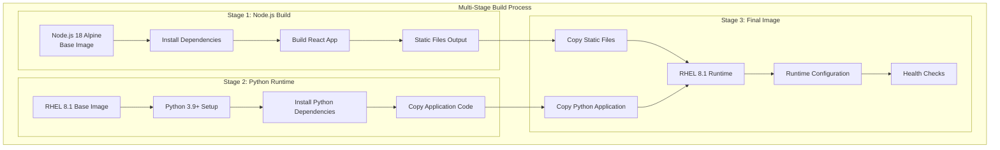

# Docker Container Structure for Whysper Web2

## Multi-Stage Dockerfile Design

This document outlines the Docker container structure for deploying Whysper Web2 as a single container image using Red Hat Enterprise Linux 8.1 as the base OS.

## Container Architecture



## Dockerfile Implementation

### Base Image Strategy
```dockerfile
# Stage 1: Frontend Build
FROM node:18-alpine AS frontend-builder
WORKDIR /app/frontend
COPY frontend/package*.json ./
RUN npm ci --only=production
COPY frontend/ ./
RUN npm run build

# Stage 2: Backend Dependencies
FROM registry.access.redhat.com/ubi8/python-39 AS backend-builder
WORKDIR /app
COPY requirements.txt .
RUN pip install --no-cache-dir -r requirements.txt

# Stage 3: Final Runtime Image
FROM registry.access.redhat.com/ubi8/minimum
WORKDIR /app

# Install runtime dependencies
RUN microdnf update -y && \
    microdnf install -y python39 python39-pip && \
    microdnf clean all

# Copy Python dependencies and application
COPY --from=backend-builder /usr/local/lib/python3.9/site-packages/ /usr/local/lib/python3.9/site-packages/
COPY --from=backend-builder /usr/local/bin/ /usr/local/bin/
COPY backend/ ./

# Copy frontend static files
COPY --from=frontend-builder /app/frontend/dist ./static

# Set up non-root user
RUN useradd -m -u 1000 appuser && chown -R appuser:appuser /app
USER appuser

# Health check
HEALTHCHECK --interval=30s --timeout=10s --start-period=5s --retries=3 \
    CMD curl -f http://localhost:8000/api/v1/ || exit 1

EXPOSE 8000
CMD ["python", "main.py"]
```

## Container Configuration Files

### .dockerignore
```
.git
.gitignore
README.md
Dockerfile
.dockerignore
node_modules
frontend/node_modules
frontend/src
frontend/public
backend/__pycache__
backend/.pytest_cache
backend/.mypy_cache
logs/
*.log
.env
.envTemplate
.DS_Store
.vscode/
```

### docker-compose.yml (for local development)
```yaml
version: '3.8'
services:
  whysper:
    build:
      context: .
      dockerfile: Dockerfile
    ports:
      - "8000:8000"
    environment:
      - API_KEY=${API_KEY}
      - PROVIDER=${PROVIDER:-openrouter}
      - DEFAULT_MODEL=${DEFAULT_MODEL:-google/gemini-2.5-flash-preview-09-2025}
      - PORT=8000
      - HOST=0.0.0.0
    volumes:
      - ./logs:/app/logs
      - ./results:/app/results
    restart: unless-stopped
    healthcheck:
      test: ["CMD", "curl", "-f", "http://localhost:8000/api/v1/"]
      interval: 30s
      timeout: 10s
      retries: 3
      start_period: 40s
```

## Container Optimization Strategies

### Image Size Optimization
1. **Multi-stage builds** to reduce final image size
2. **Alpine Linux** for Node.js build stage
3. **UBI Minimal** for final runtime image
4. **Clean package caches** after installation
5. **Remove build tools** from final image

### Security Hardening
1. **Non-root user** for application execution
2. **Minimal base images** to reduce attack surface
3. **Read-only filesystem** where possible
4. **Resource limits** for CPU and memory
5. **Security scanning** in CI/CD pipeline

### Performance Optimization
1. **Layer caching** for faster builds
2. **Dependency ordering** in Dockerfile
3. **Parallel builds** where possible
4. **Startup time optimization**
5. **Memory usage optimization**

## Environment Variables for Cloud Run

### Required Variables
```bash
# API Configuration
API_KEY=your_openrouter_api_key
PROVIDER=openrouter
DEFAULT_MODEL=google/gemini-2.5-flash-preview-09-2025

# Server Configuration
PORT=8080
HOST=0.0.0.0

# Application Configuration
STATIC_DIR=/app/static
LOG_LEVEL=INFO
```

### Optional Variables
```bash
# Performance Tuning
MAX_TOKENS=10000
TEMPERATURE=0.7
AI_CONNECT_TIMEOUT=30
AI_READ_TIMEOUT=120

# Feature Flags
ENABLE_STREAMING=true
DEBUG_LOGGING=false
SHOW_TOKEN_USAGE=true

# External Services
KROKI=https://kroki.io
OPENROUTER_API_URL=https://openrouter.ai/api/v1/chat/completions
```

## Container Runtime Configuration

### Cloud Run Service Settings
```yaml
# Container Configuration
containerConcurrency: 80
cpu: 1000m
memory: 1Gi
maxInstances: 100
minInstances: 0

# Scaling Configuration
scaling:
  - instanceCount: 1
    targetCPUUtilization: 60
    targetMemoryUtilization: 70

# Health Check Configuration
healthCheck:
  httpGet:
    path: /api/v1/
    port: 8080
  initialDelaySeconds: 15
  periodSeconds: 10
  timeoutSeconds: 5
  failureThreshold: 3
```

## Container Security Best Practices

### Image Security
1. **Use official base images** from trusted sources
2. **Regular security updates** for base images
3. **Vulnerability scanning** with tools like Trivy
4. **Signed images** for production deployments
5. **Immutable tags** for reproducible builds

### Runtime Security
1. **Least privilege** service accounts
2. **Network policies** for traffic control
3. **Resource quotas** to prevent abuse
4. **Audit logging** for security events
5. **Runtime protection** with security tools

### Data Security
1. **Secrets management** with Google Secret Manager
2. **Environment variable encryption**
3. **Temporary storage** for sensitive data
4. **Secure communication** with TLS
5. **Data classification** and handling

## Container Monitoring

### Health Checks
```python
# Health check endpoint implementation
@app.get("/health")
async def health_check():
    return {
        "status": "healthy",
        "timestamp": datetime.utcnow().isoformat(),
        "version": "2.0.0"
    }

# Readiness check endpoint
@app.get("/ready")
async def readiness_check():
    # Check database connections, external services, etc.
    return {"status": "ready"}
```

### Logging Configuration
```python
import logging
import sys
from pythonjsonlogger import jsonlogger

# Structured JSON logging for Cloud Run
logHandler = logging.StreamHandler(sys.stdout)
formatter = jsonlogger.JsonFormatter()
logHandler.setFormatter(formatter)
logger = logging.getLogger()
logger.addHandler(logHandler)
logger.setLevel(logging.INFO)
```

## Container Deployment Strategies

### Blue-Green Deployment
1. **Two identical environments** running different versions
2. **Load balancer** switches traffic between versions
3. **Instant rollback** capability if issues detected
4. **Zero downtime** during deployments
5. **Testing in production** with real traffic

### Canary Deployment
1. **Gradual traffic shift** to new version
2. **Monitoring and metrics** for early issue detection
3. **Automatic rollback** on error detection
4. **Controlled exposure** to new features
5. **Risk mitigation** for critical deployments

### Rolling Deployment
1. **Incremental replacement** of old instances
2. **Capacity maintenance** during deployment
3. **Graceful shutdown** of old instances
4. **Health verification** before traffic routing
5. **Simple implementation** with minimal complexity