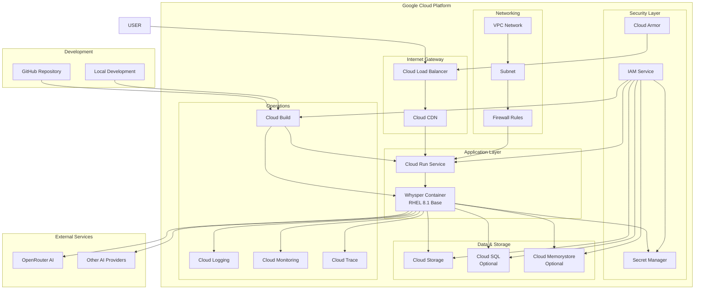
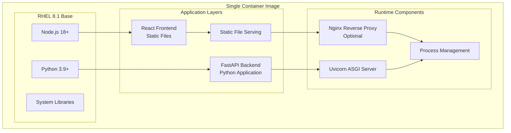

# Google Cloud Deployment Architecture for Whysper Web2

## Overview

This document provides a comprehensive architecture for deploying the Whysper Web2 application on Google Cloud Platform using a single container image approach with Red Hat Enterprise Linux 8.1 as the base OS, hosted on Google Cloud Run.

## Architecture Diagram

## Container Architecture

## Google Cloud Services Required

### Core Services
1. **Google Cloud Run** - Serverless container hosting
2. **Artifact Registry** - Container image storage
3. **Cloud Build** - CI/CD pipeline
4. **Cloud Storage** - Static assets and file storage
5. **Secret Manager** - Secure credential storage
6. **IAM** - Identity and access management

### Networking
1. **VPC Network** - Private network configuration
2. **Cloud Load Balancer** - HTTP(S) load balancing
3. **Cloud CDN** - Content delivery network
4. **Cloud Armor** - Web application firewall

### Operations
1. **Cloud Logging** - Log aggregation and analysis
2. **Cloud Monitoring** - Performance monitoring and alerting
3. **Cloud Trace** - Distributed tracing
4. **Error Reporting** - Error tracking and notification

### Optional Services
1. **Cloud SQL** - Managed database (if needed)
2. **Cloud Memorystore** - Redis cache (if needed)
3. **Cloud Scheduler** - Cron job scheduling

## Deployment Strategy

### Phase 1: Infrastructure Setup
1. Create Google Cloud project
2. Enable required APIs
3. Set up VPC networking
4. Configure IAM roles and service accounts
5. Set up Artifact Registry

### Phase 2: Container Development
1. Create Dockerfile with RHEL 8.1 base
2. Optimize multi-stage build process
3. Configure health checks and startup probes
4. Set up environment variable management

### Phase 3: CI/CD Pipeline
1. Configure Cloud Build triggers
2. Set up automated testing
3. Implement security scanning
4. Configure deployment automation

### Phase 4: Production Deployment
1. Deploy to Cloud Run
2. Configure custom domain and SSL
3. Set up monitoring and alerting
4. Implement backup and disaster recovery

## Security Architecture

### Network Security
- VPC with private subnets
- Cloud Armor WAF rules
- IAM-based access control
- Service-to-service authentication

### Application Security
- Secret Manager for sensitive data
- Environment variable encryption
- Container image vulnerability scanning
- Runtime security monitoring

### Data Protection
- Encryption in transit (TLS 1.3)
- Encryption at rest (Google-managed keys)
- Access logging and audit trails
- Data retention policies

## Cost Optimization

### Cloud Run Optimization
- Configure appropriate CPU/memory allocation
- Set concurrency limits for optimal performance
- Use minimum/maximum instance settings
- Enable request-based pricing model

### Storage Optimization
- Use appropriate storage classes
- Implement lifecycle policies
- Optimize container image sizes
- Compress static assets

### Monitoring Costs
- Set up budget alerts
- Monitor resource utilization
- Optimize query patterns
- Use cost allocation tags

## Scaling Strategy

### Horizontal Scaling
- Cloud Run automatic scaling
- Load balancer configuration
- CDN for global distribution
- Geographic deployment options

### Performance Optimization
- Container startup time optimization
- Memory and CPU tuning
- Database connection pooling
- Caching strategies

## Monitoring and Observability

### Key Metrics
- Request latency and error rates
- Container resource utilization
- API response times
- User engagement metrics

### Logging Strategy
- Structured logging with correlation IDs
- Log aggregation and filtering
- Real-time log analysis
- Long-term log retention

### Alerting
- Performance threshold alerts
- Error rate notifications
- Resource utilization warnings
- Security event notifications

## Disaster Recovery

### Backup Strategy
- Automated container image backups
- Configuration version control
- Data backup and restoration
- Cross-region replication

### Recovery Procedures
- Automated deployment rollback
- Blue-green deployment strategy
- Canary release patterns
- Emergency response procedures

## Compliance and Governance

### Standards Compliance
- SOC 2 Type II compliance
- GDPR data protection
- ISO 27001 security standards
- Industry-specific regulations

### Governance Policies
- Change management procedures
- Access control policies
- Data classification standards
- Security review processes