# Monitoring and Logging Configuration with Cloud Operations

## Overview

This document outlines comprehensive monitoring and logging configuration for Whysper Web2 application using Google Cloud Operations (formerly Stackdriver), ensuring observability, performance tracking, and proactive issue detection.

## Monitoring Architecture

```mermaid
graph TB
    subgraph "Application Layer"
        APP[Whysper Web2 Application]
        METRICS[Application Metrics]
        LOGS[Structured Logs]
        TRACES[Distributed Traces]
        ERRORS[Error Reporting]
    end
    
    subgraph "Google Cloud Operations"
        subgraph "Logging"
            LOG_SINK[Log Sinks]
            LOG_ROUTER[Log Routers]
            LOG_BUCKET[Cloud Storage Logs]
        end
        
        subgraph "Monitoring"
            METRIC_SINK[Metric Sinks]
            DASHBOARDS[Custom Dashboards]
            ALERT_POLICIES[Alert Policies]
            UPTIME_CHECKS[Uptime Checks]
        end
        
        subgraph "Tracing"
            TRACE_SINK[Trace Sinks]
            SPAN_ANALYSIS[Span Analysis]
            PERFORMANCE_INSIGHTS[Performance Insights]
        end
        
        subgraph "Error Tracking"
            ERROR_REPORTING[Error Reporting]
            INCIDENT_RESPONSE[Incident Response]
            ISSUE_TRACKING[Issue Tracking]
        end
    end
    
    subgraph "Integration Layer"
        subgraph "Third-Party Tools"
            GRAFANA[Grafana Integration]
            PROMETHEUS[Prometheus Integration]
            SLACK[Slack Notifications]
            PAGERDUTY[PagerDuty Integration]
        end
        
        subgraph "Custom Tools"
            WEBHOOKS[Custom Webhooks]
            EMAIL_ALERTS[Email Notifications]
            SMS_ALERTS[SMS Notifications]
        end
    end
    
    %% Connections
    APP --> METRICS
    APP --> LOGS
    APP --> TRACES
    APP --> ERRORS
    
    METRICS --> METRIC_SINK
    LOGS --> LOG_SINK
    TRACES --> TRACE_SINK
    ERRORS --> ERROR_REPORTING
    
    LOG_SINK --> LOG_ROUTER
    LOG_ROUTER --> LOG_BUCKET
    METRIC_SINK --> DASHBOARDS
    METRIC_SINK --> ALERT_POLICIES
    TRACE_SINK --> SPAN_ANALYSIS
    ERROR_REPORTING --> INCIDENT_RESPONSE
    
    DASHBOARDS --> GRAFANA
    ALERT_POLICIES --> SLACK
    ALERT_POLICIES --> PAGERDUTY
    INCIDENT_RESPONSE --> ISSUE_TRACKING
    ALERT_POLICIES --> WEBHOOKS
    ALERT_POLICIES --> EMAIL_ALERTS
    ALERT_POLICIES --> SMS_ALERTS
```



## Logging Configuration

### Structured Logging Setup
```python
# logging_config.py - Application logging configuration

import logging
import json
import time
import traceback
from typing import Dict, Any
from pythonjsonlogger import jsonlogger
from google.cloud import logging as cloud_logging

class StructuredLogger:
    """Structured JSON logger for Cloud Operations"""
    
    def __init__(self, name: str, project_id: str):
        self.project_id = project_id
        self.logger = jsonlogger.getLogger(name)
        
        # Configure Cloud Logging handler
        cloud_handler = cloud_logging.Client(project=project_id).get_default_handler()
        cloud_handler.setFormatter(jsonlogger.JsonFormatter())
        self.logger.addHandler(cloud_handler)
        self.logger.setLevel(logging.INFO)
    
    def log_request(self, method: str, path: str, status: int, 
                   duration: float, user_id: str = None, 
                   ip_address: str = None, user_agent: str = None):
        """Log HTTP request with structured data"""
        log_data = {
            "timestamp": time.time(),
            "event_type": "http_request",
            "method": method,
            "path": path,
            "status": status,
            "duration_ms": duration * 1000,
            "user_id": user_id,
            "ip_address": ip_address,
            "user_agent": user_agent
        }
        self.logger.info("HTTP request processed", extra=log_data)
    
    def log_ai_request(self, provider: str, model: str, tokens_used: int,
                    response_time: float, success: bool, error: str = None):
        """Log AI provider request with structured data"""
        log_data = {
            "timestamp": time.time(),
            "event_type": "ai_request",
            "provider": provider,
            "model": model,
            "tokens_used": tokens_used,
            "response_time_ms": response_time * 1000,
            "success": success,
            "error": error
        }
        self.logger.info("AI request processed", extra=log_data)
    
    def log_error(self, error_type: str, error_message: str, 
                 stack_trace: str = None, context: Dict[str, Any] = None):
        """Log error with structured data"""
        log_data = {
            "timestamp": time.time(),
            "event_type": "error",
            "error_type": error_type,
            "error_message": error_message,
            "stack_trace": stack_trace,
            "context": context
        }
        self.logger.error("Application error occurred", extra=log_data)
    
    def log_performance(self, operation: str, duration: float, 
                     memory_usage: int = None, cpu_usage: float = None):
        """Log performance metrics"""
        log_data = {
            "timestamp": time.time(),
            "event_type": "performance",
            "operation": operation,
            "duration_ms": duration * 1000,
            "memory_usage_mb": memory_usage,
            "cpu_usage_percent": cpu_usage
        }
        self.logger.info("Performance metric recorded", extra=log_data)

# Usage in FastAPI application
logger = StructuredLogger("whysper-web2", "your-gcp-project-id")

@app.middleware("http")
async def logging_middleware(request: Request, call_next):
    start_time = time.time()
    
    try:
        response = await call_next(request)
        duration = time.time() - start_time
        
        # Log request
        logger.log_request(
            method=request.method,
            path=request.url.path,
            status=response.status_code,
            duration=duration,
            user_id=getattr(request.state, 'user_id', None),
            ip_address=request.client.host,
            user_agent=request.headers.get("user-agent")
        )
        
        return response
    
    except Exception as e:
        logger.log_error(
            error_type="middleware_error",
            error_message=str(e),
            stack_trace=traceback.format_exc(),
            context={"path": request.url.path, "method": request.method}
        )
        raise
```

### Log Routing and Sinks
```bash
#!/bin/bash
# setup-log-routing.sh

PROJECT_ID="your-gcp-project-id"

echo "📋 Setting up log routing..."

# Create log sink for application logs
gcloud logging sinks create whysper-app-logs \
    --project=$PROJECT_ID \
    --description="Sink for Whysper Web2 application logs" \
    --log-filter='resource.type="cloud_run_revision" AND resource.labels.service_name="whysper-web2"' \
    --destination=bigquery.googleapis.com/projects/$PROJECT_ID/datasets/whysper_logs

# Create log sink for security logs
gcloud logging sinks create whysper-security-logs \
    --project=$PROJECT_ID \
    --description="Sink for security-related logs" \
    --log-filter='resource.type="cloud_run_revision" AND (severity="ERROR" OR severity="ALERT")' \
    --destination=bigquery.googleapis.com/projects/$PROJECT_ID/datasets/whysper_security_logs

# Create log sink for audit logs
gcloud logging sinks create whysper-audit-logs \
    --project=$PROJECT_ID \
    --description="Sink for audit and access logs" \
    --log-filter='protoPayload.methodName="SecretManagerService.AccessSecretVersion"' \
    --destination=bigquery.googleapis.com/projects/$PROJECT_ID/datasets/whysper_audit_logs

# Create log sink for performance logs
gcloud logging sinks create whysper-performance-logs \
    --project=$PROJECT_ID \
    --description="Sink for performance metrics" \
    --log-filter='event_type="performance"' \
    --destination=bigquery.googleapis.com/projects/$PROJECT_ID/datasets/whysper_performance_logs

echo "✅ Log routing configured successfully!"
```

### Log Retention and Lifecycle
```yaml
# log-retention-policy.yaml

apiVersion: logging.cnrm.cloud.google.com/v1
kind: LogBucket
metadata:
  name: whysper-logs-bucket
spec:
  location: us-central1
  retentionDays: 30  # Keep logs for 30 days
  locked: true  # Prevent accidental deletion
  
---

apiVersion: bigquery.cnrm.cloud.google.com/v1
kind: Dataset
metadata:
  name: whysper_logs
spec:
  location: US
  defaultTableExpirationMs: 2592000000  # 30 days in milliseconds
  description: "Dataset for Whysper Web2 logs"
```

## Metrics Configuration

### Custom Metrics Definition
```python
# metrics.py - Custom metrics collection

from google.cloud import monitoring_v3
from google.api_core import exceptions
import time
import psutil

class MetricsCollector:
    """Custom metrics collector for Cloud Monitoring"""
    
    def __init__(self, project_id: str):
        self.client = monitoring_v3.MetricServiceClient()
        self.project_id = project_id
        self.project_name = f"projects/{project_id}"
    
    def create_metric_descriptor(self):
        """Create custom metric descriptors"""
        # Request count metric
        self.client.create_metric_descriptor(
            name=f"{self.project_name}/metricDescriptors/http_requests_total",
            description="Total number of HTTP requests",
            metric_kind="GAUGE",
            value_type="INT64",
            unit="1"
        )
        
        # Request duration metric
        self.client.create_metric_descriptor(
            name=f"{self.project_name}/metricDescriptors/http_request_duration",
            description="HTTP request duration in milliseconds",
            metric_kind="GAUGE",
            value_type="DOUBLE",
            unit="ms"
        )
        
        # AI tokens used metric
        self.client.create_metric_descriptor(
            name=f"{self.project_name}/metricDescriptors/ai_tokens_used",
            description="Total AI tokens consumed",
            metric_kind="CUMULATIVE",
            value_type="INT64",
            unit="1"
        )
    
    def record_metric(self, metric_type: str, value: float, 
                 labels: Dict[str, str] = None):
        """Record a custom metric"""
        series = monitoring_v3.TimeSeries()
        series.metric.type = f"{self.project_name}/{metric_type}"
        series.resource.type = "cloud_run_revision"
        
        if labels:
            for key, val in labels.items():
                label = series.metric.labels.add()
                label.key = key
                label.value = val
        
        point = series.points.add()
        point.value.double_value = value
        point.interval.end_time.seconds = int(time.time())
        
        self.client.create_time_series(name=self.project_name, time_series=[series])

# Usage in application
metrics = MetricsCollector("your-gcp-project-id")

# Record request metrics
metrics.record_metric(
    metric_type="http_requests_total",
    value=1.0,
    labels={
        "method": request.method,
        "path": request.url.path,
        "status": str(response.status_code),
        "service": "whysper-web2"
    }
)
```

### Dashboard Configuration
```json
{
  "displayName": "Whysper Web2 Dashboard",
  "gridLayout": {
    "columns": "2",
    "widgets": [
      {
        "title": "Request Rate",
        "xyChart": {
          "dataSets": [
            {
              "timeSeriesQuery": {
                "prometheusQuery": {
                  "query": "fetch cloud_run_revision::run.googleapis.com/request_count",
                  "prometheusResultName": "timeSeries"
                }
              },
              "targetAxis": "Y_AXIS",
              "plotType": "LINE"
            }
          ],
          "timeshiftDuration": "1h",
          "yAxis": {
            "label": "Requests per minute",
            "scale": "LINEAR"
          }
        }
      },
      {
        "title": "Response Time",
        "xyChart": {
          "dataSets": [
            {
              "timeSeriesQuery": {
                "prometheusQuery": {
                  "query": "fetch cloud_run_revision::run.googleapis.com/request_latencies",
                  "prometheusResultName": "timeSeries"
                }
              },
              "targetAxis": "Y_AXIS",
              "plotType": "LINE"
            }
          ],
          "timeshiftDuration": "1h",
          "yAxis": {
            "label": "Response Time (ms)",
            "scale": "LINEAR"
          }
        }
      },
      {
        "title": "Error Rate",
        "xyChart": {
          "dataSets": [
            {
              "timeSeriesQuery": {
                "prometheusQuery": {
                  "query": "fetch cloud_run_revision::run.googleapis.com/request_count",
                  "prometheusResultName": "timeSeries"
                }
              },
              "targetAxis": "Y_AXIS",
              "plotType": "LINE"
            }
          ],
          "timeshiftDuration": "1h",
          "yAxis": {
            "label": "Errors per minute",
            "scale": "LINEAR"
          }
        }
      },
      {
        "title": "AI Token Usage",
        "xyChart": {
          "dataSets": [
            {
              "timeSeriesQuery": {
                "prometheusQuery": {
                  "query": "fetch custom.googleapis.com/ai_tokens_used",
                  "prometheusResultName": "timeSeries"
                }
              },
              "targetAxis": "Y_AXIS",
              "plotType": "LINE"
            }
          ],
          "timeshiftDuration": "1h",
          "yAxis": {
            "label": "Tokens Used",
            "scale": "LINEAR"
          }
        }
      }
    ]
  }
}
```

## Alerting Configuration

### Alert Policies
```yaml
# alert-policies.yaml

apiVersion: monitoring.cnrm.cloud.google.com/v1
kind: AlertPolicy
metadata:
  name: whysper-high-error-rate
spec:
  displayName: "High Error Rate Alert"
  combiner: "OR"
  conditions:
    - displayName: "Error rate > 5%"
      conditionThreshold:
        filter: >
          metric.type="run.googleapis.com/request/response_count" AND
          resource.type="cloud_run_revision" AND
          metric.labels.response_code>="400"
        aggregations:
          - alignmentPeriod: "300s"
            perSeriesAligner: "ALIGN_RATE"
            crossSeriesReducer: "REDUCE_PERCENTILE_95"
        comparison: "COMPARISON_GT"
        duration: "300s"
        trigger:
          count: 1
        thresholdValue: 0.05
  notificationChannels:
    - projects/your-gcp-project-id/notificationChannels/1234567890123456789

---

apiVersion: monitoring.cnrm.cloud.google.com/v1
kind: AlertPolicy
metadata:
  name: whysper-high-latency
spec:
  displayName: "High Latency Alert"
  combiner: "OR"
  conditions:
    - displayName: "P95 latency > 2 seconds"
      conditionThreshold:
        filter: >
          metric.type="run.googleapis.com/request/response_count" AND
          resource.type="cloud_run_revision"
        aggregations:
          - alignmentPeriod: "300s"
            perSeriesAligner: "ALIGN_PERCENTILE_95"
            crossSeriesReducer: "REDUCE_PERCENTILE_95"
        comparison: "COMPARISON_GT"
        duration: "300s"
        trigger:
          count: 1
        thresholdValue: 2000
  notificationChannels:
    - projects/your-gcp-project-id/notificationChannels/1234567890123456789

---

apiVersion: monitoring.cnrm.cloud.google.com/v1
kind: AlertPolicy
metadata:
  name: whysper-container-crash-looping
spec:
  displayName: "Container Crash Looping"
  combiner: "OR"
  conditions:
    - displayName: "Container crash count > 5 in 5 minutes"
      conditionThreshold:
        filter: >
          metric.type="run.googleapis.com/container/restart_count" AND
          resource.type="cloud_run_revision"
        aggregations:
          - alignmentPeriod: "300s"
            perSeriesAligner: "ALIGN_SUM"
            crossSeriesReducer: "REDUCE_SUM"
        comparison: "COMPARISON_GT"
        duration: "300s"
        trigger:
          count: 1
        thresholdValue: 5
  notificationChannels:
    - projects/your-gcp-project-id/notificationChannels/1234567890123456789
```

### Notification Channels Setup
```bash
#!/bin/bash
# setup-notifications.sh

PROJECT_ID="your-gcp-project-id"

echo "🔔 Setting up notification channels..."

# Slack notification channel
gcloud monitoring notification-channels create \
    --project=$PROJECT_ID \
    --type=slack \
    --display-name="Whysper Web2 Slack" \
    --channel-labels=severity=critical,team=backend \
    --slack-channel=whysper-alerts \
    --slack-auth-token=SLACK_AUTH_TOKEN

# Email notification channel
gcloud monitoring notification-channels create \
    --project=$PROJECT_ID \
    --type=email \
    --display-name="Whysper Web2 Email" \
    --channel-labels=severity=warning,team=backend \
    --email-addresses=alerts@whysper.example.com

# PagerDuty notification channel
gcloud monitoring notification-channels create \
    --project=$PROJECT_ID \
    --type=pagerduty \
    --display-name="Whysper Web2 PagerDuty" \
    --channel-labels=severity=critical,team=backend \
    --pagerduty-service-key=PAGERDUTY_SERVICE_KEY \
    --pagerduty-service-name=whysper-web2

echo "✅ Notification channels configured!"
```

## Distributed Tracing

### OpenTelemetry Configuration
```python
# tracing.py - Distributed tracing setup

from opentelemetry import trace
from opentelemetry.exporter.cloud_trace import CloudTraceSpanExporter
from opentelemetry.sdk.trace import TracerProvider
from opentelemetry.sdk.resources import Resource
from opentelemetry.instrumentation.fastapi import FastAPIInstrumentor
from opentelemetry.instrumentation.requests import RequestsInstrumentor

# Configure tracing
resource = Resource.create(
    service_name="whysper-web2",
    service_version="2.0.0",
    deployment_environment="production"
)

trace.set_tracer_provider(
    TracerProvider(
        resource=resource,
        span_processors=[CloudTraceSpanExporter()],
    )
)

# Instrument FastAPI
FastAPIInstrumentor().instrument_app(app)
RequestsInstrumentor().instrument()

# Custom span creation
@app.get("/api/v1/chat")
async def chat_endpoint(request: Request):
    tracer = trace.get_tracer(__name__)
    
    with tracer.start_as_current_span("chat_request") as span:
        span.set_attribute("user.id", user_id)
        span.set_attribute("ai.provider", "openrouter")
        span.set_attribute("ai.model", "gemini-2.5-flash")
        
        # Process the request
        result = await process_chat_request(request)
        
        span.set_attribute("tokens.used", str(result.tokens_used))
        span.set_attribute("response.time", str(result.response_time))
        
        return result
```

### Trace Sampling Configuration
```yaml
# tracing-config.yaml

apiVersion: tracing.cnrm.cloud.google.com/v1
kind: TraceConfig
metadata:
  name: whysper-trace-config
spec:
  destination: "cloud-trace.googleapis.com"
  samplingConfig:
    probability: 0.1  # Sample 10% of traces
    maxQpsPerSecond: 10
    adaptiveSampling: true
  traceSpans:
    - name: "http_request"
      kind: "SPAN_KIND_SERVER"
      description: "HTTP request processing"
    - name: "ai_request"
      kind: "SPAN_KIND_CLIENT"
      description: "AI provider request"
    - name: "database_query"
      kind: "SPAN_KIND_CLIENT"
      description: "Database operations"
  traceLimits:
    maxSpansPerSecond: 100
    maxNumberOfWorkers: 2
```

## Error Reporting

### Error Tracking Setup
```python
# error_reporting.py - Error reporting configuration

from google.cloud import error_reporting

class ErrorReporter:
    """Enhanced error reporting for Cloud Operations"""
    
    def __init__(self, project_id: str):
        self.client = error_reporting.Client(project=project_id)
    
    def report_error(self, exception: Exception, context: Dict[str, Any] = None):
        """Report error with enhanced context"""
        self.client.report(
            exception=exception,
            context=context,
            http_context={
                "method": context.get("method"),
                "url": context.get("url"),
                "user_agent": context.get("user_agent"),
                "response_code": context.get("response_code")
            },
            user: context.get("user_id")
        )
    
    def report_user_error(self, message: str, user_id: str, context: Dict[str, Any] = None):
        """Report user-generated error"""
        self.client.report(
            message=message,
            context=context,
            user=user_id,
            report_location=error_reporting.HTTPContext(
                method="POST",
                url="/api/v1/chat",
                response_code=400
            )
        )

# Global error handler
@app.exception_handler(Exception)
async def global_exception_handler(request: Request, exc: Exception):
    error_reporter = ErrorReporter("your-gcp-project-id")
    
    error_reporter.report_error(
        exception=exc,
        context={
            "method": request.method,
            "url": str(request.url),
            "user_agent": request.headers.get("user-agent"),
            "user_id": getattr(request.state, "user_id', None)
        }
    )
    
    return JSONResponse(
        status_code=500,
        content={"error": "Internal server error", "request_id": generate_request_id()}
    )
```

## Performance Monitoring

### Application Performance Monitoring (APM)
```python
# apm.py - Application performance monitoring

import psutil
import time
from typing import Dict, Any
from dataclasses import dataclass

@dataclass
class PerformanceMetrics:
    """Performance metrics data structure"""
    cpu_percent: float
    memory_mb: int
    disk_io_read_mb: float
    disk_io_write_mb: float
    network_io_recv_mb: float
    network_io_sent_mb: float
    timestamp: float

class APMCollector:
    """Application Performance Monitoring collector"""
    
    def __init__(self):
        self.start_time = time.time()
    
    def collect_metrics(self) -> PerformanceMetrics:
        """Collect system and application metrics"""
        # CPU metrics
        cpu_percent = psutil.cpu_percent(interval=1)
        
        # Memory metrics
        memory = psutil.virtual_memory()
        memory_mb = memory.used // (1024 * 1024)
        
        # Disk I/O metrics
        disk_io = psutil.disk_io_counters()
        disk_io_read_mb = disk_io.read_bytes / (1024 * 1024)
        disk_io_write_mb = disk_io.write_bytes / (1024 * 1024)
        
        # Network I/O metrics
        network_io = psutil.net_io_counters()
        network_io_recv_mb = network_io.bytes_recv / (1024 * 1024)
        network_io_sent_mb = network_io.bytes_sent / (1024 * 1024)
        
        return PerformanceMetrics(
            cpu_percent=cpu_percent,
            memory_mb=memory_mb,
            disk_io_read_mb=disk_io_read_mb,
            disk_io_write_mb=disk_io_write_mb,
            network_io_recv_mb=network_io_recv_mb,
            network_io_sent_mb=network_io_sent_mb,
            timestamp=time.time()
        )
    
    def record_startup_time(self):
        """Record application startup time"""
        startup_time = time.time() - self.start_time
        
        # Record startup metric
        metrics.record_metric(
            metric_type="application_startup_time",
            value=startup_time,
            labels={"service": "whysper-web2", "version": "2.0.0"}
        )
        
        return startup_time

# Usage in application startup
apm = APMCollector()
startup_time = apm.record_startup_time()

# Periodic metrics collection
async def collect_metrics_periodically():
    while True:
        metrics = apm.collect_metrics()
        
        # Record to Cloud Monitoring
        metrics.record_metric("cpu_usage_percent", metrics.cpu_percent)
        metrics.record_metric("memory_usage_mb", metrics.memory_mb)
        metrics.record_metric("disk_io_read_mb", metrics.disk_io_read_mb)
        metrics.record_metric("disk_io_write_mb", metrics.disk_io_write_mb)
        metrics.record_metric("network_io_recv_mb", metrics.network_io_recv_mb)
        metrics.record_metric("network_io_sent_mb", metrics.network_io_sent_mb)
        
        await asyncio.sleep(60)  # Collect every minute
```

## Health Checks and Uptime Monitoring

### Health Check Configuration
```python
# health_checks.py - Health check endpoints

from fastapi import APIRouter, HTTPException
from typing import Dict, Any
import asyncio
import time

router = APIRouter()

class HealthChecker:
    """Health check system for application monitoring"""
    
    def __init__(self):
        self.start_time = time.time()
        self.last_check_time = time.time()
        self.healthy = True
    
    async def check_database_health(self) -> Dict[str, Any]:
        """Check database connectivity"""
        try:
            # Database health check logic
            return {"status": "healthy", "response_time": 0.1}
        except Exception as e:
            return {"status": "unhealthy", "error": str(e)}
    
    async def check_ai_provider_health(self) -> Dict[str, Any]:
        """Check AI provider connectivity"""
        try:
            # AI provider health check
            return {"status": "healthy", "provider": "openrouter"}
        except Exception as e:
            return {"status": "unhealthy", "error": str(e)}
    
    async def check_external_services_health(self) -> Dict[str, Any]:
        """Check external service dependencies"""
        services = {}
        
        # Check Kroki service
        try:
            kroki_response = requests.get("https://kroki.io/health", timeout=5)
            services["kroki"] = {
                "status": "healthy" if kroki_response.status_code == 200 else "unhealthy",
                "response_time": kroki_response.elapsed.total_seconds()
            }
        except Exception:
            services["kroki"] = {"status": "unhealthy", "error": "timeout"}
        
        return services

health_checker = HealthChecker()

@router.get("/health")
async def health_check():
    """Comprehensive health check endpoint"""
    checks = {
        "status": "healthy" if health_checker.healthy else "unhealthy",
        "uptime_seconds": time.time() - health_checker.start_time,
        "timestamp": time.time(),
        "version": "2.0.0"
    }
    
    # Run parallel health checks
    db_health, ai_health, services_health = await asyncio.gather(
        health_checker.check_database_health(),
        health_checker.check_ai_provider_health(),
        health_checker.check_external_services_health()
    )
    
    checks["database"] = db_health
    checks["ai_provider"] = ai_health
    checks["external_services"] = services_health
    
    # Determine overall health
    all_healthy = all([
        db_health["status"] == "healthy",
        ai_health["status"] == "healthy"
    ])
    
    health_checker.healthy = all_healthy
    health_checker.last_check_time = time.time()
    
    status_code = 200 if all_healthy else 503
    return JSONResponse(content=checks, status_code=status_code)

@router.get("/ready")
async def readiness_check():
    """Readiness check for Kubernetes"""
    return {
        "status": "ready" if health_checker.healthy else "not_ready",
        "last_check": health_checker.last_check_time
    }

@router.get("/live")
async def liveness_check():
    """Liveness check for Kubernetes"""
    return {
        "status": "alive",
        "timestamp": time.time()
    }
```

## Integration with Third-Party Tools

### Grafana Dashboard Integration
```json
{
  "dashboard": {
    "title": "Whysper Web2 - Grafana Dashboard",
    "panels": [
      {
        "title": "Request Rate",
        "type": "graph",
        "targets": [
          {
            "expr": "rate(cloud_run_revision_request_count[5m])",
            "legendFormat": "{{method}} {{path}}"
          }
        ],
        "yAxes": [
          {
            "label": "Requests per second",
            "min": 0
          }
        ]
      },
      {
        "title": "Response Time Distribution",
        "type": "heatmap",
        "targets": [
          {
            "expr": "rate(cloud_run_revision_request_latencies_bucket[5m])",
            "legendFormat": "{{le}}"
          }
        ]
      },
      {
        "title": "Error Rate",
        "type": "singlestat",
        "targets": [
          {
            "expr": "rate(cloud_run_revision_request_count{response_code!~\"4..\"}[5m])",
            "legendFormat": "Error Rate"
          }
        ]
      }
    ]
  }
}
```

### Prometheus Integration
```yaml
# prometheus-config.yaml

global:
  scrape_interval: 15s
  evaluation_interval: 15s

scrape_configs:
  - job_name: 'whysper-web2'
    static_configs:
      - targets: ['whysper.example.com/metrics']
        metrics_path: '/metrics'
        scheme: 'https'
    scrape_interval: 15s
    metric_relabel_configs:
      - source_labels: [__name__]
        regex: 'run.googleapis.com.request_count'
        target_label: __name__
        replacement: 'http_requests_total'
      - source_labels: [__name__]
        regex: 'run.googleapis.com.request_latencies'
        target_label: __name__
        replacement: 'http_request_duration'
```

## Best Practices

### Monitoring Best Practices
1. **Structured logging** with consistent schema
2. **Custom metrics** for business-relevant KPIs
3. **Distributed tracing** for end-to-end visibility
4. **Proactive alerting** with actionable thresholds
5. **Dashboard organization** for different stakeholder needs
6. **Performance baselines** for anomaly detection

### Logging Best Practices
1. **JSON structured logs** for easy parsing
2. **Appropriate log levels** (DEBUG, INFO, WARN, ERROR)
3. **Contextual information** in all log entries
4. **Log aggregation** with proper routing
5. **Retention policies** for compliance and cost management

### Alerting Best Practices
1. **Meaningful thresholds** based on SLAs
2. **Multi-channel notifications** for different severity levels
3. **Escalation policies** for critical issues
4. **Regular alert reviews** to prevent fatigue
5. **Testing alert paths** to ensure reliability

### Performance Monitoring Best Practices
1. **Key performance indicators** (KPIs) tracking
2. **Baseline establishment** for comparison
3. **Real-time monitoring** with low overhead
4. **Historical analysis** for trend identification
5. **Automated responses** to performance issues

This comprehensive monitoring and logging configuration ensures full observability of the Whysper Web2 application across all operational dimensions.