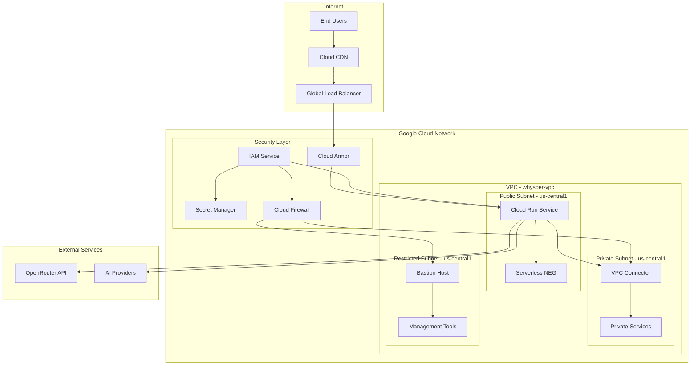

# Google Cloud Networking and Security Configuration

## Overview

This document outlines the comprehensive networking and security configuration for deploying Whysper Web2 on Google Cloud Platform, ensuring secure, scalable, and resilient infrastructure.

## Network Architecture



## VPC Network Configuration

### VPC Creation
```bash
#!/bin/bash
# create-vpc.sh - VPC network setup

PROJECT_ID="your-gcp-project-id"
NETWORK_NAME="whysper-vpc"
REGION="us-central1"

echo "🌐 Creating VPC network..."

# Create VPC network
gcloud compute networks create $NETWORK_NAME \
    --project=$PROJECT_ID \
    --description="VPC for Whysper Web2 application" \
    --subnet-mode=custom

# Create subnets
gcloud compute networks subnets create public-subnet \
    --project=$PROJECT_ID \
    --range=10.0.1.0/24 \
    --network=$NETWORK_NAME \
    --region=$REGION \
    --description="Public subnet for Cloud Run services"

gcloud compute networks subnets create private-subnet \
    --project=$PROJECT_ID \
    --range=10.0.2.0/24 \
    --network=$NETWORK_NAME \
    --region=$REGION \
    --description="Private subnet for internal services"

gcloud compute networks subnets create restricted-subnet \
    --project=$PROJECT_ID \
    --range=10.0.3.0/24 \
    --network=$NETWORK_NAME \
    --region=$REGION \
    --description="Restricted subnet for management"

# Configure VPC peering for Serverless VPC Access
gcloud compute networks vpc-access connectors create whysper-connector \
    --project=$PROJECT_ID \
    --region=$REGION \
    --subnet=private-subnet \
    --range=10.8.0.0/28 \
    --min-instances=2 \
    --max-instances=10 \
    --machine-type=e2-micro

echo "✅ VPC network created successfully!"
```

### Firewall Rules
```bash
#!/bin/bash
# create-firewall-rules.sh

PROJECT_ID="your-gcp-project-id"
NETWORK_NAME="whysper-vpc"

echo "🔥 Creating firewall rules..."

# Allow IAP for SSH to bastion host
gcloud compute firewall-rules create allow-iap-ssh \
    --project=$PROJECT_ID \
    --network=$NETWORK_NAME \
    --allow=tcp:22 \
    --source-ranges=35.235.240.0/20,35.235.244.0/20 \
    --target-tags=restricted-subnet \
    --description="Allow IAP SSH access to bastion host"

# Allow VPC Connector traffic
gcloud compute firewall-rules create allow-vpc-connector \
    --project=$PROJECT_ID \
    --network=$NETWORK_NAME \
    --allow=tcp,udp,icmp \
    --source-ranges=10.8.0.0/28 \
    --target-tags=private-subnet \
    --description="Allow VPC Connector traffic"

# Allow health check traffic
gcloud compute firewall-rules create allow-health-checks \
    --project=$PROJECT_ID \
    --network=$NETWORK_NAME \
    --allow=tcp:8080 \
    --source-ranges=130.211.0.0/22,35.191.0.0/16 \
    --target-tags=cloud-run \
    --description="Allow health check traffic"

# Allow internal traffic
gcloud compute firewall-rules create allow-internal \
    --project=$PROJECT_ID \
    --network=$NETWORK_NAME \
    --allow=tcp,udp,icmp \
    --source-ranges=10.0.0.0/8 \
    --target-tags=internal \
    --description="Allow internal VPC traffic"

echo "✅ Firewall rules created successfully!"
```

## Cloud Load Balancer Configuration

### Global HTTP(S) Load Balancer
```yaml
# load-balancer.yaml - Load balancer configuration

apiVersion: networking.gke.io/v1
kind: GCLBBackendConfig
metadata:
  name: whysper-backend-config
spec:
  healthCheck:
    checkIntervalSec: 10
    timeoutSec: 5
    healthyThreshold: 2
    unhealthyThreshold: 3
    type: HTTP
    requestPath: /health
    port: 8080
  sessionAffinity: NONE
  timeoutSec: 300
  connectionDraining:
    drainingTimeoutSec: 300

---

apiVersion: networking.gke.io/v1
kind: GCLBService
metadata:
  name: whysper-web2-lb
  annotations:
    cloud.google.com/load-balancer-type: "external"
spec:
  type: LoadBalancer
  selector:
    app: whysper-web2
  ports:
  - port: 80
    targetPort: 8080
    protocol: TCP
  backendConfig:
    name: whysper-backend-config
```

### Load Balancer Deployment Script
```bash
#!/bin/bash
# deploy-load-balancer.sh

PROJECT_ID="your-gcp-project-id"
SERVICE_NAME="whysper-web2"
REGION="us-central1"

echo "⚖️ Setting up load balancer..."

# Reserve static IP address
gcloud compute addresses create whysper-web2-ip \
    --project=$PROJECT_ID \
    --global \
    --description="Static IP for Whysper Web2"

# Create SSL certificate
gcloud compute ssl-certificates create whysper-web2-ssl \
    --project=$PROJECT_ID \
    --domains=whysper.example.com \
    --description="SSL certificate for Whysper Web2"

# Create backend service
gcloud compute backend-services create whysper-web2-backend \
    --project=$PROJECT_ID \
    --global \
    --protocol=HTTP \
    --port-name=http \
    --port=8080 \
    --health-checks=whysper-web2-hc \
    --timeout=300s \
    --connection-draining-timeout=300s

# Create URL map
gcloud compute url-maps create whysper-web2-url-map \
    --project=$PROJECT_ID \
    --default-service=whysper-web2-backend

# Create target proxy
gcloud compute target-http-proxies create whysper-web2-http-proxy \
    --project=$PROJECT_ID \
    --url-map=whysper-web2-url-map

gcloud compute target-https-proxies create whysper-web2-https-proxy \
    --project=$PROJECT_ID \
    --url-map=whysper-web2-url-map \
    --ssl-certificates=whysper-web2-ssl

# Create forwarding rules
gcloud compute forwarding-rules create whysper-web2-http-forwarding-rule \
    --project=$PROJECT_ID \
    --global \
    --address=whysper-web2-ip \
    --target-http-proxy=whysper-web2-http-proxy \
    --ports=80

gcloud compute forwarding-rules create whysper-web2-https-forwarding-rule \
    --project=$PROJECT_ID \
    --global \
    --address=whysper-web2-ip \
    --target-https-proxy=whysper-web2-https-proxy \
    --ports=443

echo "✅ Load balancer configured successfully!"
```

## Cloud Armor Security

### Web Application Firewall Rules
```yaml
# cloud-armor-policy.yaml

apiVersion: security.cnrm.cloud.google.com/v1beta1
kind: SecurityPolicy
metadata:
  name: whysper-web2-security-policy
spec:
  description: "Security policy for Whysper Web2"
  type: "CLOUD_ARMOR"
  rules:
    # Rate limiting rules
    - action: "rate_based_ban"
      description: "Rate limit and ban abusive IPs"
      priority: 1000
      rateLimitOptions:
        enforceOnDryRun: false
        conformAction: "count_only"
        exceedAction: "ban"
        rateLimitThresholds:
          - count: 100
            intervalSec: 60
        banDurationSec: 3600

    # Geographic blocking
    - action: "deny"
      description: "Block traffic from specific countries"
      priority: 2000
      match:
        versionedExpr: 
          exprOptions:
            recaptchaOptions: {}
          expression: "evaluatePreconfiguredExpr('src_geo_cn')"
    
    # IP whitelist for admin access
    - action: "allow"
      description: "Allow admin IPs"
      priority: 500
      match:
        versionedExpr:
          exprOptions: {}
          expression: "request.ip.in_ip_range('192.0.2.0/24') || request.ip.in_ip_range('198.51.100.0/24')"

    # Default deny rule
    - action: "deny"
      description: "Default deny rule"
      priority: 2147483647
      match:
        versionedExpr:
          exprOptions: {}
          expression: "true"
```

### Cloud Armor Deployment
```bash
#!/bin/bash
# deploy-cloud-armor.sh

PROJECT_ID="your-gcp-project-id"
POLICY_NAME="whysper-web2-security-policy"

echo "🛡️ Setting up Cloud Armor..."

# Create security policy
gcloud compute security-policies create $POLICY_NAME \
    --project=$PROJECT_ID \
    --description="Security policy for Whysper Web2"

# Add rate limiting rule
gcloud compute security-policies rules create 1000 \
    --project=$PROJECT_ID \
    --security-policy=$POLICY_NAME \
    --description="Rate limit and ban abusive IPs" \
    --action="rate-based-ban" \
    --rate-limit-options="rate-limit-threshold-count=100,rate-limit-threshold-interval=60,ban-duration=3600,conform-action=count-only" \
    --priority=1000

# Add IP whitelist rule
gcloud compute security-policies rules create 500 \
    --project=$PROJECT_ID \
    --security-policy=$POLICY_NAME \
    --description="Allow admin IPs" \
    --action="allow" \
    --src-ip-ranges="192.0.2.0/24,198.51.100.0/24" \
    --priority=500

# Attach policy to backend service
gcloud compute backend-services update whysper-web2-backend \
    --project=$PROJECT_ID \
    --global \
    --security-policy=$POLICY_NAME

echo "✅ Cloud Armor configured successfully!"
```

## IAM and Service Accounts

### Service Account Configuration
```bash
#!/bin/bash
# create-service-accounts.sh

PROJECT_ID="your-gcp-project-id"

echo "👤 Creating service accounts..."

# Cloud Run service account
gcloud iam service-accounts create whysper-web2-sa \
    --project=$PROJECT_ID \
    --description="Service account for Whysper Web2 Cloud Run service" \
    --display-name="Whysper Web2 Service Account"

# Grant necessary roles to service account
gcloud projects add-iam-policy-binding $PROJECT_ID \
    --member="serviceAccount:whysper-web2-sa@$PROJECT_ID.iam.gserviceaccount.com" \
    --role="roles/run.invoker"

gcloud projects add-iam-policy-binding $PROJECT_ID \
    --member="serviceAccount:whysper-web2-sa@$PROJECT_ID.iam.gserviceaccount.com" \
    --role="roles/secretmanager.secretAccessor"

gcloud projects add-iam-policy-binding $PROJECT_ID \
    --member="serviceAccount:whysper-web2-sa@$PROJECT_ID.iam.gserviceaccount.com" \
    --role="roles/logging.logWriter"

gcloud projects add-iam-policy-binding $PROJECT_ID \
    --member="serviceAccount:whysper-web2-sa@$PROJECT_ID.iam.gserviceaccount.com" \
    --role="roles/monitoring.metricWriter"

gcloud projects add-iam-policy-binding $PROJECT_ID \
    --member="serviceAccount:whysper-web2-sa@$PROJECT_ID.iam.gserviceaccount.com" \
    --role="roles/trace.agent"

# Cloud Build service account
gcloud iam service-accounts create whysper-build-sa \
    --project=$PROJECT_ID \
    --description="Service account for Cloud Build" \
    --display-name="Whysper Build Service Account"

gcloud projects add-iam-policy-binding $PROJECT_ID \
    --member="serviceAccount:whysper-build-sa@$PROJECT_ID.iam.gserviceaccount.com" \
    --role="roles/cloudbuild.buildsEditor"

gcloud projects add-iam-policy-binding $PROJECT_ID \
    --member="serviceAccount:whysper-build-sa@$PROJECT_ID.iam.gserviceaccount.com" \
    --role="roles/run.admin"

gcloud projects add-iam-policy-binding $PROJECT_ID \
    --member="serviceAccount:whysper-build-sa@$PROJECT_ID.iam.gserviceaccount.com" \
    --role="roles/iam.serviceAccountUser"

echo "✅ Service accounts created and configured!"
```

## Secret Management

### Secret Manager Configuration
```bash
#!/bin/bash
# setup-secrets.sh

PROJECT_ID="your-gcp-project-id"

echo "🔐 Setting up Secret Manager..."

# Enable Secret Manager API
gcloud services enable secretmanager.googleapis.com --project=$PROJECT_ID

# Create secrets
echo "API_KEY" | gcloud secrets create api-key --project=$PROJECT_ID --data-file=-

echo "ACCESS_KEY" | gcloud secrets create access-key --project=$PROJECT_ID --data-file=-

echo "OPENROUTER_API_URL" | gcloud secrets create openrouter-api-url --project=$PROJECT_ID --data-file=-

# Grant access to service account
gcloud secrets add-iam-policy-binding api-key \
    --project=$PROJECT_ID \
    --member="serviceAccount:whysper-web2-sa@$PROJECT_ID.iam.gserviceaccount.com" \
    --role="roles/secretmanager.secretAccessor"

gcloud secrets add-iam-policy-binding access-key \
    --project=$PROJECT_ID \
    --member="serviceAccount:whysper-web2-sa@$PROJECT_ID.iam.gserviceaccount.com" \
    --role="roles/secretmanager.secretAccessor"

gcloud secrets add-iam-policy-binding openrouter-api-url \
    --project=$PROJECT_ID \
    --member="serviceAccount:whysper-web2-sa@$PROJECT_ID.iam.gserviceaccount.com" \
    --role="roles/secretmanager.secretAccessor"

echo "✅ Secret Manager configured successfully!"
```

## SSL/TLS Configuration

### SSL Certificate Management
```bash
#!/bin/bash
# setup-ssl.sh

PROJECT_ID="your-gcp-project-id"
DOMAIN="whysper.example.com"

echo "🔒 Setting up SSL certificates..."

# Create managed SSL certificate
gcloud compute ssl-certificates create whysper-web2-ssl \
    --project=$PROJECT_ID \
    --domains=$DOMAIN \
    --description="Managed SSL certificate for Whysper Web2"

# Wait for certificate provisioning
echo "Waiting for SSL certificate to be provisioned..."
while true; do
    STATUS=$(gcloud compute ssl-certificates describe whysper-web2-ssl \
        --project=$PROJECT_ID \
        --format='value(managed.status)')
    
    if [ "$STATUS" = "MANAGED" ]; then
        echo "✅ SSL certificate provisioned successfully!"
        break
    elif [ "$STATUS" = "MANAGING" ]; then
        echo "Certificate still provisioning... waiting 30 seconds"
        sleep 30
    else
        echo "❌ Certificate provisioning failed with status: $STATUS"
        exit 1
    fi
done
```

## DNS Configuration

### Cloud DNS Setup
```bash
#!/bin/bash
# setup-dns.sh

PROJECT_ID="your-gcp-project-id"
DOMAIN="whysper.example.com"
IP_ADDRESS=$(gcloud compute addresses describe whysper-web2-ip \
    --project=$PROJECT_ID \
    --global \
    --format='get(address)')

echo "🌐 Setting up DNS records..."

# Create DNS zone if it doesn't exist
gcloud dns managed-zones create $DOMAIN \
    --project=$PROJECT_ID \
    --description="DNS zone for $DOMAIN" \
    --dns-name=$DOMAIN

# Add A record
gcloud dns record-sets create $DOMAIN \
    --project=$PROJECT_ID \
    --type=A \
    --zone=$DOMAIN \
    --ttl=300 \
    --addresses=$IP_ADDRESS

# Add CNAME record for www
gcloud dns record-sets create www.$DOMAIN \
    --project=$PROJECT_ID \
    --type=CNAME \
    --zone=$DOMAIN \
    --ttl=300 \
    --cname=$DOMAIN

echo "✅ DNS configuration completed!"
echo "📍 Point your domain to IP: $IP_ADDRESS"
```

## Security Best Practices

### Network Security
1. **Private Google Access** for Cloud Run services
2. **VPC Service Controls** for data exfiltration prevention
3. **Cloud Armor WAF** for application-level protection
4. **Private Google Access** for internal services
5. **Network Service Tiers** for performance optimization

### Application Security
1. **Input validation** and sanitization
2. **Rate limiting** at application and network level
3. **CORS configuration** for cross-origin requests
4. **Security headers** for browser protection
5. **Authentication and authorization** for sensitive endpoints

### Data Security
1. **Encryption in transit** with TLS 1.3
2. **Encryption at rest** with Google-managed keys
3. **Key management** with Cloud KMS
4. **Access logging** and audit trails
5. **Data classification** and handling policies

## Monitoring and Alerting

### Security Monitoring
```yaml
# security-monitoring.yaml

apiVersion: monitoring.cnrm.cloud.google.com/v1
kind: AlertPolicy
metadata:
  name: whysper-security-alerts
spec:
  displayName: "Whysper Web2 Security Alerts"
  combiner: "OR"
  conditions:
    # High error rate
    - displayName: "High error rate"
      conditionThreshold:
        filter: 'metric.type="run.googleapis.com/request/response_count" resource.type="cloud_run_revision"'
        aggregations:
          - alignmentPeriod: "300s"
            perSeriesAligner: "ALIGN_RATE"
            crossSeriesReducer: "REDUCE_PERCENTILE_95"
        comparison: "COMPARISON_GT"
        duration: "300s"
        trigger:
          count: 1
        thresholdValue: 0.05

    # High latency
    - displayName: "High latency"
      conditionThreshold:
        filter: 'metric.type="run.googleapis.com/request/response_count" resource.type="cloud_run_revision"'
        aggregations:
          - alignmentPeriod: "300s"
            perSeriesAligner: "ALIGN_PERCENTILE_95"
            crossSeriesReducer: "REDUCE_PERCENTILE_95"
        comparison: "COMPARISON_GT"
        duration: "300s"
        trigger:
          count: 1
        thresholdValue: 1000

  notificationChannels:
    - projects/PROJECT_ID/notificationChannels/1234567890123456789
```

## Compliance and Governance

### Security Compliance Checklist
- [ ] **SOC 2 Type II** compliance
- [ ] **GDPR** data protection measures
- [ ] **ISO 27001** security standards
- [ ] **PCI DSS** if handling payments
- [ ] **HIPAA** if handling health data

### Audit Logging Configuration
```bash
# Enable audit logging
gcloud logging settings update \
    --project=$PROJECT_ID \
    --organization=ORG_ID \
    --logging-service=all \
    --log-filter='protoPayload.methodName!="storage.objects.get" AND protoPayload.methodName!="storage.objects.list"' \
    --enable-cloud-audit-logs
```

## Incident Response

### Security Incident Response Plan
1. **Detection** - Automated monitoring and alerting
2. **Analysis** - Root cause investigation
3. **Containment** - Isolate affected systems
4. **Eradication** - Remove threats and vulnerabilities
5. **Recovery** - Restore services to normal operation
6. **Post-incident** - Review and improve processes

### Emergency Contacts and Procedures
```bash
# emergency-response.sh

# Emergency shutdown procedure
gcloud run services update whysper-web2 \
    --project=$PROJECT_ID \
    --region=$REGION \
    --no-traffic

# Emergency scale down
gcloud run services update whysper-web2 \
    --project=$PROJECT_ID \
    --region=$REGION \
    --max-instances=0

# Emergency IP blocking
gcloud compute security-policies rules create 9999 \
    --project=$PROJECT_ID \
    --security-policy=whysper-web2-security-policy \
    --description="Emergency block rule" \
    --action="deny" \
    --src-ip-ranges="MALICIOUS_IP_RANGE" \
    --priority=9999