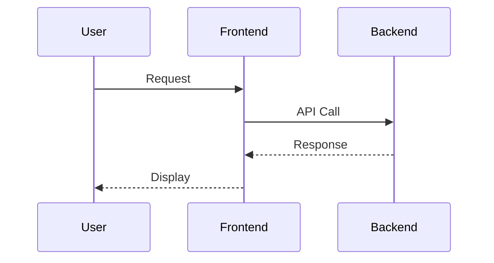

# Diagram Rendering Implementation - Complete

## 🎯 Overview

This document describes the complete implementation of diagram detection and rendering for both **Mermaid** and **D2** diagrams in the Whysper application.

## ✅ Implementation Status

### **Mermaid Diagrams**
- ✅ Client-side rendering using `mermaid` npm package (v11.12.0)
- ✅ Supports 21+ diagram types (flowcharts, sequence, class, state, gantt, etc.)
- ✅ Detects in Markdown code blocks with `language="mermaid"`
- ✅ Detects in HTML `<pre><code>` blocks via pattern matching
- ✅ HTML entity decoding using browser-native approach
- ✅ Duplicate handling (first = collapsible code, second = rendered diagram)
- ✅ Copy code, download SVG/PNG, expand to new tab

### **D2 Diagrams**
- ✅ Client-side rendering using `@terrastruct/d2` npm package (v0.1.33)
- ✅ Comprehensive pattern detection (10+ D2 syntax patterns)
- ✅ Detects in Markdown code blocks with `language="d2"`
- ✅ Detects in HTML `<pre><code>` blocks via pattern matching
- ✅ Duplicate handling (same as Mermaid)
- ✅ Copy code, download SVG/PNG, expand to new tab
- ✅ Uses local npm package (NOT CDN)

## 🏗️ Architecture

### **Dual-Path Detection System**

```
┌─────────────────────────────────────────────────┐
│  LLM Response (HTML or Markdown)                │
└─────────────────┬───────────────────────────────┘
                  │
                  ├─── Path 1: Markdown
                  │    └─> ReactMarkdown
                  │        └─> CodeComponentRenderer
                  │            ├─> isMermaidCode(language)
                  │            └─> isD2Code(language)
                  │
                  └─── Path 2: HTML
                       └─> processDiagramsInHTML()
                           └─> Regex extract <pre><code>
                               ├─> isMermaidSyntax(code)
                               └─> isD2Syntax(code)
┌─────────────────────────────────────────────────┐
│  Render: <MermaidDiagram /> or <D2Diagram />    │
└─────────────────────────────────────────────────┘
```

### **Priority Rules**

1. **Markdown takes precedence** over HTML detection
2. **Mermaid takes precedence** over D2 when patterns match both
3. **First occurrence** = collapsible code block
4. **Second occurrence** = rendered diagram

## 📁 File Structure

```
frontend/
├── src/
│   ├── components/chat/
│   │   ├── ChatView.tsx           # Main message renderer with dual-path detection
│   │   ├── MermaidDiagram.tsx     # Mermaid rendering component
│   │   └── D2Diagram.tsx          # D2 rendering component
│   │
│   └── utils/
│       └── mermaidUtils.ts        # Centralized detection utilities
│
├── package.json                   # Dependencies: mermaid, @terrastruct/d2
│
test_mermaid.html                  # Mermaid test file
test_d2_detection.html             # D2 detection test cases (15 patterns)
test_d2_rendering.html             # D2 rendering verification
```

## 🔍 Detection Patterns

### **Mermaid Keywords (21+ diagram types)**
```typescript
const MERMAID_KEYWORDS = [
  'graph', 'flowchart', 'sequenceDiagram', 'classDiagram', 'stateDiagram',
  'erDiagram', 'journey', 'gantt', 'pie', 'quadrantChart', 'requirementDiagram',
  'gitGraph', 'mindmap', 'timeline', 'zenuml', 'sankey', 'block', 'packet',
  'architecture', 'kanban', 'xyChart'
];
```

### **D2 Patterns (10 detection rules)**
```typescript
const D2_PATTERNS = [
  /^[a-zA-Z0-9_]+\s*-+>/,          // Arrow: x -> y
  /^[a-zA-Z0-9_]+\s*<-+>/,         // Bidirectional: x <-> y
  /^[a-zA-Z0-9_]+\s*<-+\s/,        // Reverse: x <- y
  /\.shape\s*:/,                   // Shape: node.shape: rectangle
  /\.style\./,                     // Style: node.style.fill: "#color"
  /\.label\s*:/,                   // Label: node.label: "text"
  /layers\s*\{/,                   // Layers block
  /scenarios\s*\{/,                // Scenarios block
  /classes\s*\{/,                  // Classes block
  /vars\s*\{/                      // Variables block
];
```

## 💻 Key Components

### **1. Detection Utilities** (`mermaidUtils.ts`)

```typescript
// Mermaid detection
export const isMermaidCode = (language: string, inline: boolean): boolean;
export const isMermaidSyntax = (code: string): boolean;
export const prepareMermaidCode = (code: string): string;

// D2 detection
export const isD2Code = (language: string, inline: boolean): boolean;
export const isD2Syntax = (code: string): boolean;
export const prepareD2Code = (code: string): string;

// HTML entity decoding (browser-native)
export const decodeMermaidCode = (code: string): string;
```

### **2. Markdown Rendering** (`ChatView.tsx`)

```typescript
const CodeComponentRenderer = (props: React.ComponentProps<'code'>) => {
  const { inline, className, children } = props;
  const match = /language-(\w+)/.exec(className || '');
  const language = match ? match[1] : '';

  if (isMermaidCode(language, inline || false)) {
    return <MermaidDiagram code={prepareMermaidCode(String(children))} />;
  }

  if (isD2Code(language, inline || false)) {
    return <D2Diagram code={prepareD2Code(String(children))} />;
  }

  return <pre><code>{children}</code></pre>;
};
```

### **3. HTML Diagram Processing** (`ChatView.tsx`)

```typescript
const processDiagramsInHTML = (htmlContent: string): React.ReactNode[] => {
  type DiagramOccurrence = { count: number; type: 'mermaid' | 'd2' };
  const diagramOccurrences = new Map<string, DiagramOccurrence>();

  const codeBlockRegex = /<pre><code[^>]*>([\s\S]*?)<\/code><\/pre>/gi;

  htmlContent.replace(codeBlockRegex, (match, rawCode) => {
    const decodedMermaid = prepareMermaidCode(rawCode);
    const decodedD2 = prepareD2Code(rawCode);

    const isMermaid = isMermaidSyntax(decodedMermaid);
    const isD2 = isD2Syntax(decodedD2);

    if (isMermaid || isD2) {
      const diagramType = isMermaid ? 'mermaid' : 'd2';
      const code = isMermaid ? decodedMermaid : decodedD2;

      const occurrence = diagramOccurrences.get(code)?.count || 0;
      diagramOccurrences.set(code, { count: occurrence + 1, type: diagramType });

      if (occurrence === 0) {
        // First occurrence = collapsible code
        return <details><summary>📝 {diagramType} Code...</summary>...</details>;
      } else {
        // Second occurrence = rendered diagram
        return diagramType === 'mermaid'
          ? <MermaidDiagram code={code} />
          : <D2Diagram code={code} />;
      }
    }
  });
};
```

### **4. Diagram Components**

#### **MermaidDiagram.tsx**
```typescript
import mermaid from 'mermaid';

mermaid.initialize({
  startOnLoad: false,
  theme: 'default',
  securityLevel: 'loose',
});

const { svg } = await mermaid.render(id, code);
containerRef.current.innerHTML = svg;
```

#### **D2Diagram.tsx**
```typescript
import { D2 } from '@terrastruct/d2';

// Create D2 instance
const d2 = new D2();

// Compile D2 code with options
const result = await d2.compile(code, {
  options: {
    layout: 'dagre',
    sketch: false,
  }
});

// Render the compiled diagram to SVG
const svg = await d2.render(result.diagram, result.renderOptions);
containerRef.current.innerHTML = svg;
```

## 🎨 UI Features

### **Diagram Controls**
- **Copy** - Copy diagram code to clipboard
- **Download SVG** - Download as vector graphic
- **Download PNG** - Download as raster image
- **Expand** - Open in new tab for full-screen view

### **Error Handling**
```tsx
{error && (
  <div style={{ color: '#ff4d4f', backgroundColor: '#fff2f0' }}>
    <strong>Error rendering {diagramType} diagram:</strong>
    <pre>{error}</pre>
    <details>
      <summary>Show diagram code</summary>
      <pre>{code}</pre>
    </details>
  </div>
)}
```

## 🧪 Testing

### **Test Files**
1. **test_mermaid.html** - Mermaid.js client-side rendering test (5 diagram types)
2. **test_d2_detection.html** - D2 pattern detection test (15 test cases)
3. **test_d2_rendering.html** - D2 npm package rendering verification

### **Manual Testing**
```bash
# Open test files in browser
start test_mermaid.html
start test_d2_detection.html
start test_d2_rendering.html
```

## 📦 Dependencies

```json
{
  "dependencies": {
    "mermaid": "^11.12.0",
    "@terrastruct/d2": "^0.1.33"
  }
}
```

**Installation:**
```bash
cd frontend
npm install
```

## 🚀 Usage Examples

### **Mermaid - Sequence Diagram**


### **D2 - Architecture Diagram**
```d2
Frontend -> Backend: API Request
Backend -> Database: Query
Database -> Backend: Results
Backend -> Frontend: Response

Frontend.shape: rectangle
Backend.shape: rectangle
Database.shape: cylinder
```

## 🔄 LLM Response Handling

### **Scenario 1: Proper Markdown**
```markdown
Here's the diagram:

\```mermaid
graph TD
    A --> B
\```
```
**Detection:** Path 1 (Markdown) → `isMermaidCode()`

### **Scenario 2: HTML with Language Tag**
```html
<pre><code class="language-mermaid">
graph TD
    A --> B
</code></pre>
```
**Detection:** Path 1 (ReactMarkdown handles this)

### **Scenario 3: HTML without Language Tag** (The Problem Case)
```html
<pre><code>
graph TD
    A --> B
</code></pre>
```
**Detection:** Path 2 (HTML) → `processDiagramsInHTML()` → `isMermaidSyntax()`

### **Scenario 4: Duplicate Diagram Pattern**
```html
<h3>Mermaid Code:</h3>
<pre><code>graph TD
    A --> B</code></pre>

<h3>Rendered Diagram:</h3>
<pre><code>graph TD
    A --> B</code></pre>
```
**Handling:**
- First `<pre><code>` = Collapsible code block with summary
- Second `<pre><code>` = Rendered <MermaidDiagram />

## 🐛 Known Issues & Solutions

### ❌ Issue: TypeScript Build Error (Line 108)
```typescript
// WRONG - Inline object type in generic
const map = new Map<string, { count: number; type: 'mermaid' | 'd2' }>();
```

### ✅ Solution: Type Alias
```typescript
// CORRECT - Extract type alias
type DiagramOccurrence = { count: number; type: 'mermaid' | 'd2' };
const map = new Map<string, DiagramOccurrence>();
```

### ❌ Issue: D2 Using CDN
```typescript
// WRONG - Dynamic CDN import
const d2 = await import('https://unpkg.com/@terrastruct/d2@0.1.33/lib/index.js');
```

### ✅ Solution: NPM Package
```typescript
// CORRECT - Static npm import
import * as d2 from '@terrastruct/d2';
```

## 🔮 Future Enhancements

### **Planned** (From Approved Plan)
1. **Expand detection scope:**
   - ✅ `<pre><code>` blocks (DONE)
   - ⏳ Inline `<code>` tags (TODO)
   - ⏳ Plain text in `<p>` paragraphs (TODO)

2. **More lenient detection:**
   - ⏳ Lower threshold for minimum pattern matches
   - ⏳ Fuzzy matching for common typos
   - ⏳ Support for partial/incomplete diagrams

3. **Better error recovery:**
   - ⏳ Suggest corrections for common syntax errors
   - ⏳ Show line numbers in error messages
   - ⏳ Syntax highlighting in error code blocks

### **Potential**
- Support for additional diagram types (PlantUML, Graphviz, etc.)
- Real-time diagram preview while typing
- Diagram editing capabilities
- Export to more formats (PDF, JPG, etc.)
- Diagram version history

## 📚 References

- [Mermaid.js Documentation](https://mermaid.js.org/)
- [D2 Language Documentation](https://d2lang.com/)
- [@terrastruct/d2 NPM Package](https://www.npmjs.com/package/@terrastruct/d2)
- [ReactMarkdown Documentation](https://github.com/remarkjs/react-markdown)

## ✅ Verification Checklist

- [x] Mermaid npm package installed and working
- [x] D2 npm package installed and working (NOT CDN)
- [x] TypeScript build passes (`npx tsc --noEmit`)
- [x] Production build succeeds (`npm run build`)
- [x] Markdown detection working
- [x] HTML detection working
- [x] Duplicate handling working
- [x] All diagram controls functional (copy, download, expand)
- [x] Error handling displays properly
- [x] Test files created and verified
- [x] No TypeScript compilation errors
- [ ] Real-world LLM response testing (pending)
- [ ] Inline `<code>` detection (planned)
- [ ] Plain text `<p>` detection (planned)

---

**Last Updated:** 2025-10-09
**Status:** ✅ Core implementation complete, enhancements planned
