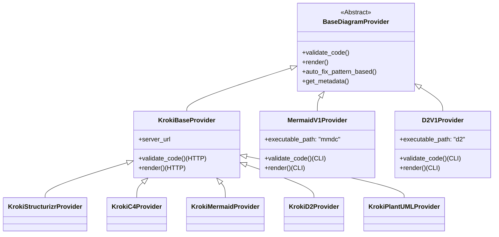

# Diagram Provider System Architecture and Support

This document details the architecture, inheritance hierarchy, responsibilities, and specific capabilities of the Diagram Provider System.

## Architecture Overview

The system is built on a plugin-based architecture where each diagram renderer is a self-contained "Provider". All providers inherit from a common base class, ensuring a consistent interface for validation, rendering, and error correction.

### Inheritance Hierarchy

### Core Components

1.  **BaseDiagramProvider (`backend/diagrams/base_diagram.py`)**:
    *   **Role**: Abstract base class defining the contract for all providers.
    *   **Responsibilities**:
        *   Configuration loading (`config.json`).
        *   Standardized logging setup.
        *   Orchestration of the "Render Pipeline" (Validation -> Pattern Fix -> LLM Correction -> Render).
        *   Metadata generation.

2.  **KrokiBaseProvider (`backend/diagrams/kroki_base.py`)**:
    *   **Role**: Intermediate base class for all providers using the Kroki service.
    *   **Responsibilities**:
        *   Managing HTTP connections to the Kroki server.
        *   Common validation logic (checking HTTP 400 responses).
        *   Common rendering logic (fetching SVG/PNG).

3.  **Concrete Providers**:
    *   Implement specific diagram types.
    *   Define provider-specific pattern fixes.
    *   Provide LLM correction rules.

## Supported Providers

### 1. D2 CLI Renderer (`d2v1`)
*   **Type**: `d2`
*   **Mechanism**: CLI (calls `d2` executable locally).
*   **Capabilities**: Validation, SVG/PNG Rendering, Pattern Auto-fix, LLM Correction.
*   **Key Features**:
    *   High-performance validation using text layout engine.
    *   Self-contained syntax fixer (braces, arrows, direction).
    *   Strips icon attributes to prevent 403 errors.

### 2. Mermaid CLI Renderer (`mermaidv1`)
*   **Type**: `mermaid`
*   **Mechanism**: CLI (calls `mmdc` executable locally).
*   **Capabilities**: Validation, SVG/PNG Rendering, Pattern Auto-fix, LLM Correction.
*   **Key Features**:
    *   Uses official Mermaid CLI for pixel-perfect rendering.
    *   Pattern fixers for missing diagram types, arrow spacing, and quoting labels.

### 3. Kroki Structurizr (`krokistructurizr`)
*   **Type**: `structurizr`
*   **Mechanism**: HTTP (Kroki).
*   **Capabilities**: Validation, SVG/PNG Rendering, Pattern Auto-fix, LLM Correction.
*   **Key Features**:
    *   Specialized fixes for Structurizr DSL (injecting `workspace`, `model` blocks).
    *   Renders complex C4 models via Structurizr DSL.

### 4. Kroki C4 (`krokic4`)
*   **Type**: `c4`
*   **Mechanism**: HTTP (Kroki via PlantUML).
*   **Capabilities**: Validation, SVG/PNG Rendering, LLM Correction.
*   **Key Features**:
    *   Renders C4 diagrams using PlantUML's C4 library support.

### 5. Kroki Mermaid (`krokimermaid`)
*   **Type**: `mermaid`
*   **Mechanism**: HTTP (Kroki).
*   **Capabilities**: Validation, SVG/PNG Rendering, Pattern Auto-fix, LLM Correction.
*   **Key Features**:
    *   Alternative to local CLI, useful when Node.js is not available.
    *   Includes similar pattern fixes as `mermaidv1`.

### 6. Kroki D2 (`krokid2`)
*   **Type**: `d2`
*   **Mechanism**: HTTP (Kroki).
*   **Capabilities**: Validation, SVG/PNG Rendering, LLM Correction.
*   **Key Features**:
    *   Alternative to local CLI.

### 7. Kroki PlantUML (`krokiplantuml`)
*   **Type**: `plantuml`
*   **Mechanism**: HTTP (Kroki).
*   **Capabilities**: Validation, SVG/PNG Rendering, LLM Correction.
*   **Key Features**:
    *   Standard PlantUML rendering.

## Logging and Observability

All providers utilize a standardized logging approach:
*   **Context**: Logs include `provider_id` and relevant metadata.
*   **Levels**:
    *   `INFO`: High-level operations (Validation start/end, Render success/fail, Fix applied).
    *   `DEBUG`: Detailed logic flow and payload sizes.
    *   `ERROR`: Exceptions and critical failures.
*   **Decorator**: `@log_method_call` ensures entry/exit logging for critical methods.

## Testing Strategy

*   **Mock Tests**: Located in `backend/diagrams/tests/test_mock_*.py`. These tests simulate external dependencies (CLI/HTTP) to verify logic, logging, and error handling without requiring the actual tools installed.
*   **Integration Tests**: Existing tests in `backend/diagrams/tests/` that attempt to connect to real services if available.
