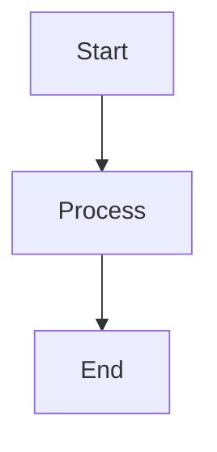
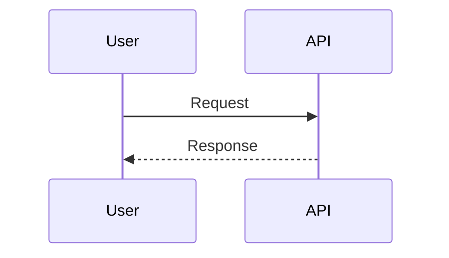

# Frontend Diagram Provider Integration - Testing Plan

## Overview
This document outlines the comprehensive testing strategy for the new DiagramProviderService and updated diagram components.

---

## Phase 1: Manual Testing (Browser)

### 1.1 Mermaid Diagram Rendering

**Test Case: M1 - Basic Flowchart**
```
Input:


Expected:
- ✅ Diagram renders successfully via mermaidv1 provider
- ✅ Provider name and render time displayed in Card title
- ✅ Console shows: "🎨 [MERMAID DIAGRAM] SVG rendered successfully via provider"
- ✅ No errors in console
```

**Test Case: M2 - Sequence Diagram**
```
Input:


Expected:
- ✅ Renders via mermaidv1 provider
- ✅ Proper sequence flow displayed
- ✅ Provider metadata shows in Card
```

**Test Case: M3 - Class Diagram with Errors**
```
Input: (intentionally broken)
```mermaid
classDiagram
  class User {
    string name
    login()
  // Missing closing brace
```

Expected:
- ✅ Validation detects error
- ✅ Auto-fix attempts correction
- ✅ If successful, shows success message
- ✅ If failed, shows error message
- ✅ No crash, graceful error handling
```

**Test Case: M4 - Zoom and Pan**
- ✅ Click zoom in button → diagram zooms to 125%
- ✅ Click zoom out button → diagram zooms to 75%
- ✅ Scroll wheel zooms diagram in/out
- ✅ Click and drag to pan when zoomed
- ✅ Reset zoom button returns to 100%

**Test Case: M5 - Export Functionality**
- ✅ Click "Copy" button → code copied to clipboard
- ✅ Click "SVG" button → downloads diagram as SVG file
- ✅ Click "PNG" button → downloads diagram as PNG image
- ✅ Click expand button → opens SVG in new window

---

### 1.2 D2 Diagram Rendering

**Test Case: D1 - Basic D2 Diagram**
```
Input:
```d2
direction: right

frontend: "Web Frontend" {
  shape: rectangle
}

backend: "API Server" {
  shape: rectangle
}

frontend -> backend: "HTTP"
```

Expected:
- ✅ Diagram renders via d2v1 provider
- ✅ Provider name and render time shown in Card title
- ✅ Console shows: "🎯 [D2 DIAGRAM] SVG rendered successfully via provider"
- ✅ No errors
```

**Test Case: D2 - D2 with Styling**
```
Input:
```d2
direction: down

node1: "Node 1" {
  shape: rectangle
  style.fill: "#a8dadc"
}

node2: "Node 2" {
  shape: circle
  style.fill: "#457b9d"
}

node1 -> node2: "connection"
```

Expected:
- ✅ Renders with proper colors and shapes
- ✅ Styling applied correctly
- ✅ Provider metadata displayed
```

**Test Case: D3 - Invalid D2 Code**
```
Input: (broken syntax)
```d2
frontend -> backend
backend --> // missing target
```

Expected:
- ✅ Validation detects errors
- ✅ Auto-fix attempts pattern-based correction
- ✅ Shows success or error message
- ✅ Graceful error display
```

**Test Case: D4 - Export Functionality**
- ✅ Click "Copy SVG" → copies rendered SVG to clipboard
- ✅ Click "Download" → downloads SVG file
- ✅ Click "Expand" → opens in new window
- ✅ Debug info shows/hides properly

**Test Case: D5 - Debug Panel**
- ✅ Click "Show Debug" → displays provider metadata
- ✅ Shows: success status, code length, render time, timestamp
- ✅ Shows: validation status, errors, file paths
- ✅ Click "Hide Debug" → hides panel

---

### 1.3 Provider Service Integration

**Test Case: P1 - Provider Info Fetching**
```
In browser console:
```javascript
const info = await diagramProviderService.getProviderInfo('mermaid');
console.log(info);
```

Expected:
- ✅ Returns: { provider_id: 'mermaidv1', provider_name: 'Mermaid v1', ... }
- ✅ Shows: capabilities, supported_formats, version
- ✅ Available flag is true
```

**Test Case: P2 - List All Providers**
```javascript
const list = await diagramProviderService.listProviders();
console.table(list.providers);
```

Expected:
- ✅ Shows all registered providers
- ✅ mermaidv1 listed with diagram_type: 'mermaid'
- ✅ d2v1 listed with diagram_type: 'd2'
- ✅ Availability status correct
```

**Test Case: P3 - Health Check**
```javascript
const health = await diagramProviderService.checkHealth();
console.log(health);
```

Expected:
- ✅ Returns health status
- ✅ Shows available_providers > 0
- ✅ Includes diagram_types array
```

**Test Case: P4 - Caching**
```javascript
// First call
const info1 = await diagramProviderService.getProviderInfo('mermaid');
console.time('cached');

// Second call (should be cached)
const info2 = await diagramProviderService.getProviderInfo('mermaid');
console.timeEnd('cached');

// Check cache was used (should be <10ms)
```

Expected:
- ✅ First call makes network request
- ✅ Second call returns immediately from cache
- ✅ Cache expires after 5 minutes
```

---

### 1.4 Error Handling

**Test Case: E1 - Network Error**
- ✅ Disconnect internet
- ✅ Try to render diagram
- ✅ Shows error message
- ✅ No crash, graceful handling

**Test Case: E2 - Backend Provider Unavailable**
- ✅ Stop backend service
- ✅ Try to render diagram
- ✅ Shows error: "Provider not available"
- ✅ Graceful error display

**Test Case: E3 - Invalid Diagram Code**
- ✅ Paste completely random text as diagram
- ✅ Should show validation error
- ✅ May or may not render depending on fallback

**Test Case: E4 - Very Long Code**
- ✅ Generate 10,000+ line diagram code
- ✅ Should timeout gracefully
- ✅ Show error message, not crash

---

## Phase 2: Console Testing

### 2.1 Logging Output

**Check Debug Prefixes**
- 🎨 = Mermaid operations (in console)
- 🎯 = D2 operations (in console)
- 📊 = Provider service operations (in console)

```javascript
// In browser console, filter by prefix:
// To see all Mermaid logs:
console.log('🎨', 'test');

// To see all D2 logs:
console.log('🎯', 'test');

// To see all Provider Service logs:
console.log('📊', 'test');
```

**Expected Output Sequence for Mermaid**:
```
🎨 [MERMAID DIAGRAM] Provider info loaded: Mermaid v1
🎨 [MERMAID DIAGRAM] Starting Mermaid diagram render via provider
🔧 [MERMAID DIAGRAM] Validating via provider service...
🎨 [MERMAID DIAGRAM] Validation result: { is_valid: true, auto_fixed: false, ... }
🎨 [MERMAID DIAGRAM] Rendering via backend provider...
🎨 [MERMAID DIAGRAM] SVG rendered successfully via provider
```

**Expected Output Sequence for D2**:
```
🎯 [D2 DIAGRAM] Provider info loaded: D2 v1
🎯 [D2 DIAGRAM] Starting D2 diagram render via provider service
🎯 [D2 DIAGRAM] Validating D2 code via provider...
🎯 [D2 DIAGRAM] Validation result: { is_valid: true, auto_fixed: false, ... }
🎯 [D2 DIAGRAM] Rendering via backend provider...
🎯 [D2 DIAGRAM] SVG rendered successfully via provider
```

---

## Phase 3: Network Inspection (DevTools)

### 3.1 API Calls

**Check Network Tab**:
1. Open DevTools → Network tab
2. Render a diagram
3. Look for these requests:

**Expected Requests for Mermaid**:
- ✅ GET `/api/v1/diagram-provider/providers` (provider info fetch)
- ✅ POST `/api/v1/diagram-provider/validate` (validation)
- ✅ POST `/api/v1/diagram-provider/render` (rendering)

**Check Request/Response**:

For `POST /api/v1/diagram-provider/validate`:
```json
Request:
{
  "code": "flowchart TD...",
  "diagram_type": "mermaid",
  "auto_fix": true,
  "use_llm": false
}

Response:
{
  "is_valid": true,
  "error": null,
  "code_length": 45,
  "auto_fixed": false,
  "llm_corrected": false,
  "fixed_code": null,
  "correction_method": null,
  "provider_id": "mermaidv1"
}
```

For `POST /api/v1/diagram-provider/render`:
```json
Response:
{
  "success": true,
  "content": "<svg>...</svg>",
  "output_format": "svg",
  "validation": { ... },
  "metadata": {
    "provider_id": "mermaidv1",
    "provider_name": "Mermaid v1",
    "render_time": 145.23,
    "timestamp": "2025-11-02T...",
    "code_length": 45
  },
  "error": null,
  "file_path": null,
  "provider_id": "mermaidv1"
}
```

### 3.2 Performance Metrics

**Monitor Render Time**:
1. Look at `metadata.render_time` in response
2. Mermaid typically: 50-200ms
3. D2 typically: 100-500ms
4. Large diagrams: 500ms-2s

Expected:
- ✅ Mermaid renders quickly (<300ms)
- ✅ D2 renders in reasonable time (<1s)
- ✅ Metadata shows accurate times

---

## Phase 4: Component-Specific Tests

### 4.1 MermaidDiagram Component

**Test Case: MC1 - Provider Info Display**
- ✅ Render Mermaid diagram
- ✅ Card title shows: "Mermaid Diagram" + green tag "Mermaid v1" + blue tag "145ms"
- ✅ Tags disappear if rendering fails

**Test Case: MC2 - Auto-fix Notification**
- Provide broken Mermaid code that can be auto-fixed
- ✅ Show success notification: "Mermaid diagram rendered successfully (pattern_fix)"
- ✅ Notification disappears after 4 seconds

**Test Case: MC3 - Client-side Fallback**
- ✅ Still uses mermaid.js for client-side parse validation
- ✅ Fallback to backend if client-side fails
- ✅ Both work together seamlessly

**Test Case: MC4 - State Management**
```javascript
// In component, check state after successful render:
renderResult should have:
- success: true
- content: (SVG string)
- metadata: { provider_id, provider_name, render_time, ... }
```

### 4.2 D2DiagramBackend Component

**Test Case: DC1 - Provider Info Display**
- ✅ Render D2 diagram
- ✅ Card title shows: "D2 Diagram" + green tag "D2 v1" + blue tag "234ms"
- ✅ Tags show only on successful render

**Test Case: DC2 - Auto-fix Notification**
- Provide broken D2 code
- ✅ Show: "D2 diagram rendered successfully (pattern_fix)"
- ✅ Or show error if not fixable

**Test Case: DC3 - Responsive Container**
- ✅ Render diagram
- ✅ Resize browser window
- ✅ Diagram re-renders automatically (via ResizeObserver)
- ✅ Container adjusts properly

**Test Case: DC4 - SVG Insertion**
- ✅ Check containerRef is populated with SVG
- ✅ SVG renders correctly in DOM
- ✅ Interactive elements work (if any)

---

## Phase 5: Integration Tests

### 5.1 Chat Flow

**Test Case: INT1 - Complete Chat Cycle**
1. Open chat application
2. Request: "Create a mermaid flowchart for login process"
3. LLM generates mermaid code
4. ✅ MermaidDiagram component appears
5. ✅ Diagram renders via mermaidv1 provider
6. ✅ Provider info displayed

**Test Case: INT2 - D2 Architecture Diagram**
1. Request: "Draw D2 diagram of microservices architecture"
2. LLM generates d2 code
3. ✅ D2DiagramBackend component appears
4. ✅ Diagram renders via d2v1 provider
5. ✅ Provider metadata shown

**Test Case: INT3 - Mixed Diagrams**
1. Request: "Show both a flowchart and an architecture diagram"
2. LLM returns both mermaid and d2
3. ✅ Both render side by side
4. ✅ Each uses correct provider
5. ✅ Both show provider info independently

---

## Phase 6: Edge Cases

### 6.1 Boundary Tests

**Test Case: EDGE1 - Empty Code**
```
Input: ""
Expected: Skip rendering, no error
```

**Test Case: EDGE2 - Single Character**
```
Input: "A"
Expected: Show validation error, handle gracefully
```

**Test Case: EDGE3 - Very Large Diagram**
```
Input: 50KB of valid code
Expected: Render successfully or timeout with error
```

**Test Case: EDGE4 - Special Characters**
```
Input: Code with Unicode, emojis, special symbols
Expected: Render correctly or show encoding error
```

**Test Case: EDGE5 - Nested Containers**
```
Input: D2 with deeply nested objects (5+ levels)
Expected: Render correctly, handle styling
```

---

## Phase 7: Cross-Browser Testing

Test on multiple browsers:

| Browser | Action | Expected |
|---------|--------|----------|
| Chrome | Render diagram | ✅ Works perfectly |
| Firefox | Render diagram | ✅ Works perfectly |
| Safari | Render diagram | ✅ Works perfectly |
| Edge | Render diagram | ✅ Works perfectly |

---

## Phase 8: Performance Testing

### 8.1 Render Time Benchmarks

Create test suite:
```javascript
const testCases = [
  { name: 'Simple Flowchart', code: '...', expectedTime: 50 },
  { name: 'Complex Sequence', code: '...', expectedTime: 100 },
  { name: 'Large D2', code: '...', expectedTime: 300 },
];

for (const test of testCases) {
  const start = performance.now();
  await diagramProviderService.render({
    code: test.code,
    diagram_type: test.diagram_type
  });
  const duration = performance.now() - start;
  console.log(`${test.name}: ${duration}ms (expected: ${test.expectedTime}ms)`);
}
```

Expected:
- ✅ All diagrams render within 2x expected time
- ✅ No memory leaks after multiple renders
- ✅ Smooth UI, no freezing

### 8.2 Memory Usage

```javascript
// Before rendering
console.memory.usedJSHeapSize

// Render 20 diagrams
for (let i = 0; i < 20; i++) {
  await renderDiagram(testCode);
}

// After rendering
console.memory.usedJSHeapSize

// Should not increase more than 10MB
```

---

## Phase 9: Accessibility Testing

**Test Case: A1 - Keyboard Navigation**
- ✅ Tab through buttons
- ✅ Enter/Space activates buttons
- ✅ All controls accessible

**Test Case: A2 - Screen Reader**
- ✅ ARIA labels present
- ✅ SVG has alt text
- ✅ Error messages readable

---

## Phase 10: Checklist

### Pre-Testing
- [ ] Backend is running and healthy
- [ ] All endpoints accessible
- [ ] Browser DevTools open
- [ ] Network tab visible

### Mermaid Tests
- [ ] M1 - Basic Flowchart
- [ ] M2 - Sequence Diagram
- [ ] M3 - Error Handling
- [ ] M4 - Zoom & Pan
- [ ] M5 - Export

### D2 Tests
- [ ] D1 - Basic Diagram
- [ ] D2 - Styling
- [ ] D3 - Error Handling
- [ ] D4 - Export
- [ ] D5 - Debug Panel

### Provider Service Tests
- [ ] P1 - Provider Info
- [ ] P2 - List Providers
- [ ] P3 - Health Check
- [ ] P4 - Caching

### Error Handling
- [ ] E1 - Network Error
- [ ] E2 - Backend Unavailable
- [ ] E3 - Invalid Code
- [ ] E4 - Timeout

### Console Logging
- [ ] Verify 🎨 prefix for Mermaid
- [ ] Verify 🎯 prefix for D2
- [ ] Verify 📊 prefix for Provider Service
- [ ] Check all expected log messages

### Network Inspection
- [ ] Validate API requests
- [ ] Check response formats
- [ ] Monitor performance

### Component Tests
- [ ] MC1-MC4 (Mermaid)
- [ ] DC1-DC4 (D2)

### Integration Tests
- [ ] INT1 - Chat cycle
- [ ] INT2 - D2 architecture
- [ ] INT3 - Mixed diagrams

### Edge Cases
- [ ] EDGE1-EDGE5

### Cross-Browser
- [ ] Chrome
- [ ] Firefox
- [ ] Safari
- [ ] Edge

### Performance
- [ ] Render times acceptable
- [ ] No memory leaks
- [ ] Smooth UI

### Accessibility
- [ ] A1 - Keyboard nav
- [ ] A2 - Screen reader

---

## Testing Tools

### Browser Tools
- Chrome DevTools (Network, Console, Performance)
- React DevTools extension
- Redux DevTools (if applicable)

### Testing Libraries (for automated tests later)
```bash
npm install --save-dev vitest @testing-library/react @testing-library/user-event
```

### Useful Commands
```bash
# Start frontend dev server
npm run dev

# Open DevTools
F12 or Cmd+Option+I (Mac)

# Performance profiling
Cmd+Shift+P → "Performance"

# Network throttling
DevTools → Network tab → Slow 3G
```

---

## Issue Reporting Template

When you find an issue, report it as:

```
**Test Case**: [ID]
**Step to Reproduce**:
[Detailed steps]

**Expected**:
[What should happen]

**Actual**:
[What actually happened]

**Screenshots**:
[Include if helpful]

**Console Errors**:
[Any error messages]

**Network Requests**:
[Any failed API calls]

**Browser**:
[Chrome/Firefox/Safari/Edge]

**Severity**:
[Critical/High/Medium/Low]
```

---

## Sign-off

- [ ] All Phase 1-10 tests completed
- [ ] No critical issues found
- [ ] Performance acceptable
- [ ] All error cases handled
- [ ] Ready for production deployment

---

**Testing Date**: _______________
**Tester Name**: _______________
**Notes**:
