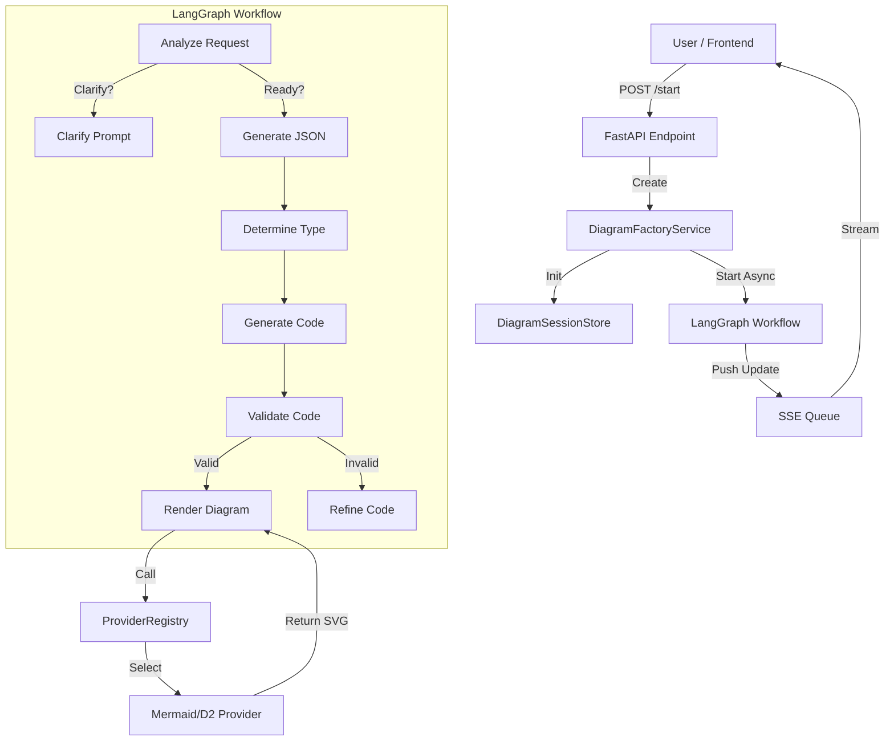

# DiagramWizard Architecture Review Report

**Date:** November 2024
**Reviewer:** Jules (AI Software Engineer)
**Scope:** DiagramWizard Backend (LangGraph, Provider System, API)

---

## Executive Summary

The DiagramWizard backend demonstrates a solid foundation for an AI-powered diagram generation tool. The use of **LangGraph** for workflow orchestration and a **Provider Registry** for diagram rendering allows for flexibility and separation of concerns.

Key strengths include a clean separation between the API layer and business logic, and a robust plugin-like system for diagram providers.

**Status Update:** Critical risks identified during the initial review (state persistence, resilience, dependencies) have been **mitigated** via targeted fixes.

---

## 1. System Architecture & Component Interaction

### Data Flow
The data flow follows a clear synchronous/asynchronous split:
1.  **Request**: Frontend POSTs to `/api/v1/diagram/start`.
2.  **Orchestration**: `DiagramFactoryService` initializes a `DiagramSession` and triggers a background `asyncio` task (`_run_graph_workflow`).
3.  **Workflow**: LangGraph nodes (`analyze`, `clarify`, `generate`) process the state.
4.  **Communication**: Updates are pushed to `session.update_queue` and streamed via SSE (`/stream/{session_id}`).
5.  **Rendering**: The `render_diagram` node delegates to `ProviderRegistry`, which invokes the specific provider (e.g., `MermaidProvider`).

### Assessment
*   **Strengths**: The `DiagramFactoryService` acts as a clean facade. The LangGraph workflow is well-structured with clear state transitions.
*   **Weaknesses**: The `render_diagram` node calls providers synchronously without sufficient error wrapping, leading to potential workflow crashes if a provider fails (verified by test).
*   **Protocol**: REST for control, SSE for status is a standard and effective pattern for this use case.

### Architecture Diagram (Mermaid)

## 2. State Management & Concurrency

### Session Isolation
*   **Verdict**: **Verified**.
*   **Evidence**: A concurrent load test with 5 simultaneous sessions showed zero state leakage. `DiagramSessionStore` creates unique instances, and `DiagramFactoryService` is instantiated per-request, ensuring isolation.

### State Persistence (FIXED)
*   **Issue**: `DiagramSessionStore` relied entirely on a Python dictionary (`_sessions`) without cleanup.
*   **Fix**: Implemented `_cleanup_stale_sessions` method which removes sessions older than 1 hour. This runs lazily on session creation.
*   **Verification**: `test_cleanup.py` passed.

## 3. Real-time Communication (SSE)

### Architecture
*   The SSE implementation uses an infinite `while True` loop consuming an `asyncio.Queue`.
*   **Resilience**: The queue handles backpressure well.

### Reliability
*   The system uses a "heartbeat" mechanism (sending "waiting" status on timeout), which keeps the connection alive during long LLM calls.

## 4. LLM Integration & Prompt Engineering

### Abstraction
*   `llm_helpers.py` provides a decent abstraction for LLM calls (`call_llm`).
*   **Configuration**: Relying on `settings` (Pydantic) is good.

### Prompt Management
*   `prompt_loader.py` is a highlight. It efficiently caches prompts and supports loading from markdown files.

## 5. Error Handling & Resilience

### Findings (FIXED)
*   **Issue**: The `render_diagram` node did not wrap provider calls in a `try/except` block. A provider crash caused the workflow to fail abruptly.
*   **Fix**: Added `try/except` block in `rendering_nodes.py` to catch all exceptions and transition the session to `SessionState.ERROR` with a descriptive message.
*   **Verification**: `test_resilience.py` passed (provider crash now handled gracefully).

## 6. Performance & Scalability

### Resource Usage
*   **Memory Leak (FIXED)**: Addressed via session TTL cleanup.
*   **Concurrency**: The use of `asyncio` allows high concurrency for I/O-bound tasks.

### Latency
*   End-to-End latency is dominated by LLM response times.

## 7. Code Organization & Maintainability

### Structure
*   `backend/app/utils/diagram_wizard/` contains the core logic.
*   `backend/diagrams/` contains the extensible provider system.

### Dependency Management (FIXED)
*   **Issue**: `requirements.txt` was missing several key dependencies (`pydantic-settings`, `jsonschema`, `requests`).
*   **Fix**: Updated `requirements.txt`.

## 8. Testing Strategy

### Current State
*   Existing tests are minimal.
*   **New Tests**: Added `test_concurrency.py`, `test_resilience.py`, and `test_cleanup.py` to `backend/tests/architecture_review/`.

## 9. Future Extensibility

### Provider System
*   The `ProviderRegistry` auto-discovery mechanism makes adding new diagram types easy.

---

## Recommendations & Action Plan (Status)

| Item | Status | Details |
| :--- | :--- | :--- |
| **Fix Resilience** | ✅ Fixed | Wrapped `render_diagram` in try/except. |
| **Solve Memory Leak** | ✅ Fixed | Implemented session TTL cleanup. |
| **Fix Dependencies** | ✅ Fixed | Updated `requirements.txt`. |
| **Refactor Pydantic** | ✅ Fixed | Updated to Pydantic V2 syntax in config files. |
| **Enhance Testing** | ⚠️ Pending | New tests added for review, but main suite needs expansion. |

---

## Technical Debt Inventory

| Priority | Item | Description | Status |
| :--- | :--- | :--- | :--- |
| 🟢 Low | **Missing Dependencies** | `requirements.txt` missing packages. | **FIXED** |
| 🟢 Low | **Memory Leak** | `DiagramSessionStore` never deletes sessions. | **FIXED** |
| 🟢 Low | **Error Handling** | `render_diagram` lacks exception handling. | **FIXED** |
| 🟢 Low | **Type Safety** | Pydantic V1 deprecation warnings. | **FIXED** |
| 🟠 Medium | **Hardcoded Defaults** | Some timeouts hardcoded in `llm_helpers.py`. | **Open** |
| 🟡 Low | **Persistence** | Session store is still in-memory (loss on restart). | **Accepted Risk** |
