# Diagram Wizard Lifecycle Sequence Diagram

This document provides a comprehensive sequence diagram showing the complete lifecycle of the diagram wizard, focusing on LangGraph nodes and their interactions with the frontend.

## Architecture Overview

The diagram wizard uses a **LangGraph state machine** to orchestrate the diagram generation workflow. The system follows a conversational approach where the AI guides users through creating professional diagrams through intelligent clarification and validation loops.

## Sequence Diagram

```mermaid
sequenceDiagram
    participant User
    participant Frontend
    participant BackendAPI
    participant DiagramFactoryService
    participant LangGraph
    participant Nodes
    participant ProviderSystem

    Note over User,ProviderSystem: Diagram Wizard Lifecycle

    %% Initial Request
    User->>Frontend: Enter diagram description
    Frontend->>BackendAPI: POST /api/v1/diagram/start-generation
    BackendAPI->>DiagramFactoryService: start_generation(prompt, diagram_type, model_id)
    
    %% Session Creation
    DiagramFactoryService->>DiagramFactoryService: Create DiagramSession
    DiagramFactoryService->>DiagramFactoryService: Initialize GraphState
    DiagramFactoryService->>LangGraph: get_diagram_factory_graph(service)
    
    %% LangGraph Workflow Start
    DiagramFactoryService->>LangGraph: ainvoke(initial_state)
    LangGraph->>Nodes: analyze_request(state, service)
    
    %% Analysis Phase
    Nodes->>Nodes: Assess information completeness
    Nodes->>Nodes: Call LLM with analyze_request prompt
    Nodes->>Frontend: SSE: status=analyzing
    Nodes->>Nodes: Parse AI response (analysis_summary, clarity_score, json_representation)
    Nodes->>Frontend: SSE: status=analysis_complete<br/>score, question, json_representation
    
    %% Clarification Loop (can iterate multiple times)
    loop Until clarity_score >= SCORE_TARGET or timeout
        LangGraph->>Nodes: clarify_prompt(state)
        Nodes->>Nodes: Check timeout (max 20 questions, 30 min)
        Nodes->>Nodes: Build combined ANALYZE+CLARIFY prompt
        Nodes->>Nodes: Call LLM with user context
        Nodes->>Frontend: SSE: status=clarifying<br/>question, clarity_score, json_representation
        
        alt clarity_score >= SCORE_TARGET
            Nodes->>Frontend: SSE: status=clarification_ready<br/>awaiting_user_confirmation=true
            Frontend->>User: Show design summary & confirmation button
            User->>Frontend: Click "Confirm & Generate"
            Frontend->>BackendAPI: POST /api/v1/diagram/confirm-ready
            BackendAPI->>DiagramFactoryService: confirm_ready()
            DiagramFactoryService->>LangGraph: _resume_graph_if_idle()
        else clarity_score < SCORE_TARGET
            Nodes->>Frontend: SSE: status=clarifying<br/>question displayed
            Frontend->>User: Show clarification question
            User->>Frontend: Enter clarification response
            Frontend->>BackendAPI: POST /api/v1/diagram/handle-clarification
            BackendAPI->>DiagramFactoryService: handle_clarification(response)
            DiagramFactoryService->>LangGraph: _resume_graph_if_idle()
        end
    end
    
    %% JSON Representation Generation
    LangGraph->>Nodes: generate_json_representation(state)
    Nodes->>Nodes: Call LLM with JSON_GENERATION prompt
    Nodes->>Nodes: Generate Structurizr workspace + clean_structurizr + json_representation
    Nodes->>Nodes: Validate against ArchitectureSchema
    Nodes->>Frontend: SSE: status=generating_json<br/>message="Validating architecture..."
    Nodes->>Frontend: SSE: status=json_generated
    
    %% Diagram Type Determination
    LangGraph->>Nodes: determine_diagram_type_node(state)
    Nodes->>Nodes: Analyze final_design_summary + json_representation
    Nodes->>Nodes: Score all diagram types (Mermaid, D2, PlantUML, Structurizr)
    Nodes->>Frontend: SSE: status=awaiting_diagram_type_selection<br/>keyword_scores, recommended_type
    Frontend->>User: Show diagram type options with scores
    User->>Frontend: Select diagram type
    Frontend->>BackendAPI: POST /api/v1/diagram/select-diagram-type
    BackendAPI->>DiagramFactoryService: select_diagram_type(diagram_type)
    DiagramFactoryService->>LangGraph: _resume_graph_if_idle()
    
    %% Code Generation
    LangGraph->>Nodes: generate_code(state)
    Nodes->>Nodes: Get diagram-type-specific prompt
    Nodes->>Nodes: Call LLM with json_representation
    Nodes->>Nodes: Clean markdown formatting
    Nodes->>Frontend: SSE: status=generating<br/>message="Generating Mermaid code..."
    Nodes->>Frontend: SSE: status=code_generated
    
    %% Validation Loop (can iterate up to 3 times)
    loop Until code is valid or max_attempts reached
        LangGraph->>Nodes: validate_code(state)
        Nodes->>ProviderSystem: provider.validate_code(diagram_code)
        ProviderSystem-->>Nodes: ValidationResult (is_valid, errors)
        
        alt is_valid = true
            Nodes->>Frontend: SSE: status=validating<br/>message="Code is valid"
            Nodes->>LangGraph: route to render_diagram
        else is_valid = false
            Nodes->>Frontend: SSE: status=validation_error<br/>validation_error message
            LangGraph->>Nodes: refine_code(state)
            Nodes->>Nodes: Call LLM with REFINE prompt + error context
            Nodes->>Nodes: Clean markdown formatting
            Nodes->>Frontend: SSE: status=refining<br/>message="Fixing code (attempt X)..."
            Nodes->>Frontend: SSE: status=code_refined
            Nodes->>LangGraph: route back to validate_code
        end
        
        alt refinement_attempt >= 3
            Nodes->>Frontend: SSE: status=error<br/>message="Max refinement attempts reached"
            Nodes->>LangGraph: route to END
        end
    end
    
    %% Rendering
    LangGraph->>Nodes: render_diagram(state)
    Nodes->>ProviderSystem: provider.render_with_validation(code, svg)
    ProviderSystem-->>Nodes: RenderResult (success, svg_content, error)
    
    alt rendering success
        Nodes->>Frontend: SSE: status=rendering
        Nodes->>Frontend: SSE: status=completed<br/>svg_output
        Frontend->>User: Display rendered diagram
    else rendering failed
        Nodes->>Frontend: SSE: status=error<br/>error_message
        Frontend->>User: Show error message
    end
    
    %% Workflow Completion
    LangGraph-->>DiagramFactoryService: Final state
    DiagramFactoryService->>DiagramFactoryService: Update session with results
    DiagramFactoryService->>Frontend: SSE: status=completed<br/>final results
    
    Note over User,ProviderSystem: Session Complete - Diagram Ready
```



## Node Details

### 1. Analysis Nodes (`analysis_nodes.py`)
- **`analyze_request`**: Initial request analysis
  - Assesses information completeness using keyword scoring
  - Calls LLM with analyze_request prompt
  - Returns analysis_summary, clarity_score, and initial json_representation
  - Always routes to clarification phase

### 2. Clarification Nodes (`clarification_nodes.py`)
- **`clarify_prompt`**: Interactive clarification loop
  - **Smart skipping**: Avoids duplicate first question
  - **Timeout protection**: Max 20 questions or 30 minutes
  - **Scoring**: Tracks clarity_score (1-100) per iteration
  - **User confirmation**: Waits for explicit confirmation before proceeding
  - **Conditional routing**: 
    - `clarity_score >= SCORE_TARGET` → Wait for user confirmation
    - `clarity_score < SCORE_TARGET` → Ask another question
    - `timeout reached` → Ask for confirmation to proceed with available info

### 3. Generation Nodes (`generation_nodes.py`)
- **`generate_json_representation`**: Architecture representation generation
  - Generates Structurizr workspace, clean_structurizr, and legacy JSON
  - Validates against ArchitectureSchema
  - Provides synchronized multi-format output
  
- **`determine_diagram_type`**: Intelligent diagram type recommendation
  - Analyzes final_design_summary and json_representation
  - Scores all diagram types (Mermaid, D2, PlantUML, Structurizr)
  - Returns keyword_scores for user selection
  - **Conditional routing**: Always waits for user selection

- **`generate_code`**: Diagram code generation
  - Uses diagram-type-specific prompts
  - Generates clean, syntactically correct code
  - Removes markdown formatting

### 4. Validation Nodes (`validation_nodes.py`)
- **`validate_code`**: Code validation
  - Uses provider system for validation
  - **Conditional routing**:
    - `is_valid = true` → Route to render_diagram
    - `is_valid = false` → Route to refine_code

- **`refine_code`**: Code refinement
  - Fixes validation errors using LLM
  - Max 3 refinement attempts
  - **Conditional routing**: Always routes back to validate_code
  - **Loop termination**: After 3 attempts, routes to END with error

### 5. Rendering Nodes (`rendering_nodes.py`)
- **`render_diagram`**: Final rendering
  - Uses provider system for SVG generation
  - **Final node**: Routes to END
  - Returns svg_output or error_message

## Conditional Routing Logic

The LangGraph uses three key routing functions:

### 1. `route_after_clarify`
```python
if llm_ready and user_confirmed_ready:
    → "generate_json_representation"
else:
    → END (wait for user input)
```

### 2. `route_after_diagram_type`
```python
if user_selected_diagram_type:
    → "generate_code"
else:
    → END (wait for user selection)
```

### 3. `route_validation`
```python
if is_valid:
    → "render_diagram"
else:
    → "refine_code"
```

## Frontend Interactions

The frontend communicates with the backend through:

1. **REST API Endpoints**:
   - `POST /api/v1/diagram/start-generation` - Start new diagram session
   - `POST /api/v1/diagram/handle-clarification` - Submit clarification response
   - `POST /api/v1/diagram/confirm-ready` - Confirm ready to generate
   - `POST /api/v1/diagram/select-diagram-type` - Select diagram type

2. **Server-Sent Events (SSE)**:
   - Real-time status updates during generation
   - Status types: analyzing, clarifying, generating, validating, rendering, completed, error
   - Includes progress messages, scores, and partial results

3. **User Interactions**:
   - Initial diagram description input
   - Clarification question responses
   - Design summary confirmation
   - Diagram type selection
   - Manual code editing and re-rendering

## State Management

### GraphState Flow
The `GraphState` TypedDict flows through all nodes, accumulating:

- **Session metadata**: session_id, user_id, conversation_id
- **Input tracking**: design_prompt, diagram_type, model_id
- **Clarification data**: clarification_history, clarity_scores, question_count
- **Generation data**: json_representation, diagram_code, svg_output
- **Status flags**: llm_ready, user_confirmed_ready, is_valid
- **Error tracking**: validation_error, error_message

### Session Persistence
- `DiagramSessionStore` manages in-memory sessions
- Each session has unique ID, history, state, and update queue
- Sessions persist across clarification iterations
- Real-time updates via asyncio queues

## Error Handling & Resilience

1. **LLM Failures**: Graceful degradation with fallback prompts
2. **JSON Parsing**: Multiple parsing strategies with error recovery
3. **Validation Errors**: Up to 3 refinement attempts with LLM correction
4. **Timeout Protection**: Clarification loop limits (20 questions, 30 minutes)
5. **Provider System**: Direct validation/rendering with error propagation

## Key Features

- **Conversational AI**: Intelligent clarification with scoring
- **Multi-format Output**: Structurizr, D2, and legacy JSON simultaneously
- **Real-time Updates**: SSE for progressive UI updates
- **User Control**: Explicit confirmation before generation
- **Intelligent Recommendations**: Keyword-based diagram type scoring
- **Validation Loop**: Automatic error correction with LLM
- **Provider Integration**: Pluggable diagram rendering system