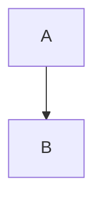

# HTML-Based Mermaid Detection Enhancement

## Problem
Some AI models return Mermaid diagrams in HTML `<pre><code>` blocks instead of Markdown code blocks, which prevents our React-based detection from working.

## Current Detection Method

**Location:** `ChatView.tsx` - CodeComponentRenderer

**Works for:**
```markdown

```

**Doesn't work for:**
```html
<pre><code>flowchart TD
    A --> B
</code></pre>
```

## Enhanced Solution

Add a post-processing step in ChatView to detect and replace HTML code blocks containing Mermaid syntax with proper Mermaid diagrams.

### Implementation Steps:

1. **Detect HTML code blocks with Mermaid syntax**
2. **Extract and decode the Mermaid code**
3. **Replace with MermaidDiagram component**

### Code Changes:

#### File: `ChatView.tsx`

Add a preprocessing function:

```typescript
import { isMermaidSyntax, prepareMermaidCode } from '../../utils/mermaidUtils';

/**
 * Process HTML content to detect and replace Mermaid code blocks
 */
const processMermaidInHTML = (htmlContent: string): React.ReactNode[] => {
  // Regex to find <pre><code>...</code></pre> blocks
  const codeBlockRegex = /<pre><code[^>]*>([\s\S]*?)<\/code><\/pre>/gi;
  const parts: React.ReactNode[] = [];
  let lastIndex = 0;
  let match;

  while ((match = codeBlockRegex.exec(htmlContent)) !== null) {
    // Add HTML before the code block
    if (match.index > lastIndex) {
      const beforeHtml = htmlContent.substring(lastIndex, match.index);
      parts.push(
        <div
          key={`html-${lastIndex}`}
          dangerouslySetInnerHTML={{ __html: beforeHtml }}
        />
      );
    }

    // Extract and decode the code content
    const rawCode = match[1];
    const decodedCode = rawCode
      .replace(/&lt;/g, '<')
      .replace(/&gt;/g, '>')
      .replace(/&amp;/g, '&')
      .replace(/&quot;/g, '"')
      .replace(/&#39;/g, "'")
      .trim();

    // Check if it's Mermaid syntax
    if (isMermaidSyntax(decodedCode)) {
      parts.push(
        <MermaidDiagram
          key={`mermaid-${match.index}`}
          code={decodedCode}
          title="Mermaid Diagram"
        />
      );
    } else {
      // Not Mermaid, render as regular code block
      parts.push(
        <pre key={`code-${match.index}`}>
          <code dangerouslySetInnerHTML={{ __html: rawCode }} />
        </pre>
      );
    }

    lastIndex = match.index + match[0].length;
  }

  // Add remaining HTML after last code block
  if (lastIndex < htmlContent.length) {
    const afterHtml = htmlContent.substring(lastIndex);
    parts.push(
      <div
        key={`html-${lastIndex}`}
        dangerouslySetInnerHTML={{ __html: afterHtml }}
      />
    );
  }

  return parts.length > 0 ? parts : [
    <div key="full" dangerouslySetInnerHTML={{ __html: htmlContent }} />
  ];
};
```

#### Update HTML View Rendering:

Replace the HTML view dangerouslySetInnerHTML with:

```typescript
{viewMode === 'html' && hasHtmlContent ? (
  // HTML View with Mermaid detection
  <div className="prose max-w-none" style={{...}}>
    {processMermaidInHTML(displayContent)}
  </div>
) : (
  // Markdown View - existing code
  <ReactMarkdown {...props}>
    {displayContent}
  </ReactMarkdown>
)}
```

## Benefits

✅ Works with AI models that return HTML instead of Markdown
✅ Automatically detects all Mermaid diagram types
✅ Uses existing MermaidDiagram component (copy, download, expand features)
✅ Backward compatible with Markdown-based detection
✅ Handles HTML entity encoding properly

## Testing

Test with HTML content containing:
1. Mermaid flowcharts
2. Mermaid sequence diagrams
3. Regular code blocks (should remain unchanged)
4. Mixed HTML and code blocks

---

**Recommendation:** Implement both solutions:
1. **Short-term:** Add HTML detection for immediate fix
2. **Long-term:** Update system prompt to standardize on Markdown
