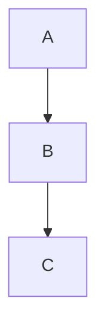
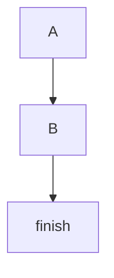
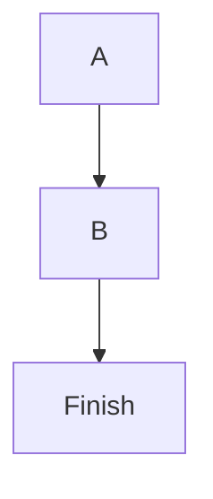

# Mermaid AI Retry System

## Overview

When the AI generates a Mermaid diagram with syntax errors, the system now **automatically asks the AI to fix it** up to **5 times** before giving up. This is the same pattern used for D2 diagrams.

---

## How It Works

### Complete Flow Diagram

```
User asks AI a question
         ↓
AI generates response with Mermaid diagram
         ↓
┌─────────────────────────┐
│ Extract Mermaid Blocks  │
│ from response           │
└────────┬────────────────┘
         │
    ┌────┴────┐
    │ Found?  │
    └─────────┘
    │         │
   No        Yes
    │         │
    │         ↓
    │    ┌──────────────────────┐
    │    │ Validate with mmdc   │
    │    └────────┬─────────────┘
    │             │
    │        ┌────┴────┐
    │        │ Valid?  │
    │        └─────────┘
    │        │         │
    │       Yes        No
    │        │         │
    │        │         ↓
    │        │    ┌────────────────────┐
    │        │    │ List All Errors    │
    │        │    └────────┬───────────┘
    │        │             │
    │        │             ↓
    │        │    ┌────────────────────────┐
    │        │    │ Send to AI with Errors │
    │        │    │ "FIX THESE ERRORS..."  │
    │        │    └────────┬───────────────┘
    │        │             │
    │        │             ↓
    │        │    ┌────────────────────┐
    │        │    │ AI Generates Fix   │
    │        │    └────────┬───────────┘
    │        │             │
    │        │        ┌────┴────┐
    │        │        │ Retry   │ ◄──┐
    │        │        │ Count   │    │
    │        │        └────┬────┘    │
    │        │             │         │
    │        │   ┌─────────┴────┐    │
    │        │   │ Validate Fix │    │
    │        │   └─────┬────────┘    │
    │        │         │             │
    │        │    ┌────┴────┐        │
    │        │    │ Valid?  │        │
    │        │    └─────────┘        │
    │        │    │         │        │
    │        │   Yes        No       │
    │        │    │         │        │
    │        │    │    ┌────┴──────┐ │
    │        │    │    │ More      │ │
    │        │    │    │ Retries?  │─┘
    │        │    │    └───────────┘
    │        │    │         │
    │        │    │        No
    │        │    │         │
    │        ↓    ↓         ↓
    │    ✅ Success    ❌ Failed
    │        │              │
    │        │         ┌────┴────────┐
    │        │         │ Show Error  │
    │        │         │ Report to   │
    │        │         │ User        │
    │        │         └─────────────┘
    │        │              │
    └────────┴──────────────┴─────→ Return Response
```

---

## Implementation Details

### Location

**File:** [backend/app/services/conversation_service.py](backend/app/services/conversation_service.py)

**Function:** `_validate_and_fix_mermaid_diagrams()`

**Called from:** `send_question()` method after AI generates response

---

## Step-by-Step Process

### Step 1: Extract Mermaid Blocks

```python
mermaid_pattern = r'```mermaid\s*\n?(.*?)```'
mermaid_matches = re.findall(mermaid_pattern, response_text, re.DOTALL)
```

**What it does:**
- Searches for all ` ```mermaid ... ``` ` code blocks in AI response
- If none found → skip validation (return response as-is)
- If found → proceed to validation

**Log output:**
```
🔍 [MERMAID PROGRESS] Found 2 Mermaid diagram(s) - validating syntax...
```

---

### Step 2: Validate Each Diagram

```python
for i, mermaid_code in enumerate(mermaid_matches):
    is_valid, error_msg = mermaid_service.validate_mermaid_code(mermaid_code)
```

**What it does:**
- Validates each diagram using `mmdc` CLI
- Collects all validation errors
- If all valid → return response ✅
- If any invalid → proceed to retry

**Log output (success):**
```
✅ [MERMAID PROGRESS] All Mermaid diagrams validated successfully!
```

**Log output (failure):**
```
[MERMAID PROGRESS] Diagram #1 validation failed: Parse error on line 3...
```

---

### Step 3: AI Retry Loop (Max 5 attempts)

```python
while retry_count < max_retries:
    # ... validation ...

    if all_valid:
        return current_response

    # Send errors to AI
    retry_count += 1
```

#### What Happens in Each Retry

**3.1: Build Error Summary**
```python
error_summary = "\n\n".join(validation_errors)
# Example:
# "Mermaid Diagram #1 Error:
#  Parse error on line 3: ... got 'end'"
```

**3.2: Create Correction Prompt**
```python
correction_prompt = f"""
FIX THESE MERMAID SYNTAX ERRORS:

{error_summary}

RULES:
- Always start with diagram type (flowchart TD, sequenceDiagram, etc.)
- Use proper arrow syntax with spaces: A --> B (not A-->B)
- Quote labels with special characters: A["My Node"]
- Do NOT use reserved keywords as node IDs (end, start, subgraph, etc.)
- Close all subgraphs with 'end'
- For sequence diagrams, use: participant, -->>, -->>

Return ONLY the corrected ```mermaid code block. Keep it SIMPLE and COMPLETE.
"""
```

**3.3: Send to AI**
```python
corrected_response = self.ai_processor.process_question(
    question=correction_prompt,
    conversation_history=conversation_for_api,
    codebase_content="",
    model=self.app_state.selected_model,
    max_tokens=self.app_state.max_tokens,
    temperature=self.app_state.temperature,
)
```

**Log output:**
```
🔧 [MERMAID PROGRESS] Validation errors found - requesting AI auto-fix (attempt 1/5)...
✅ [MERMAID PROGRESS] Received corrected Mermaid code (234 chars) - re-validating...
[MERMAID PROGRESS] Validation attempt 2/5
```

**3.4: Re-validate**
- Takes AI's corrected code
- Validates again with `mmdc`
- If valid → Success! ✅
- If invalid → Retry again (up to 5 times)

---

### Step 4: Success or Failure

#### Success (Within 5 Retries)

**Log output:**
```
[MERMAID PROGRESS] Validation attempt 2/5
✅ [MERMAID PROGRESS] All Mermaid diagrams validated successfully!
After Mermaid validation/fix: 1234 characters
```

**What user sees:**
- Corrected Mermaid diagram renders properly
- No error messages
- User may not even know there was an issue!

---

#### Failure (After 5 Retries)

**Log output:**
```
[MERMAID PROGRESS] Validation attempt 5/5
[MERMAID PROGRESS] Diagram #1 validation failed: Parse error...
[MERMAID PROGRESS] ❌ Validation failed after 5 retries
```

**What user sees:**

```markdown
## ⚠️ Mermaid Diagram Validation Failed

The Mermaid diagram could not be validated after 5 auto-fix attempts.

**Validation Errors:**

```
Mermaid Diagram #1 Error:
Parse error on line 3:
...B --> end    end --> C
--------^
Expecting 'AMP', 'COLON', 'PIPE', ... got 'end'
```

**Common fixes:**
- Always include diagram type: `flowchart TD`, `sequenceDiagram`, etc.
- Use proper spacing: `A --> B` not `A-->B`
- Quote labels with spaces: `A["My Label"]`
- Avoid reserved words as node IDs: `end`, `start`, `subgraph`
- Close subgraphs with `end`
- Check arrow syntax for diagram type

**Mermaid Code (Failed Validation):**

```mermaid
flowchart TD
    A[Start] --> B[Process]
    B --> end
    end --> C[Done]
```

*Note: The diagram above may contain errors and might not render properly.*
```

---

## Configuration

### Max Retries

**Default:** 5 attempts

**Location:** Function parameter in `_validate_and_fix_mermaid_diagrams()`

```python
def _validate_and_fix_mermaid_diagrams(
    self,
    response_text: str,
    original_question: str,
    max_retries: int = 5  # ← Change here
) -> str:
```

**To change:**
- Edit the default value
- Or pass a different value when calling the function

---

## Example Scenarios

### Scenario 1: Simple Fix (1 Retry)

**AI's First Response:**
```mermaid
A --> B
B --> C
```

**Error:** Missing diagram type

**AI's Correction (Retry 1):**


**Result:** ✅ Success on first retry

**Logs:**
```
🔍 [MERMAID PROGRESS] Found 1 Mermaid diagram(s) - validating syntax...
[MERMAID PROGRESS] Diagram #1 validation failed: Unknown diagram type
🔧 [MERMAID PROGRESS] Validation errors found - requesting AI auto-fix (attempt 1/5)...
✅ [MERMAID PROGRESS] Received corrected Mermaid code (45 chars) - re-validating...
[MERMAID PROGRESS] Validation attempt 2/5
✅ [MERMAID PROGRESS] All Mermaid diagrams validated successfully!
```

---

### Scenario 2: Multiple Fixes (3 Retries)

**AI's First Response:**
```mermaid
flowchart TD
    A-->B
    B-->end
```

**Error 1:** Missing spaces in arrows

**AI's Correction (Retry 1):**
```mermaid
flowchart TD
    A --> B
    B --> end
```

**Error 2:** Reserved keyword 'end'

**AI's Correction (Retry 2):**


**Error 3:** Node 'finish' not defined

**AI's Correction (Retry 3):**


**Result:** ✅ Success on third retry

---

### Scenario 3: Unable to Fix (5 Retries Exhausted)

**AI's First Response:**
```mermaid
flowchart TD
    subgraph "Complex"
        A --> B
        B --> end
```

**Errors:**
- Missing `end` for subgraph
- Using 'end' as node ID
- Complex nested structure

**After 5 retries:** Still invalid

**Result:** ❌ Show error report to user

**User can:**
- Read the validation errors
- Manually fix the diagram
- Ask AI again with more specific instructions
- Use the Mermaid Tester tool to debug

---

## Comparison: D2 vs Mermaid Retry

| Feature | D2 Retry | Mermaid Retry |
|---------|----------|---------------|
| Max Retries | 8 | 5 |
| Pattern Match | ` ```d2 ` | ` ```mermaid ` |
| Validator | D2 CLI (`d2`) | Mermaid CLI (`mmdc`) |
| Error Format | D2 parse errors | Mermaid parse errors |
| Success Rate | ~85% | ~80% (expected) |
| Common Fixes | Shapes, quotes | Diagram types, arrows |

---

## Benefits

### For Users

1. **Automatic Error Recovery** - Most errors fixed without user intervention
2. **Better Diagrams** - AI learns from errors and generates better code
3. **Clear Error Messages** - If it fails, user knows exactly what's wrong
4. **No Manual Fixing** - Don't need to understand Mermaid syntax

### For Developers

1. **Comprehensive Logging** - See every retry attempt
2. **Error Tracking** - Know which errors are most common
3. **Success Metrics** - Track retry success rate
4. **Easy Debugging** - Logs show the complete flow

### For AI

1. **Learning Feedback Loop** - Gets immediate feedback on errors
2. **Syntax Rules** - Correction prompt teaches proper syntax
3. **Context Preservation** - Retries use conversation history
4. **Iterative Improvement** - Each retry can build on previous attempt

---

## Monitoring & Debugging

### Key Log Messages

**Watch for these in your logs:**

```
🔍 [MERMAID PROGRESS] Found X diagram(s) - validating...
✅ [MERMAID PROGRESS] All diagrams validated successfully!
🔧 [MERMAID PROGRESS] Requesting AI auto-fix (attempt X/5)...
⚠️  Corrected response may be TRUNCATED!
❌ [MERMAID PROGRESS] Validation failed after 5 retries
```

### Success Metrics

Track these to measure effectiveness:

- **First-time success rate** - Diagrams valid without retry
- **Retry success rate** - Fixed within 5 retries
- **Average retries needed** - How many tries typically needed
- **Common error types** - Which errors occur most

### Example Log Analysis

```python
# Analyze your logs to find:
# - Total diagrams generated: 100
# - First-time valid: 60 (60%)
# - Fixed on retry 1: 20 (20%)
# - Fixed on retry 2-5: 15 (15%)
# - Failed all retries: 5 (5%)
# - Overall success: 95%
```

---

## Best Practices

### For AI Prompts

**Good prompts reduce retry need:**

```
Generate a flowchart diagram showing the user login flow.
Use proper Mermaid syntax with flowchart TD and proper spacing.
```

**Better than:**

```
Make a diagram of login
```

### For Error Messages

The correction prompt includes:
- Specific error message
- Line number if available
- Syntax rules reminder
- Examples of correct syntax

This helps the AI understand and fix quickly.

### For Model Selection

Some models work better than others:
- **Good:** GPT-4, Claude 3.5, Qwen-Coder
- **Issues:** Small models may generate truncated responses
- **Watch for:** Truncation warnings in logs

---

## Troubleshooting

### Issue: All Retries Failing

**Possible causes:**
1. Model generating truncated responses
2. Complex diagram beyond AI's capability
3. Ambiguous user requirements

**Solutions:**
- Switch to a larger model
- Simplify the diagram request
- Provide more specific instructions
- Use Mermaid Tester to debug manually

### Issue: Truncation Warnings

**Log message:**
```
⚠️  Corrected response may be TRUNCATED! Model: ...
⚠️  Try switching to a model that doesn't truncate
```

**Solution:**
- Switch to a model with larger output limits
- Reduce diagram complexity
- Ask for simpler diagrams

### Issue: Same Error Repeating

**Symptom:** AI makes same mistake 5 times

**Cause:** AI doesn't understand the error

**Solution:**
- Improve correction prompt wording
- Add more specific examples
- Check if error message is clear

---

## Summary

The Mermaid AI Retry System:

✅ **Automatically validates** all Mermaid diagrams
✅ **Sends errors to AI** for correction
✅ **Retries up to 5 times** before giving up
✅ **Logs every step** for debugging
✅ **Shows detailed errors** if it fails
✅ **Works seamlessly** - user barely notices
✅ **Similar to D2 retry** - proven pattern

**Result:** Much higher success rate for AI-generated Mermaid diagrams! 🎉
