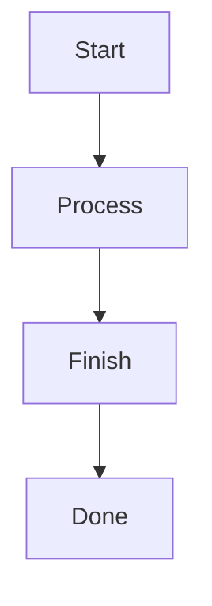

# Mermaid Auto-Fix: How It Works

## Overview

The Mermaid validation system has a sophisticated **auto-fix** mechanism that attempts to correct common syntax errors automatically. This document explains the complete flow and what happens when errors occur.

---

## Auto-Fix Flow Diagram

```
User submits Mermaid code
         ↓
┌────────────────────────┐
│ Step 1: Initial        │
│ Validation with mmdc   │
└────────┬───────────────┘
         │
    ┌────┴────┐
    │ Valid?  │
    └─────────┘
    │         │
   Yes        No
    │         │
    │         ↓
    │    ┌──────────────────┐
    │    │ Step 2: Auto-Fix │
    │    │ (Max 3 Attempts) │
    │    └────────┬─────────┘
    │             │
    │        ┌────┴────┐
    │        │ Attempt │ ◄──┐
    │        │ Counter │    │
    │        └────┬────┘    │
    │             │         │
    │    ┌────────┴────┐    │
    │    │ Apply Fixes │    │
    │    └────────┬────┘    │
    │             │         │
    │    ┌────────┴────┐    │
    │    │ Validate    │    │
    │    │ Again       │    │
    │    └────┬────────┘    │
    │         │             │
    │    ┌────┴────┐        │
    │    │ Valid?  │        │
    │    └─────────┘        │
    │    │         │        │
    │   Yes        No       │
    │    │         │        │
    │    │    ┌────┴────┐   │
    │    │    │ More    │   │
    │    │    │Attempts?│───┘
    │    │    └─────────┘
    │    │         │
    │    │        No
    │    │         │
    │    ↓         ↓
    │ Success   Failure
    │    │         │
    └────┴─────────┴──────→ Return Result
```

---

## Detailed Auto-Fix Process

### Step 1: Initial Validation

```python
# Location: backend/app/services/mermaid_render_service.py
# Function: render_mermaid_with_metadata()

[MERMAID RENDER] Step 1/3: Validating syntax...
[MERMAID VALIDATE] Starting validation for 123 character code
```

**What happens:**
1. Code is sent to `mmdc` CLI for validation
2. If valid → proceed to rendering
3. If invalid → get error message and proceed to auto-fix

**Log output for INVALID code:**
```
[MERMAID VALIDATE] ❌ Validation failed
[MERMAID VALIDATE] Error: Parse error on line 3: ... got 'end'
```

---

### Step 2: Auto-Fix Attempts (Max 3)

```python
# Location: backend/mvp_diagram_generator/mermaid_cli_validator.py
# Function: validate_and_fix_mermaid_with_cli()

[MERMAID RENDER] Step 2/3: Validation failed, attempting auto-fix...
[MERMAID AUTO-FIX] Starting auto-fix process (max 3 attempts)
```

#### Attempt 1

```
[MERMAID AUTO-FIX] Attempt 1/3
[MERMAID AUTO-FIX] Validation failed, applying syntax fixes...
```

**What it tries to fix:**
1. **Missing Diagram Type**
   - Detects: Code starts directly with nodes
   - Fix: Adds `flowchart TD` based on content analysis
   - Example:
     ```mermaid
     # Before
     A --> B

     # After
     flowchart TD
     A --> B
     ```

2. **Arrow Syntax Issues**
   - Detects: Missing spaces around arrows
   - Fix: Adds proper spacing
   - Example:
     ```mermaid
     # Before
     A-->B

     # After
     A --> B
     ```

3. **Node Label Issues**
   - Detects: Labels with special characters not quoted
   - Fix: Adds quotes
   - Example:
     ```mermaid
     # Before
     A[My Node]

     # After
     A["My Node"]
     ```

4. **Subgraph Issues**
   - Detects: Missing `end` statements
   - Fix: Adds missing `end`
   - Example:
     ```mermaid
     # Before
     subgraph "Group"
         A --> B

     # After
     subgraph "Group"
         A --> B
     end
     ```

**Log output after fixes:**
```
[MERMAID AUTO-FIX] Applied 2 correction(s):
[MERMAID AUTO-FIX]   1. Added missing diagram type declaration
[MERMAID AUTO-FIX]   2. Fixed arrow spacing
[MERMAID AUTO-FIX] Code length after fixes: 150 chars
```

#### Re-validation After Fixes

```
[MERMAID AUTO-FIX] Attempt 1/3
# ... validation with mmdc ...
```

**If successful:**
```
[MERMAID AUTO-FIX] ✅ Success on attempt 1!
```

**If still failing:**
```
[MERMAID AUTO-FIX] Attempt 2/3
[MERMAID AUTO-FIX] Validation failed, applying syntax fixes...
```

---

### What Auto-Fix CANNOT Fix

Some errors are **too complex** or **context-dependent** to auto-fix:

#### 1. Reserved Keywords as Node IDs

```mermaid
flowchart TD
    A --> end      ← Cannot fix: 'end' is reserved
    end --> B      ← Context-dependent
```

**Why:** The system doesn't know if you meant:
- The `end` keyword (close subgraph)
- A node named "end"
- A typo

**Solution:** Manual fix required - rename to `E[End]`

#### 2. Invalid Diagram Structure

```mermaid
flowchart TD
    A --> B
    participant C  ← Wrong diagram type mix
```

**Why:** Mixing flowchart and sequence diagram syntax

**Solution:** Use correct diagram type or split into separate diagrams

#### 3. Complex Syntax Errors

```mermaid
flowchart TD
    A[Node with "nested quotes" and (parens)]
```

**Why:** Nested quotes and special characters require escape sequences

**Solution:** Manual fix with proper escaping

---

## Auto-Fix Result Codes

### Success Scenarios

#### 1. Already Valid
```json
{
  "is_valid": true,
  "auto_fixed": false,
  "error": null
}
```

**Logs:**
```
[MERMAID AUTO-FIX] ✅ Code was already valid, no fixes needed
```

#### 2. Fixed on First Attempt
```json
{
  "is_valid": true,
  "auto_fixed": true,
  "fix_message": "Mermaid syntax fixed after 1 attempt(s)",
  "fixed_code": "flowchart TD\n  A --> B"
}
```

**Logs:**
```
[MERMAID AUTO-FIX] ✅ Success on attempt 1!
[MERMAID AUTO-FIX] Applied 1 correction(s):
[MERMAID AUTO-FIX]   1. Added missing diagram type declaration
```

#### 3. Fixed After Multiple Attempts
```json
{
  "is_valid": true,
  "auto_fixed": true,
  "fix_message": "Mermaid syntax fixed after 2 attempt(s)",
  "fixed_code": "..."
}
```

**Logs:**
```
[MERMAID AUTO-FIX] Attempt 1/3 - Failed
[MERMAID AUTO-FIX] Attempt 2/3 - Success!
[MERMAID AUTO-FIX] ✅ Success on attempt 2!
```

### Failure Scenarios

#### 1. No Corrections Possible
```json
{
  "is_valid": false,
  "auto_fixed": false,
  "error": "Parse error on line 3..."
}
```

**Logs:**
```
[MERMAID AUTO-FIX] No corrections could be applied
[MERMAID AUTO-FIX] ❌ No corrections possible, stopping attempts
```

**Why:** The fixer couldn't identify any fixable patterns

#### 2. All Attempts Exhausted
```json
{
  "is_valid": false,
  "auto_fixed": false,
  "error": "Parse error..."
}
```

**Logs:**
```
[MERMAID AUTO-FIX] Attempt 1/3 - Failed
[MERMAID AUTO-FIX] Attempt 2/3 - Failed
[MERMAID AUTO-FIX] Attempt 3/3 - Failed
[MERMAID AUTO-FIX] ❌ All 3 attempts exhausted
[MERMAID AUTO-FIX] Final error: Parse error on line 3...
```

**Why:** Fixes were applied but didn't resolve the core issue

---

## Complete Log Example: Failed Auto-Fix

Here's what you'll see in the logs for the "Reserved Keyword" test case:

```
[MERMAID RENDER] Starting render request for SVG
[MERMAID RENDER] Code length: 78 characters
[MERMAID RENDER] Step 1/3: Validating syntax...
[MERMAID VALIDATE] Starting validation for 78 character code
[MERMAID VALIDATE] ❌ Validation failed
[MERMAID VALIDATE] Error: Parse error on line 3:
...[Process]    B --> end    end --> C[Do
----------------------^
Expecting 'AMP', 'COLON', 'PIPE', 'TESTSTR', 'DOWN', 'DEFAULT', 'NUM', 'COMMA', 'NODE_STRING', 'BRKT', 'MINUS', 'MULT', 'UNICODE_TEXT', got 'end'

[MERMAID RENDER] Step 2/3: Validation failed, attempting auto-fix...
[MERMAID RENDER] Original error: Parse error on line 3: ... got 'end'

[MERMAID AUTO-FIX] Starting auto-fix process (max 3 attempts)
[MERMAID AUTO-FIX] Original code length: 78 chars
[MERMAID AUTO-FIX] Attempt 1/3
[MERMAID AUTO-FIX] Validation failed, applying syntax fixes...
[MERMAID AUTO-FIX] Applied 1 correction(s):
[MERMAID AUTO-FIX]   1. Cleaned up formatting and whitespace
[MERMAID AUTO-FIX] Code length after fixes: 76 chars
[MERMAID AUTO-FIX] Attempt 2/3
[MERMAID AUTO-FIX] Validation failed, applying syntax fixes...
[MERMAID AUTO-FIX] No corrections could be applied
[MERMAID AUTO-FIX] ❌ No corrections possible, stopping attempts

[MERMAID RENDER] ❌ Auto-fix failed after 3 attempts
[MERMAID RENDER] Final error: Parse error on line 3: ... got 'end'
```

**Result returned to user:**
```json
{
  "success": false,
  "error": "Mermaid Syntax Error:\nParse error on line 3...",
  "validation": {
    "is_valid": false,
    "attempted_auto_fix": true,
    "auto_fix_failed": true
  }
}
```

---

## How AI Can Use Error Information

When auto-fix fails, the AI can use the detailed error to regenerate:

### 1. Parse the Error
```python
error = "Parse error on line 3: ... got 'end'"
# Extract: line 3, keyword 'end'
```

### 2. Provide Context to AI
```
The Mermaid diagram has an error:
- Line 3 has a syntax error
- Using reserved keyword 'end' as node ID
- Error: "Expecting 'AMP', 'COLON', 'PIPE', ... got 'end'"

Please regenerate the diagram without using 'end' as a node name.
```

### 3. AI Generates Fixed Version


---

## Best Practices

### For Developers

1. **Always check logs** - Look for `[MERMAID AUTO-FIX]` tags
2. **Monitor success rates** - Track how often auto-fix succeeds
3. **Add new fix patterns** - Enhance `mermaid_syntax_fixer.py` with new cases

### For AI Integration

1. **Use error messages** - Parse errors to understand what failed
2. **Show fix attempts** - Tell users "Tried to auto-fix but couldn't"
3. **Provide suggestions** - Use error context to guide regeneration

### For Users

1. **Review fixed code** - Click "View Fixed Code" to see changes
2. **Apply fixes manually** - Use "Apply Fixed Code" button
3. **Learn from errors** - Understand what was wrong

---

## Summary

**Auto-fix handles:**
- ✅ Missing diagram types
- ✅ Arrow spacing
- ✅ Node label formatting
- ✅ Missing subgraph ends
- ✅ Whitespace issues

**Auto-fix cannot handle:**
- ❌ Reserved keywords as IDs
- ❌ Mixed diagram types
- ❌ Complex escaping issues
- ❌ Logic errors

**When auto-fix fails:**
1. Logs show detailed attempt information
2. Error message returned to user
3. AI can use error to regenerate
4. User can manually fix

The comprehensive logging helps you understand **exactly** why validation failed and what was attempted during auto-fix!
