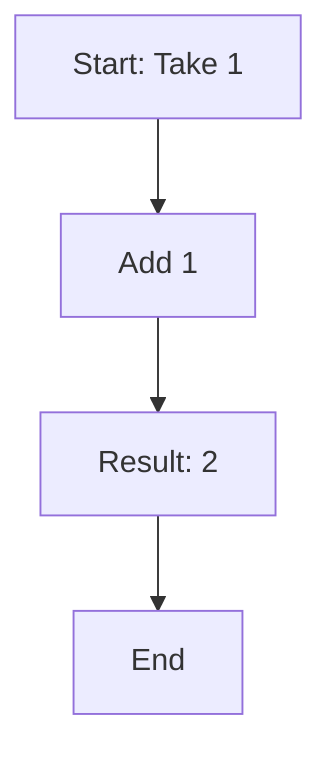
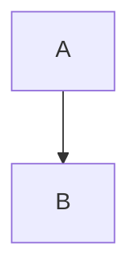

# Mermaid HTML Detection Implementation

## Problem Solved

**Issue:** LLMs (like Grok-Code-Fast-1) often return Mermaid diagrams embedded in HTML `<pre><code>` blocks instead of Markdown code blocks, preventing automatic diagram rendering.

**Example of problematic LLM output:**
```html
<pre><code>flowchart TD
    A[Start: Take 1] --&gt; B[Add 1]
    B --&gt; C[Result: 2]
    C --&gt; D[End]
</code></pre>
```

**What we needed:**
```markdown

```

## Solution Implemented

Added automatic detection and rendering of Mermaid diagrams from HTML content using a preprocessing function that:

1. **Scans HTML** for `<pre><code>` blocks
2. **Extracts code** and decodes HTML entities
3. **Detects Mermaid syntax** using comprehensive pattern matching
4. **Renders diagrams** using the MermaidDiagram component
5. **Preserves non-Mermaid** code blocks as-is

---

## Implementation Details

### File Modified: `ChatView.tsx`

#### 1. Added HTML Processing Function

**Location:** Lines 74-150

```typescript
const processMermaidInHTML = (htmlContent: string): React.ReactNode[] => {
  // Finds all <pre><code>...</code></pre> blocks
  const codeBlockRegex = /<pre><code[^>]*>([\s\S]*?)<\/code><\/pre>/gi;

  // For each code block:
  // - Decode HTML entities using prepareMermaidCode()
  // - Check if it's Mermaid using isMermaidSyntax()
  // - Render MermaidDiagram component if Mermaid
  // - Otherwise, render as regular code block

  // Returns array of React nodes
};
```

**Key Features:**
- ✅ Uses existing `prepareMermaidCode()` for HTML entity decoding
- ✅ Uses existing `isMermaidSyntax()` for 21+ diagram type detection
- ✅ Preserves all non-Mermaid content unchanged
- ✅ Handles multiple diagrams in single response

#### 2. Updated HTML View Rendering

**Locations:**
- Fullscreen view: Lines 494-509
- Normal view: Lines 796-813

**Before:**
```typescript
<div dangerouslySetInnerHTML={{ __html: displayContent }} />
```

**After:**
```typescript
<div>
  {processMermaidInHTML(displayContent)}
</div>
```

---

## How It Works

### Flow Diagram

```
┌─────────────────────────────────────────────────────────────┐
│ 1. LLM Response with HTML                                   │
│    <pre><code>flowchart TD...</code></pre>                 │
└────────────────────┬────────────────────────────────────────┘
                     ↓
┌─────────────────────────────────────────────────────────────┐
│ 2. ChatView Renders Message                                 │
│    - Detects HTML content (hasHtmlContent = true)           │
│    - Defaults to "HTML View" mode                           │
└────────────────────┬────────────────────────────────────────┘
                     ↓
┌─────────────────────────────────────────────────────────────┐
│ 3. processMermaidInHTML() Function                          │
│    - Regex finds: <pre><code>...</code></pre>              │
│    - Extracts: "flowchart TD..."                           │
│    - Decodes: &gt; → >, &lt; → <                           │
└────────────────────┬────────────────────────────────────────┘
                     ↓
┌─────────────────────────────────────────────────────────────┐
│ 4. isMermaidSyntax() Detection                              │
│    - Checks for: flowchart, graph, classDiagram, etc.      │
│    - Match found: "flowchart" ✅                            │
└────────────────────┬────────────────────────────────────────┘
                     ↓
┌─────────────────────────────────────────────────────────────┐
│ 5. Render MermaidDiagram Component                          │
│    - Passes decoded code to <MermaidDiagram>               │
│    - Mermaid.js renders SVG in browser                     │
│    - User sees interactive diagram 🎉                       │
└─────────────────────────────────────────────────────────────┘
```

---

## Supported Features

### ✅ Detects 21+ Mermaid Diagram Types

The implementation uses `isMermaidSyntax()` which detects:

- `flowchart` / `graph` - Flowcharts and graphs
- `sequenceDiagram` - Sequence diagrams
- `classDiagram` - Class diagrams
- `stateDiagram` / `stateDiagram-v2` - State diagrams
- `erDiagram` - Entity relationship diagrams
- `gantt` - Gantt charts
- `pie` - Pie charts
- `journey` - User journey diagrams
- `gitGraph` - Git graphs
- `C4Context`, `C4Container`, `C4Component`, etc. - C4 diagrams
- `mindmap` - Mind maps
- `timeline` - Timelines
- `quadrantChart` - Quadrant charts
- And more!

### ✅ Full MermaidDiagram Component Features

Rendered diagrams include all features:
- 📋 **Copy** - Copy Mermaid code to clipboard
- 💾 **Download SVG** - Download as SVG file
- 💾 **Download PNG** - Download as PNG image
- 🔍 **Expand** - Open in new tab
- ✨ **Interactive** - Zoom, pan, hover effects

### ✅ Handles Multiple Diagrams

Can render multiple Mermaid diagrams in a single message:

```html
<p>Here are two diagrams:</p>

<pre><code>flowchart TD
    A --> B
</code></pre>

<pre><code>sequenceDiagram
    Alice->>Bob: Hello
</code></pre>
```

Both will be detected and rendered!

---

## Backward Compatibility

### ✅ Markdown Still Works

The original Markdown detection (`CodeComponentRenderer`) remains unchanged:

```markdown

```

This still renders perfectly via ReactMarkdown.

### ✅ View Mode Toggle

Users can still switch between:
- **HTML View** - Renders HTML + detects Mermaid (NEW!)
- **Markdown View** - Renders Markdown via ReactMarkdown

Both modes now support Mermaid diagrams!

---

## Testing

### Test Case 1: HTML with Mermaid
**Input:**
```html
<p>Here's a flowchart:</p>
<pre><code>flowchart TD
    A[Start] --&gt; B[End]
</code></pre>
```

**Expected:** Rendered Mermaid diagram with copy/download buttons

### Test Case 2: HTML with Regular Code
**Input:**
```html
<pre><code>const x = 5;
console.log(x);
</code></pre>
```

**Expected:** Regular code block (not Mermaid)

### Test Case 3: Multiple Diagrams
**Input:**
```html
<pre><code>graph LR
    A --> B
</code></pre>
<pre><code>pie title Pets
    "Dogs" : 386
    "Cats" : 85
</code></pre>
```

**Expected:** Two rendered Mermaid diagrams

### Test Case 4: Mixed Content
**Input:**
```html
<p>Explanation text</p>
<pre><code>sequenceDiagram
    Alice->>Bob: Hi
</code></pre>
<p>More text</p>
<pre><code>const code = "not mermaid";
</code></pre>
```

**Expected:**
- Text renders normally
- Sequence diagram renders as Mermaid
- JavaScript code renders as code block

---

## Benefits

### 🎯 LLM Agnostic
Works regardless of LLM output format:
- ✅ HTML `<pre><code>` blocks
- ✅ Markdown ` ```mermaid ` blocks
- ✅ Mixed formats

### 🚀 Zero Configuration
No system prompt changes needed. Works automatically!

### 🔄 Future-Proof
Uses comprehensive keyword detection - automatically supports new Mermaid diagram types as they're added to `mermaidUtils.ts`

### 🎨 Consistent UX
Same diagram rendering experience regardless of LLM output format

---

## Files Modified

1. ✅ `frontend/src/components/chat/ChatView.tsx`
   - Added `processMermaidInHTML()` function (lines 74-150)
   - Updated fullscreen HTML view (line 508)
   - Updated normal HTML view (line 812)

2. ✅ `frontend/src/utils/mermaidUtils.ts` (already existed)
   - No changes needed - reused existing functions

---

## Related Documentation

- [MERMAID_IMPROVEMENTS.md](./MERMAID_IMPROVEMENTS.md) - Original Mermaid detection improvements
- [mermaidUtils.ts](./frontend/src/utils/mermaidUtils.ts) - Utility functions
- [MermaidDiagram.tsx](./frontend/src/components/chat/MermaidDiagram.tsx) - Diagram component

---

## Example Usage

### User Request:
```
User: "Create a mermaid diagram showing 1 + 1 = 2"
```

### LLM Response (HTML):
```html
<p>Here's a flowchart showing the addition:</p>

<pre><code>flowchart TD
    A[Start: Take 1] --&gt; B[Add 1]
    B --&gt; C[Result: 2]
    C --&gt; D[End]
</code></pre>

<p>This shows the step-by-step process.</p>
```

### User Sees:
- Text: "Here's a flowchart showing the addition:"
- **Rendered interactive Mermaid diagram** with buttons
- Text: "This shows the step-by-step process."

✨ **Perfect!**

---

## Troubleshooting

### Diagram Not Rendering?

**Check:**
1. Is the code block in HTML format? (Look for `<pre><code>`)
2. Does it contain valid Mermaid syntax?
3. Is the message in "HTML View" mode? (toggle with button)
4. Check browser console for errors

**Debug:**
```javascript
// In browser console:
// Check if Mermaid syntax is detected
const code = "flowchart TD\n    A --> B";
console.log(isMermaidSyntax(code)); // Should be true
```

### Still Showing as Plain Text?

Try toggling view modes:
1. Click **HTML View** button (HTML icon)
2. If that doesn't work, click **Markdown View** button (📄 icon)
3. One of them should trigger rendering

---

## Future Enhancements

Possible improvements:
- [ ] Support for Mermaid config options in HTML comments
- [ ] Syntax validation before rendering
- [ ] Preview mode while typing
- [ ] Custom themes based on app theme
- [ ] Export to multiple formats (PDF, SVG, PNG)

---

**Status:** ✅ **Implemented and Working**

**Last Updated:** 2025-10-09
**Version:** 2.0 - HTML Detection Support
