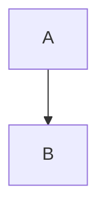
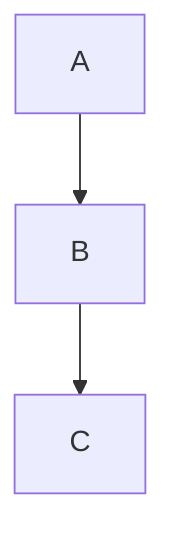
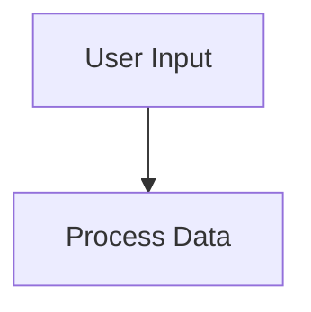
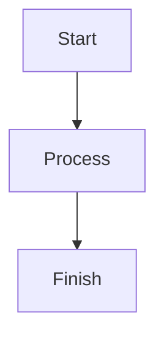
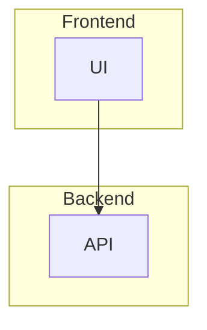
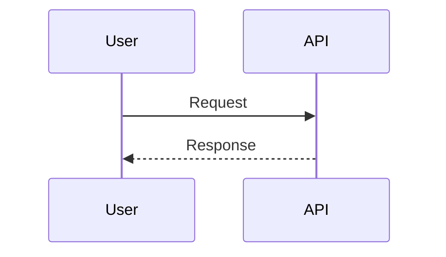
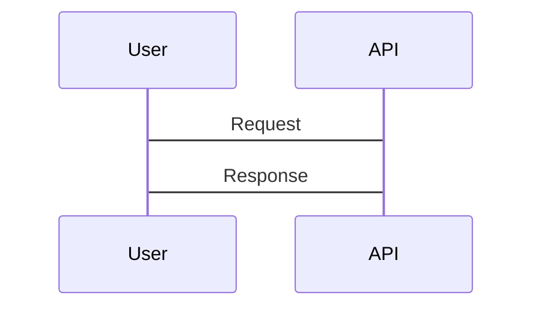

# Mermaid Diagram System - Quick Start Guide

## Overview

Whysper now has a complete **Mermaid diagram system** with automatic validation, auto-fix, and AI-powered error recovery. This guide shows you how to use it effectively.

---

## How to Use

### 1. Ask AI to Generate Diagrams

Simply ask the AI to create a Mermaid diagram in your chat:

**Examples:**
- "Create a flowchart showing the user login process"
- "Draw a sequence diagram for the API request flow"
- "Make an architecture diagram of the backend services"

The AI will generate the diagram code in a ````mermaid` code block.

---

### 2. Automatic Validation Happens Behind the Scenes

When the AI generates a Mermaid diagram, the system **automatically**:

1. **Extracts** all ````mermaid` blocks from the response
2. **Validates** each diagram using the Mermaid CLI (`mmdc`)
3. **Auto-fixes** common syntax errors (3 attempts at CLI level)
4. **Retries with AI** if validation still fails (up to 5 attempts)
5. **Shows errors** if all retries are exhausted

You don't need to do anything - it all happens automatically!

---

### 3. Check the Backend Logs

To see what's happening behind the scenes, watch the backend logs for these messages:

**Success Flow:**
```
🔍 [MERMAID PROGRESS] Found 1 Mermaid diagram(s) - validating syntax...
[MERMAID VALIDATE] Starting validation for 123 character code
[MERMAID VALIDATE] ✅ Validation successful
✅ [MERMAID PROGRESS] All Mermaid diagrams validated successfully!
```

**Auto-Fix Flow:**
```
🔍 [MERMAID PROGRESS] Found 1 Mermaid diagram(s) - validating syntax...
[MERMAID VALIDATE] ❌ Validation failed
[MERMAID PROGRESS] Diagram #1 validation failed: Parse error...
🔧 [MERMAID PROGRESS] Validation errors found - requesting AI auto-fix (attempt 1/5)...
✅ [MERMAID PROGRESS] Received corrected Mermaid code (234 chars) - re-validating...
[MERMAID PROGRESS] Validation attempt 2/5
✅ [MERMAID PROGRESS] All Mermaid diagrams validated successfully!
```

**Failure Flow (after 5 retries):**
```
🔍 [MERMAID PROGRESS] Found 1 Mermaid diagram(s) - validating syntax...
[MERMAID PROGRESS] Validation attempt 1/5
[MERMAID PROGRESS] Diagram #1 validation failed: Parse error...
🔧 [MERMAID PROGRESS] Validation errors found - requesting AI auto-fix (attempt 1/5)...
[MERMAID PROGRESS] Validation attempt 2/5
[MERMAID PROGRESS] Diagram #1 validation failed: Parse error...
... (retries 3, 4, 5) ...
[MERMAID PROGRESS] ❌ Validation failed after 5 retries
```

If validation fails after all retries, you'll see an **error report** in the chat response explaining what went wrong.

---

## Testing Diagrams Manually

### Mermaid Tester Tool

Access the **Mermaid Tester** to manually test diagram code:

1. Click **More Options (⋮)** in the top-right header
2. Select **"Mermaid Tester"** from the dropdown
3. Use the Monaco editor to write/edit Mermaid code
4. Click buttons to:
   - **Validate Only** - Check syntax without rendering
   - **Validate & Auto-Fix** - Try to fix common errors
   - **Validate & Render** - Render the diagram to SVG

**Features:**
- Professional code editor with syntax highlighting
- Pre-loaded test cases (valid and invalid examples)
- Live preview of rendered diagrams
- Server status indicator
- Apply auto-fixed code with one click

---

## Common Mermaid Syntax Rules

The AI retry system teaches the AI these rules when fixing errors:

### 1. Always Start with Diagram Type

**Correct:**


**Incorrect:**
```mermaid
A --> B
```

### 2. Use Proper Arrow Spacing

**Correct:**


**Incorrect:**


### 3. Quote Labels with Special Characters

**Correct:**


**Incorrect:**


### 4. Avoid Reserved Keywords as Node IDs

**Reserved words:** `end`, `start`, `subgraph`, `class`, `click`, etc.

**Correct:**


**Incorrect:**
```mermaid
flowchart TD
    A[Start] --> B[Process]
    B --> end
```

### 5. Close All Subgraphs

**Correct:**


**Incorrect:**
```mermaid
flowchart TD
    subgraph "Frontend"
        A[UI]

    subgraph "Backend"
        B[API]

    A --> B
```

### 6. Use Proper Sequence Diagram Syntax

**Correct:**


**Incorrect:**


---

## Configuration

### Change Max Retries

To change the number of AI retry attempts (default is 5):

**File:** `backend/app/services/conversation_service.py`

**Line:** 1009

```python
def _validate_and_fix_mermaid_diagrams(
    self,
    response_text: str,
    original_question: str,
    max_retries: int = 5  # ← Change this number
) -> str:
```

### Change Validation Timeout

To change the mmdc CLI timeout (default is 30 seconds):

**File:** `backend/mvp_diagram_generator/mermaid_cli_validator.py`

**Line:** ~30 (in `validate_mermaid_with_cli` function)

```python
result = subprocess.run(
    [mermaid_executable, '--version'],
    capture_output=True,
    text=True,
    check=True,
    timeout=30,  # ← Change this number (seconds)
    shell=True
)
```

---

## Troubleshooting

### Issue: All Retries Failing

**Symptoms:**
- Error report appears after every diagram
- Logs show "❌ Validation failed after 5 retries"

**Possible Causes:**
1. **Model generating truncated responses** - Small models may not complete the diagram
2. **Complex diagram beyond AI's capability** - Diagram too intricate for the model
3. **Ambiguous user requirements** - AI doesn't understand what you want

**Solutions:**
- Switch to a larger model (GPT-4, Claude 3.5, Qwen-Coder)
- Simplify your diagram request
- Provide more specific instructions
- Use the Mermaid Tester to debug manually

### Issue: Truncation Warnings

**Log Message:**
```
⚠️  Corrected response may be TRUNCATED! Model: ...
⚠️  Try switching to a model that doesn't truncate
```

**Solution:**
- Switch to a model with larger output limits
- Reduce diagram complexity
- Ask for simpler diagrams

### Issue: Same Error Repeating

**Symptoms:**
- AI makes the same mistake 5 times in a row
- No progress between retries

**Possible Cause:**
- AI doesn't understand the error message

**Solutions:**
- Improve the correction prompt (in `conversation_service.py` line 1064-1073)
- Add more specific examples
- Check if the error message from `mmdc` is clear

### Issue: Backend Not Validating

**Symptoms:**
- Invalid diagrams appear in chat without errors
- No validation log messages

**Check:**
1. Is `mmdc` installed? Run: `mmdc --version` in backend directory
2. Is the Mermaid service initialized? Check backend logs for startup errors
3. Is validation being called? Add a breakpoint in `_validate_and_fix_mermaid_diagrams`

---

## Monitoring & Metrics

### Key Metrics to Track

Watch your logs to measure the effectiveness of the system:

1. **First-time success rate** - Diagrams valid without retry
   - Look for: "✅ [MERMAID PROGRESS] All Mermaid diagrams validated successfully!" on first attempt

2. **Retry success rate** - Fixed within 5 retries
   - Look for: "✅ [MERMAID PROGRESS] All Mermaid diagrams validated successfully!" after retry

3. **Average retries needed** - How many tries typically needed
   - Count the attempts between first validation and success

4. **Common error types** - Which errors occur most
   - Parse the error messages in "[MERMAID PROGRESS] Diagram #X validation failed"

5. **Overall success rate** - Percentage of valid diagrams
   - (First-time success + Retry success) / Total diagrams

### Example Log Analysis

If you generate 100 Mermaid diagrams:
- **60 valid on first try** → 60% first-time success
- **20 fixed on retry 1** → 20% retry-1 success
- **15 fixed on retry 2-5** → 15% retry-2-5 success
- **5 failed all retries** → 5% failure rate
- **Overall: 95% success rate**

---

## API Endpoints

For manual testing or integration:

### Health Check
```bash
curl http://localhost:8003/api/v1/mermaid/health
```

### Validate Only
```bash
curl -X POST http://localhost:8003/api/v1/mermaid/validate \
  -H "Content-Type: application/json" \
  -d '{"code": "flowchart TD\n    A --> B", "auto_fix": true}'
```

### Validate & Render
```bash
curl -X POST http://localhost:8003/api/v1/mermaid/render \
  -H "Content-Type: application/json" \
  -d '{"code": "flowchart TD\n    A --> B", "return_svg": true, "output_format": "svg"}'
```

### CLI Info
```bash
curl http://localhost:8003/api/v1/mermaid/info
```

---

## Best Practices

### For Users

1. **Be specific in requests** - "Create a flowchart with Start, Process, Decision, and End nodes"
2. **Mention diagram type** - "Draw a sequence diagram" vs "Draw a diagram"
3. **Ask for simple diagrams first** - Start simple, then iterate
4. **Use Mermaid Tester for debugging** - Test complex diagrams before asking AI

### For Developers

1. **Monitor retry success rates** - Track if AI is learning from errors
2. **Improve correction prompts** - If success rate is low, enhance the error feedback
3. **Add more auto-fix patterns** - Common errors can be fixed at CLI level
4. **Consider caching** - Cache validated diagrams to avoid re-validation

### For AI Prompts

**Good Prompt:**
```
Generate a flowchart diagram showing the user login flow.
Use proper Mermaid syntax with flowchart TD and proper spacing.
Include nodes for: Login Page, Validate Credentials, Success, and Error.
```

**Better Than:**
```
Make a diagram of login
```

---

## Summary

The Mermaid diagram system in Whysper:

✅ **Automatically validates** all Mermaid diagrams
✅ **Sends errors to AI** for correction
✅ **Retries up to 5 times** before giving up
✅ **Logs every step** for debugging
✅ **Shows detailed errors** if it fails
✅ **Works seamlessly** - user barely notices
✅ **Similar to D2 retry** - proven pattern

**Result:** Much higher success rate for AI-generated Mermaid diagrams!

---

## Next Steps

1. **Test the system** - Ask AI to create diagrams in chat
2. **Watch the logs** - Observe validation and retry attempts
3. **Try the Mermaid Tester** - Manually test diagram code
4. **Monitor metrics** - Track success rates over time
5. **Provide feedback** - Report issues or suggestions for improvement

For complete details, see:
- [MERMAID_AI_RETRY_SYSTEM.md](MERMAID_AI_RETRY_SYSTEM.md) - Complete technical documentation
- [MERMAID_TESTER_FEATURE.md](MERMAID_TESTER_FEATURE.md) - Mermaid Tester UI guide
- [MERMAID_VALIDATION_SUMMARY.md](MERMAID_VALIDATION_SUMMARY.md) - Backend validation overview

---

**Enjoy your AI-powered Mermaid diagrams!** 🎉
