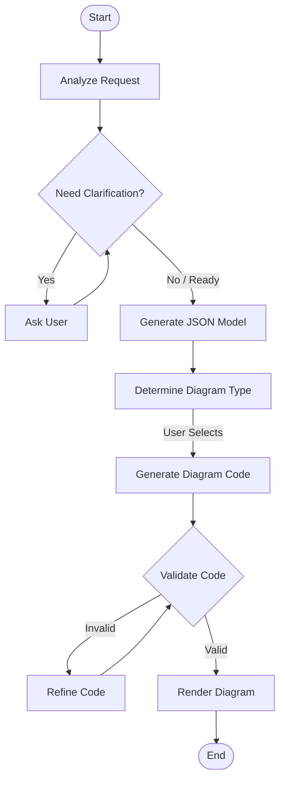

# Diagram Wizard Architecture

## Overview

The Diagram Wizard is a LangGraph-based intelligent agent designed to generate system architecture diagrams from natural language descriptions. It uses a state-machine approach to iteratively analyze, clarify, generate, validate, and render diagrams.

## Core Components

### 1. State Management (`GraphState`)

The workflow state is maintained in a `GraphState` TypedDict (in `graph_state.py`), which flows through all nodes. Key fields include:

- **Input**: `design_prompt`
- **Analysis**: `json_representation` (architecture model), `keyword_scores`
- **Clarification**: `clarification_history`, `clarity_score`, `llm_ready`
- **Generation**: `diagram_type` (Mermaid, D2, PlantUML, Structurizr), `diagram_code`
- **Output**: `svg_output`, `validation_error`
- **Session**: `session_id`, `current_state`

### 2. Workflow Nodes (`nodes/`)

The system is composed of specialized nodes, each handling a specific phase of the pipeline:

- **Analysis (`analyze_request`)**:
  - Uses LLM to assess if the user request is clear enough.
  - Generates an initial `json_representation` of the system.
  - Determines if clarification is needed.

- **Clarification (`clarify_prompt`)**:
  - Interactive loop where the AI asks targeted questions.
  - Scores the clarity of information (1-100).
  - Updates `json_representation` with new details.
  - Proceeds when score > target or user confirms.

- **Diagram Type Determination (`determine_diagram_type_node`)**:
  - Analyzes the final design summary and JSON.
  - Scores suitability for Mermaid, D2, PlantUML, and Structurizr.
  - Can pause for user selection or auto-select.

- **Generation (`generate_code`, `generate_json_representation`)**:
  - `generate_json_representation`: Finalizes the architecture model (Structurizr DSL + JSON).
  - `generate_code`: Converts the model into specific diagram syntax (e.g., Mermaid code).

- **Validation (`validate_code`)**:
  - Integrates with the `ProviderRegistry` system.
  - Uses actual provider tools (or their validators) to check syntax.
  - Returns `is_valid` flag and error details.

- **Refinement (`refine_code`)**:
  - If validation fails, uses LLM to fix the code based on the specific error message.
  - Retries validation up to 3 times.

- **Rendering (`render_diagram`)**:
  - Uses the `ProviderRegistry` to convert valid code to SVG.
  - Handles provider availability checks.

### 3. Provider Integration

The Wizard delegates actual diagram processing to the `backend/diagrams/` provider system:

- **Discovery**: Uses `get_registry()` to find available providers.
- **Abstraction**: `validate_code` and `render_diagram` nodes interact with providers via a unified interface.
- **Resilience**: Checks `PROVIDER_AVAILABLE` flag and handles missing providers gracefully (logging errors).

### 4. Session Management (`session_store.py`)

- In-memory `DiagramSessionStore` manages user sessions.
- Handles concurrency with `asyncio.Lock`.
- Implements TTL-based cleanup for expired sessions.

## Workflow Diagram

## Logging & Monitoring

- **Structured Logging**: Uses `common.logger` for consistent JSON-formatted logs.
- **Session Context**: Logs include `session_id` for tracing requests across nodes.
- **Error Handling**: Critical errors (e.g., provider failures, LLM timeouts) are logged with `logger.info` and stack traces.

## Testing Strategy

- **Unit Tests**: Mocks are used for LLM calls and Provider interactions to ensure fast, deterministic tests.
- **Integration**: `test_provider_integration.py` verifies the handshake between Wizard nodes and the Provider Registry.
