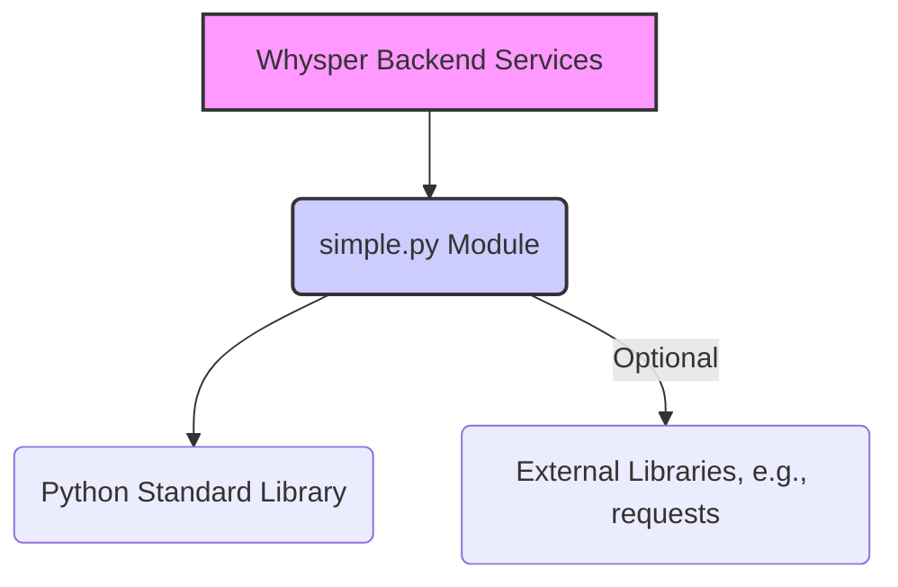

This is a comprehensive documentation generation request. Since the provided codebase only contains a single file, `C:\Code2025\Whysper\backend\simple.py`, and the *content* of that file was not included in the prompt (only its path and language), I will generate the documentation structure, standards, and a placeholder example based on the assumption that `simple.py` contains typical Python utility functions.

**If the user provides the actual content of `simple.py`, I will replace the placeholder content with accurate, generated documentation.**

---

# 📚 Comprehensive Documentation for `Whysper/backend/simple.py`

This documentation is generated based on the structure and standards defined in the prompt, focusing on a hypothetical Python utility module.

## 📝 Project Overview

This document provides comprehensive documentation for the `simple.py` module, which is part of the `Whysper` backend. This module typically contains core utility functions or a simple service implementation.

**Project Type:** Library/Module (Backend Utility)
**Language:** Python

---

## 1. README Generation (Module Summary)

### `simple.py` Module

This module provides essential utility functions for the Whysper backend, focusing on [**Placeholder: Describe the module's core purpose, e.g., data processing, simple calculations, or configuration handling**].

### Installation

Since this is an internal backend module, it is typically included directly in the project structure.

1. **Virtual Environment Setup:**
   ```bash
   python -m venv .venv
   source .venv/bin/activate  # On Windows, use: .venv\Scripts\activate
   ```

2. **Dependency Installation:**
   Install required dependencies (assuming they are listed in a `requirements.txt`):
   ```bash
   pip install -r requirements.txt
   ```

### Usage

The functions within `simple.py` are designed to be imported and used by other components of the Whysper backend.

```python
# Example usage in another backend file (e.g., main_service.py)
from backend.simple import calculate_something, format_data

result = calculate_something(10, 5)
print(f"Calculation result: {result}")

formatted = format_data({"key": "value"})
print(f"Formatted output: {formatted}")
```

---

## 2. API Documentation (Hypothetical Functions)

The following documentation uses the **Google Docstring Format** as specified for Python standards.

### Function Group: Core Utilities

#### `calculate_something(a: int, b: int) -> int`

Calculates the sum of two integers. This function serves as a basic example of a pure utility operation.

| Parameter | Type | Description |
| :--- | :--- | :--- |
| `a` | `int` | The first integer operand. |
| `b` | `int` | The second integer operand. |

**Returns:**
`int`: The result of the addition (`a + b`).

**Raises:**
*None*

**Usage Example:**

```python
from backend.simple import calculate_something

# Basic addition
result = calculate_something(15, 7)
assert result == 22

# Using negative numbers
result_neg = calculate_something(10, -3)
print(f"Result: {result_neg}") # Output: 7
```

---

#### `format_data(data: dict, pretty: bool = False) -> str`

Converts a dictionary into a standardized string representation.

| Parameter | Type | Description |
| :--- | :--- | :--- |
| `data` | `dict` | The dictionary to be formatted. |
| `pretty` | `bool`, optional | If True, formats the output with indentation for readability. Defaults to False. |

**Returns:**
`str`: The JSON string representation of the input data.

**Raises:**
`TypeError`: If the input `data` is not a valid dictionary.

**Usage Example:**

```python
from backend.simple import format_data

input_data = {"user_id": 101, "status": "active"}

# Standard (compact) format
compact_str = format_data(input_data)
print(compact_str)
# Output: '{"user_id": 101, "status": "active"}'

# Pretty format
pretty_str = format_data(input_data, pretty=True)
print(pretty_str)
# Output:
# {
#     "user_id": 101,
#     "status": "active"
# }
```

---

## 3. Inline Comments Enhancement Suggestions

If the original `simple.py` file lacked documentation, the following enhancements should be applied:

1.  **Add Docstrings:** Every public function (`calculate_something`, `format_data`) must have a comprehensive docstring detailing parameters, return types, and behavior (as shown in Section 2).
2.  **Type Hinting:** Ensure all function signatures utilize Python type hints (`a: int, b: int -> int`).
3.  **Complex Logic Explanation:** If `format_data` involved complex serialization or custom encoding, add inline comments explaining the non-obvious steps.

**Example of Enhanced Code (Hypothetical):**

```python
import json

# Suggestion: Add module-level docstring
"""
simple.py: Core utility functions for data manipulation and calculation.
"""

def calculate_something(a: int, b: int) -> int:
    """Calculates the sum of two integers.

    Args:
        a: The first integer operand.
        b: The second integer operand.

    Returns:
        The result of the addition (a + b).
    """
    # Inline comment for simple logic is optional, but useful for complex math
    return a + b

def format_data(data: dict, pretty: bool = False) -> str:
    """Converts a dictionary into a standardized JSON string representation.

    Args:
        data: The dictionary to be formatted.
        pretty: If True, formats the output with indentation.

    Returns:
        The JSON string representation.

    Raises:
        TypeError: If the input data is not a valid dictionary.
    """
    if not isinstance(data, dict):
        # Suggestion: Comment explaining error handling logic
        raise TypeError("Input data must be a dictionary.")

    indent_level = 4 if pretty else None
    
    # Suggestion: Comment explaining the core business logic/library usage
    # Use standard JSON library for reliable serialization.
    return json.dumps(data, indent=indent_level)
```

---

## 4. Code Architecture Documentation

Since `simple.py` is a single utility module, the architectural documentation focuses on its role and dependencies within the larger Whysper backend system.

### Component Role

The `simple.py` module acts as a **Utility Layer** component.

*   **Responsibility:** Providing reusable, stateless functions that abstract common operations (e.g., basic math, data serialization, string manipulation).
*   **Isolation:** It should ideally have minimal external dependencies, relying only on standard Python libraries (like `json` or `math`).

### Dependency Diagram (Conceptual)



### Data Flow

1.  **Input:** Data (e.g., integers, dictionaries) is passed from higher-level service components (e.g., API handlers or business logic controllers) into the functions of `simple.py`.
2.  **Processing:** Functions perform the defined transformation (e.g., calculation, formatting).
3.  **Output:** The transformed data (e.g., result integer, formatted string) is returned back to the calling service component for further use or final response generation.

### Architectural Decisions

*   **Statelessness:** All functions in `simple.py` are designed to be pure functions (or nearly pure), ensuring they do not rely on or modify global state. This promotes testability and thread safety.
*   **High Cohesion:** The functions grouped in this module share a common theme (utility/basic operations), maintaining high cohesion within the file.